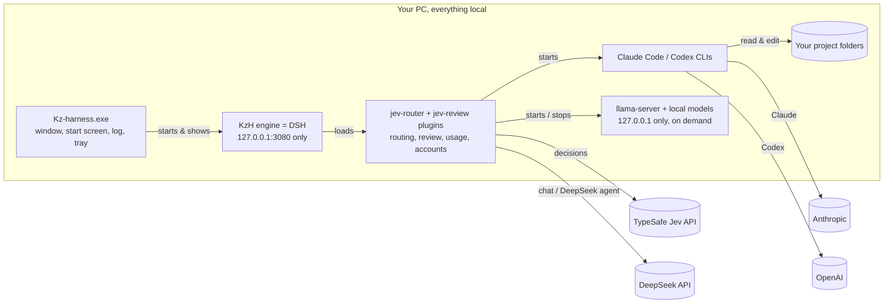

<p align="center"></p>

<h1 align="center">Kz-harness (KzH)</h1>

<p align="center">One desktop app for Claude Code, Codex, DeepSeek and your own API-key models. You type; <a href="https://docs.typesafe.ai/introduction">Jev</a> decides who handles it, the project's own checks verify the work, and Jev reviews the result before you see it.</p>

---

Kz-harness is a reskin and a set of plugins on top of [DSH](https://www.npmjs.com/package/@deepseek-ai/dsh) (DSH, the engine). It is shared as-is for anyone to use, fork, copy and change; see [License](#license).

## How it works


**In words:**

1. **You type** in the Kz-harness window. The **Jev Auto** model is the default, so every message goes straight to the router, with no chat model in front of it.
2. **Jev sorts it:** is this *work in the project* or *a question*? Questions get a direct answer from a chat model. The **No project** workspace is chat-only.
3. **Jev routes the work** in a single fast call. It picks the agent, reads the task type, complexity and risk, and decides whether tests must pass and whether a second opinion or a person is worth it. Agents that are signed out, switched off or at your usage limit are never picked.
4. **The agent works** inside your project folder. If it hits its usage limit mid-task, an API-key agent switches to your next key; a subscription agent (Claude ↔ Codex) hands the task to its peer, along with a **handoff note** (`.kz-harness/handoff.md`).
5. **Deterministic checks run:** the git diff, plus your project's `typecheck`, `lint`, `test` and `build` scripts. A check that passed before must still pass.
6. **Jev reviews** with small yes/no questions (did it do the task? all of it? anything unrelated? regression risk? does it need a person?). Code decides from those answers: pass, second opinion, retry, or hand it to you.
7. **You get the answer and a report**, ending with who took part, e.g. `Answered by: Jev (jev-1.13.0) → deepseek (deepseek-flash) · claude (opus), reviewer`. The **Jev inspector** shows every decision.

### What runs where



Only the model and API calls you choose go online. KzH switches off DSH's data collection (see [Privacy](#privacy)).

## What you get

- **Kz-harness.exe:** its own window, name and icon, a start screen with a live log, a colored log window (Ctrl+Shift+L), a tray icon, and DevTools on F12. Closing it stops everything it started.
- **Header like Claude desktop:** buttons for **Terminal**, **Background tasks**, **Browser** and **Jev inspector**, plus a **⋮** menu (Files, Usage, focus mode, settings). Every action has a hotkey you can change in **Settings → Shortcuts**.
- **Right sidebar** (opens at 20% width; change it in Settings → Shortcuts):
  - **Jev inspector:** timings, the pick and its reasons, every step with that agent's own answer, and every question Jev was asked with its probabilities.
  - **Overview:** the whole session as one time-ordered ledger: your messages and the assistant's, tool calls, context and compaction, then the routed runs, background tasks and subagents. Filter chips by kind, and every row expands to the inspector's own detail (see [The work board, history and feedback](#the-work-board-history-and-feedback)).
  - **Background tasks:** Jev runs, background jobs and subagents, each with a live timer, output and **Stop**.
  - **Usage:** each account's 5-hour and weekly limits, DeepSeek balance and Jev spend; editable per-account limits; recent runs; and **Saved by Jev (estimate)**, covering money, time and tokens compared with a chat model making the same decisions.
  - **Browser:** a real browser pane, sandboxed in its own session.
  - **Files:** the project's files.
- **Agent chips:** switch agents on and off with one click (only Claude, GPT + DeepSeek, …), or type `/use claude ds`.
- **Accounts** (Settings → Jev setup): log Claude and ChatGPT in and out; keep several DeepSeek, Jev and API-key-model keys; pick the active key. Keys are typed once and never shown again.
- **No project** workspace: plain chat without a project folder.
- **Tools without an LLM:** Jev runs one of your scripts when it fully covers the task.

## Install (new PC)

KzH runs on **any Windows 10/11 PC**, not just the one it was built on: nothing in the repo hardcodes a machine, a user folder or a drive. It is Windows only, though, and deliberately so. The launcher is a packaged Electron app for `win32-x64`, the installer and starter are PowerShell, and the shortcuts are Desktop and Start menu entries. There is no macOS or Linux build, and none is planned here.

Two things never travel with the repo, by design: your keys (they live in `~/.kzh/.env`, outside the repo) and the local model binaries (`models/` and `engine/` are ignored; only `config/local-models.json` is committed, and the installer downloads from it). A fresh clone therefore needs step 2 and, if you want local models, the `-LocalModels` flag in step 3.

**You need:** Windows 10/11, [Node.js](https://nodejs.org) 22.19+ (24 recommended), [Git](https://git-scm.com), and at least one of:

| Agent | Install | Sign in |
|---|---|---|
| Claude Code | `npm i -g @anthropic-ai/claude-code` | run `claude`, then `/login` |
| Codex | `npm i -g @openai/codex` (or the Codex app) | `codex login`, then Sign in with ChatGPT |
| DeepSeek | nothing | an API key from https://platform.deepseek.com/api_keys |

Also get a Jev key from https://console.typesafe.ai/keys. Without it, KzH still works; it uses a fixed default agent and says so.

**1. Get the code.** The scripts assume `C:\Harness`.

```powershell
git clone https://github.com/kz-95/kz-harness.git C:\Harness
```

**2. Add your keys** to `C:\Users\<you>\.kzh\.env`. It must be in `.kzh`, never in the repo. You can add more keys later in the app.

```
TYPESAFE_API_KEY="your Jev key"
DEEPSEEK_API_KEY="your DeepSeek key"
```

**3. Run the installer.** It is safe to re-run; it only does what is missing.

```powershell
powershell -ExecutionPolicy Bypass -File C:\Harness\scripts\Install-Harness.ps1
```

The installer:
- checks your tools;
- installs the packages;
- installs the engine with the Claude and Codex connectors;
- writes the KzH settings, including the privacy switches, and backs up anything it replaces;
- makes Jev Auto the default model;
- builds **Kz-harness.exe**;
- creates **Kz-harness** shortcuts on the Desktop and in the Start menu;
- lists any keys or CLIs still missing;
- lists the optional local models; it downloads them only with `-LocalModels <ids|all>` (see [Local models & offline](#local-models--offline)).

**4. First start.**

1. Double-click **Kz-harness**. The start screen shows the log; the app opens after 10-20 s.
2. **Settings → Jev setup:** every agent you use should show a green dot. A red dot tells you what to run; do it, then click **Recheck logins**.
3. Pick a workspace (a project folder) or **No project**, and type.

Start it from the icon. Double-clicking a `.ps1` file opens Notepad on purpose; don't change that. `Start-KzH.cmd` starts the engine in a console and your browser, if you ever need to run it without the app.

## Everyday use

- Type a task (`Fix the bug in the user lookup function and make sure the tests pass.`) or a question (`how does the login flow work?`).
- Force an agent with `/claude …`, `/codex …` or `/deepseek …`. `/auto …` lets Jev choose from any model. `/use claude ds` switches which agents may run.
- The model menu's **Jev** section lists **Jev Auto** and one entry per enabled agent - **Claude Code**, **Codex (GPT)**, **DeepSeek agent**, plus any local or custom agent. Picking an agent sends every message to it with no routing question; the checks, the review and the queue still run. Switching an agent off takes it out of the menu.
- Once you install a local model, three more Jev rows appear, in order from the most off-machine to the least. They all let Jev route; they differ only in how wide the field of agents is.

  | Row | Picks from | Jev call |
  |---|---|---|
  | **Jev Auto** | everything enabled | yes |
  | **Jev Auto · Online** | cloud and subscription agents only, never this PC | yes |
  | **Jev Auto · Local** | the local models on this PC only | yes |
  | **Offline · Local only** | the local models, by a fixed rule | no |

  **Online** is for when you do not want to wait on your own hardware. Being offline, or picking a `local-*` effort on a single message, still overrides it: those say what the machine can do, while Online only says what it should prefer. With no local model installed none of these rows appear, because Jev Auto already has nothing but cloud agents to choose from.
- **Export chat as Markdown** (Ctrl+Alt+M, or the header's ... menu): copy it, or save a `.md`. Tool calls and their output are included, folded into `<details>` blocks; untick that to export just the conversation.
- **Show all transcripts** (top bar, next to the Jev inspector button; rebindable in Settings -> Shortcuts, empty by default): opens or closes every reasoning and tool transcript in the conversation at once, including ones that arrive afterwards. The label and `aria-expanded` follow the state, and the button is disabled when the conversation has none.
- **Effort** (the model menu): `Auto` lets Jev pick from the task's complexity and risk. Picking a level by hand applies to background work only - the conversation stays responsive at every level.
  - **Ultra** gives each background executor its own top mode: Claude Code Opus 5, Sonnet 5 and Fable get `ultracode`; Codex on GPT-5.6 or newer (Astra, Sol, Terra, Luna) gets `ultra`; DeepSeek gets `max`. Local models and registered tools get no synthetic effort - they use their own configured mode. An older or unknown Codex model is capped at what that model actually supports rather than being sent a value it would reject.
- **Final status:**
  - `ACCEPTED` means done.
  - `ANSWERED` means it was a question.
  - `NEEDS HUMAN` means look at it yourself.
  - `STOPPED` means the retry limit was hit.
  - `PAUSED` means every agent is at its limit. The handoff note is saved, and asking to *continue* later picks it up.

## What it costs

Jev is told what each agent costs at the hour it is choosing, and prefers an agent on its cheap rate when the choice is otherwise even. It is a preference, not a rule: a task that needs a particular agent still goes there.

DeepSeek bills by the UTC clock, twice the price inside its weekday business hours and at its cheap rate the rest of the time, so every evening and the whole weekend is already cheap. The dear hours are config, not code - `pricing.peak` in the plugin's Config, keyed by agent id:

```yaml
- id: jev-router
  config:
    pricing:
      peak:
        deepseek:
          windowsUtc: [{ fromUtc: '01:00', toUtc: '04:00' }, { fromUtc: '06:00', toUtc: '10:00' }]
          daysUtc: [1, 2, 3, 4, 5]
```

The windows are the **dearer** hours; anything outside them is off-peak. An end at or before the start wraps past midnight, and `daysUtc` is the UTC day, 0 = Sunday, defaulting to Monday to Friday. Check the hours against [DeepSeek's pricing page](https://api-docs.deepseek.com/quick_start/pricing) and edit them there if they move; add an entry for any other agent whose provider charges by time of day. Subscription agents (Claude Code, Codex) are flat-rate, so they have no entry.

## Subscription first

A subscription is free per token but **not** free per percent: its weekly window is the thing
that runs out. So the harness spends the window on the work that needs it, and moves bulk work
to the metered API only once a subscription is far enough through its week.

Past its gate, an agent stops taking **execution** work and stays available for **review**, where
few tokens buy the most judgement. Work prefers another subscription that is still under its own
gate, and only reaches the API agent when every subscription is past one.

```yaml
- id: jev-router
  config:
    policy:
      gateAtPercent:
        default: 80
        claude: 90      # Max
        codex: 80       # Plus
```

**Set this to match your plan**: Claude Pro 80 / Max 90, Codex Plus 80 / Pro 90. It is not
detected for you on purpose. The live usage endpoint reports no plan name, and the cached
credential (`~/.claude/.credentials.json`, `subscriptionType`) lags a plan change, so an upgrade
would keep gating you at the old number and push paid work you did not need to pay for.

Three deliberate choices:

- **Unknown never gates.** On a cold start, or when a usage fetch fails, the weekly percent is
  unknown. Unknown is treated as under the gate. Guessing "over" would send paid traffic every
  cold start; guessing "under" only spends subscription faster, and the existing `stopAtPercent`
  and limit-error paths are still the real ceiling.
- **Evaluated once per run.** Re-reading per attempt costs a usage snapshot each time and could
  land a retry on a different agent than the primary, which means two agents editing one working
  tree. Crossing the gate mid-task is invisible until the next task; crossing the real limit keeps
  its existing handoff behaviour.
- **The window is found by length, not by name.** Both providers label it `weekly` today, but the
  gate reads the longest window (>= 1 day) so a relabelled window cannot silently switch it off.

A forced agent (`/claude`, or picking one in the model menu) is never swapped: an explicit choice
beats the policy. When the gate does move work, the report says so, and the reasoning line reads
`claude is 92% into its weekly window (gate 90%): codex takes the work, claude stays for review`.

### When an agent runs out mid-task

Nothing is lost. The harness writes `.kz-harness/handoff.md` from the evidence so far, hands the
task to another agent with that note in its prompt, and carries on. The replacement is the cheapest
one that is not itself past a gate, so a spent subscription is never handed work that just moves
the problem. If no agent is left, the run pauses with the handoff saved and asking to *continue*
later picks it up.

### API keys get two tiers as well

A metered key is protected the way a subscription is, so it cannot be drained without warning:

```yaml
limits:
  deepseek:
    handoffAtBalance: 10   # soft: work in small steps, keep the handoff current, hand over
    minBalance: 5          # hard: never start
```

In the key's own currency. Below the soft figure the agent behaves exactly as one near a
subscription limit: Jev prefers others, and the agent is told to work in small steps and keep the
handoff updated, so a handover loses nothing. Both are editable per agent in the Usage tab.

## Background tasks

A task you type in a project does **not** hold the chat. Jev queues it, answers with the line

> Queued -> claude as **jev-3** (2nd in line for HarnessProjects). Keep chatting - the result posts here when done.

and you carry on: ask a question, start a task in another project, read the inspector.

When the task finishes, its result is posted into that chat **as its own message**, headed with the task name, its id, the agent, the model and the status - never merged into, and never in front of, whatever the assistant is saying. If an answer is streaming when the task lands, delivery waits for that answer to finish, so nothing interrupts it. A result counts as **unread** until your browser reports that it actually rendered the row, so the badge means "you have not seen this yet"; if the message could not be posted it stays on offer and is retried, and an appended result is never posted twice. Each result is a collapsed `Context injection · jev-router` row, which is the engine's own notice row rather than a bespoke card. That is deliberate: the slot the card needed is keyed, not chained, so taking it replaced the row for every other producer too and flattened five structured bodies. Open the row for the raw text, or the **Overview** tab in the right sidebar to read the same report rendered as Markdown, on a surface KzH owns outright.

- **One at a time per project folder.** Two agents never edit the same folder at once; a second task for the same folder waits its turn. Different folders run in parallel.
- **Every state is on the record**: waiting, choosing executor, running, verifying, reviewing, and then completed, failed, stopped, needs input or paused by limit. A completed row gets a check mark and a struck-through title; failed, stopped, needs-input and paused rows keep their own icon, a text label (never colour alone) and the reason.
- **Every terminal outcome reports**, including a task you stopped yourself: its message says `Status: Stopped` and why, because the report is where the explanation lives. Nothing is quietly closed without being shown.
- **A finished result held for display is visible without touching the answer.** If a task settles while an answer is still streaming, its message waits for that answer to end; until it goes out, the top bar's Background button marks it (`N result(s) waiting to be posted`). The active answer is never modified to say so.
- **Interrupted work is reconciled.** If the app closes mid-task, that row comes back as stopped with the reason and the last progress line it had, instead of showing work that can never finish.
- **The task list** is the Jev inspector's **Background** tab (Ctrl+Alt+B). It shows the row's phase, place in line, agent, model, effort, elapsed time, the last router line, and the full report once you open a finished row.
- **Stop** cancels a running or queued task; work already written to the project stays. **Run next** moves a waiting task to the front of its folder's line. **Clear** removes finished rows from the list and the saved log; results already posted in the chat stay.
- Questions, `/auto`, `/claude` and the other forced-agent commands still answer in line, as before - only routed project work is queued.
- Task records are kept in `~/.kzh/jev-router/tasks.jsonl` (the last 100). If the engine has no job service, tasks run in the chat exactly as they did before.

## The work board, history and feedback

These are plugin features (`plugins/jev-router/client.js`), loaded by the engine: a harness restart picks them up, not a rebuilt exe.

- **The work board** is a sticky card at the top of the conversation, per session: this session's background tasks as a checklist. The header reads `N/M completed` and names each non-completed terminal state that occurred (`1 failed`, `2 stopped`, and so on), because only `completed` counts as done. Each row shows its state in words plus the agent, model, effort and elapsed time, and a live row ticks once a second. **Stop all** stops every live task after a confirmation naming them and what is kept; the control is hidden while nothing is live. A session with no tasks renders nothing at all. Every row reuses the Tasks panel's own row model, so the words in the board, the panel and the delivered result cannot drift apart.
- **Composer history:** ArrowUp recalls your previous input, ArrowDown walks forward, and the draft you were typing is restored once you walk past the newest entry. The entries are this session's own user messages (the newest 50), and the arrows work only while the composer is on screen and the caret is on the draft's first or last line.
- **Left sidebar file tree:** a toggle beside the Workspaces search icon opens a VS Code style tree of the open session's project folder. One directory level loads at a time as you expand it (capped at 400 rows); a directory opens and closes, and clicking a file opens it in the right sidebar the same way the shipped Files tab does. The honest limit: it roots at the **open session's** folder, because the engine exposes no independent selected workspace, so it follows the session, not a separately highlighted workspace row.
- **Answer feedback:** every answer carries **Like** and **Dislike**. A verdict can take an optional tag and an optional one-line **Why?**; a dislike also gets a **should have been** picker naming another enabled agent.
  - The routing tags (`wrong agent`, `misread my question`, `wrong scope`, `good pick`) are statements about the pick and may move Jev's probabilities within a bounded bias (weight 0.15, ramped over the first three votes, reading the newest 20). An untagged verdict votes too.
  - The answer-only tags (`not enough detail`, `too slow`, `good answer`) never move a pick; their text and tag still ride the routing prompt as context.
  - A written reason always reaches the routing prompt, with its tag in front when one was picked.
  - A `should have been` suggestion is stronger and can switch the pick outright, but only to an agent this run could really have used: enabled, capable and not past its weekly gate. Clearing a verdict appends a tombstone row, so an earlier verdict is never lost by a clear.
  - Verdicts are stored locally, one append-only row each, in `<DSH_HOME>/jev-router/feedback.jsonl` (`~/.kzh/jev-router/feedback.jsonl`). The bias is small and ramped, so a handful of clicks will not change picks: no accuracy improvement is measurable until real verdicts accumulate.

## How Jev decides

Jev is TypeSafe's System One model. It answers typed questions with calibrated probabilities and never writes code. KzH follows the [Jev docs](https://docs.typesafe.ai/introduction): each call batches all its questions, each question is one judgment, and **code** makes the decision.

- **Before running** (one call): which agent, the task type, complexity and risk, whether a second opinion, a person or passing tests are needed, whether any tool fits exactly (and its arguments), whether the task continues an earlier handoff, **what kind of outcome the request needs** (below), and **whether a question also asks for work** (below). Only small facts are sent (the task, file-type counts, script and dependency names, changed file names, recent outcomes, and the folder's handoff note when it has one, which quotes the previous task's answer and so can carry code from it); whole source files never are.
- **After each run** (one call over the diff, the checks and the answer): addressed, complete, unrelated changes, regression risk, needs a person, and which agent should go next.

### One message can do both

A message is not forced to be either a question or a task. Ask *"what does the parser do, and also fix the typo in it?"* and Jev answers the question now while queueing the fix behind it, in the same message:

```text
<the answer>
Queued -> codex as jev-7 (starting now in Harness). Keep chatting - the result posts here when done.
```

The two judgments are asked separately (is this a question to answer, and does it also ask for work), because one choice between them could not express a message that is both. Work is only queued when Jev is at least 0.7 sure the message really asks for it: a wrong guess costs a background run of something you only asked about.

### What the request needs (capabilities)

Every executor on this machine declares what it can do, and **code decides who is capable before Jev is asked**. Jev then chooses among candidates that can actually do the work, and code checks its pick afterwards - so a capability mismatch cannot be routed. This is what lets non-code work be routed at all: the old question was only "question or coding task", which has nowhere to put OCR, a document or a look-up.

| Capability | Example | Preferred path |
|---|---|---|
| `quick_answer` | Greeting or a short factual answer | fastest capable local chat model |
| `reasoned_answer` | A multi-step explanation | a model that declares reasoning, local first |
| `ocr` | Text in an image or scan | an image-capable executor, never a text-only one |
| `image_inspection` | Describe or check an image | an executor that really reads images |
| `document_processing` | Read or transform a PDF or spreadsheet | an executor that accepts the file |
| `web_research` | Current information with sources | an executor with the network |
| `deterministic_tool` | An exact conversion a script does | the registered script, ahead of any model |
| `project_read` | Explain how the repo behaves | a read-only project agent |
| `project_change` | Implement or fix something | a mutating agent, with checks and review |
| `human_required` | A missing permission or a choice only you can make | the request stops and asks you |

Nothing is delegated that code can settle: availability, sign-in, limits, modality support, write permission, input size, price and arithmetic stay in code. A request nothing here can do says so instead of running anyway, and `human_required` stops the run rather than letting an agent guess at an answer it is not allowed to give. A capability below its confidence threshold still runs normally, and picking an agent by hand always wins.


| Situation | Action |
|---|---|
| The agent failed, a passing check now fails, or required checks fail | retry (never accepted) |
| "needs a person" ≥ 0.6 | human |
| quality ≥ the accept bar | accept (a second opinion first, if routing asked for one and code changed) |
| quality ≤ 0.3 | retry with another agent |
| in between | second opinion, then human |

- **Quality:** `min(addressed, complete, 1 − unrelated changes, 1 − regression risk)`.
- **Accept bar:** scales with the task's risk: 0.55 (risk < 0.25), 0.70 (< 0.6), 0.85 above that.
- **Limits:** 3 attempts, 2 reviews, 5 rounds.
- **Model:** Jev is pinned to `jev-1.13.0`, so the thresholds keep their meaning.

## Usage limits and handoff

- **Where the numbers come from:**
  - Claude: its 5-hour and weekly limits.
  - Codex: its 5-hour and weekly limits.
  - DeepSeek: the balance for each key.
  - Jev: counted locally at $0.042 per million input tokens.
- **Your limits, per account** (Usage tab):
  - **handoff at** (default 85%): agents are told to work in small steps and keep the handoff note updated.
  - **stop at** (default 97%): no new tasks go to that account.
  - For API keys, a **minimum balance** plays the same role.
- **A real limit error always counts.** API keys rotate to your next key; subscriptions hand the task to their peer agent. With no agent left, the run pauses with the note saved.
- **Local models** have no quota and no key: the Usage tab shows them as *free, local*.

## Local models & offline

KzH can run open models on your own PC with [llama.cpp](https://github.com/ggml-org/llama.cpp)'s `llama-server`. The jev-router plugin starts it on demand on **127.0.0.1 only**, with a new random API key each start (so other programs on the PC can't use it), and stops it after 10 idle minutes (Settings) and when KzH closes. Nothing is installed by default.

**Install:** type `/install-llm` in any chat. A picker checks this PC (GPU and VRAM, NVIDIA driver, RAM, CPU, free disk), rates every model (*runs fully on GPU*, *splits GPU + CPU* with a speed estimate, *CPU only*, or *won't fit*) and preselects its suggestions: official and stable releases that were tested with this engine first, then what runs at a usable speed, then quality. It installs the matching engine build first (CUDA 12 or 13 by driver version, Vulkan for other GPUs, CPU otherwise). `/remove-llm` opens the same list for removal, behind a confirmation that names every file and its size. Typed forms work too: `/install-llm qwen3-8b`, `/install-llm all`, `/remove-llm qwen3-8b confirm`. The installer can do it as well: `Install-Harness.ps1 -LocalModels qwen3-8b,gemma4-e4b` (or `all`). Every file comes from the model's own organization (or llama.cpp's own GitHub releases), resumes if interrupted, and must match the size and SHA256 in the manifest.

**What is there now** ([`config/local-models.json`](config/local-models.json)):

| Module | Agent | On a 4 GB GPU (RTX 3050 Laptop, 24 GB RAM) |
|---|---|---|
| Qwen3 8B, Q4_K_M, `Qwen/Qwen3-8B-GGUF` (4.7 GB) | `qwen-local` | 18 of 37 layers on the GPU, ~8 tokens/s; best local tool calling |
| Gemma 4 E4B, QAT Q4_0, `google/gemma-4-E4B-it-qat-q4_0-gguf` (4.8 GB) | `gemma-local` | all 43 layers on the GPU, ~47 tokens/s |
| Gemma 4 E4B vision add-on (0.9 GB, optional) | `gemma-local` reads images | runs on the CPU (not tested yet) |

**What they do:** once a model is installed, its agent appears in Jev setup and switches on. Jev may pick it like any other agent; its description says it is free, private and offline-capable but weaker, so it gets simple edits, explanations and summaries. The installed model also answers direct questions when DeepSeek fails (before an agent is asked), and it shows in the model picker as *Local (llama.cpp)*. Thinking is off and the context is 16,384 tokens (12,288 on PCs with less than 12 GB RAM), so a local agent's run can hit the context limit on big tasks.

**Offline:** KzH checks `api.typesafe.ai` (2.5 s timeout, cached 30 s). When it does not answer:
- only local agents can run; Jev is not asked;
- questions (a question mark or a question word) go to the local chat model; tasks go to `qwen-local`, else `gemma-local`;
- the review uses the checks only (the git diff and your project's scripts);
- the report says **OFFLINE: local models only**.

Claude Code, Codex, DeepSeek and API-key models need the internet and are skipped.

**Add another model** by adding an entry to `config/local-models.json` (then `/install-llm` offers it):

| Field | Meaning |
|---|---|
| `id`, `name` | Short id (lowercase) and display name |
| `kind` | `model`, `vision` (a `--mmproj` add-on; `for` names its model) or `engine` (`variant`: `cuda12`, `cuda13`, `vulkan`, `cpu`; `minCuda` for CUDA builds) |
| `source`, `file`, `size`, `sha256` | Official download URL (`https://huggingface.co/<org>/<repo>/resolve/main/<file>` from the model's **own** organization, or a llama.cpp GitHub release asset), file name, bytes, and SHA256 (Hugging Face: `lfs.oid` from `/api/models/<repo>/tree/main`; GitHub: the asset `digest`) |
| `license`, `notes` | Shown in the picker |
| `reliability`, `verified`, `verifiedOn` | `official-stable`, `official-preview` or `community`; `verified: true` only after it ran here with tool calls working. Only `official-stable` + verified modules are suggested |
| `role`, `rank`, `hfRepo` | `best-quality`, `fast` or `vision-addon`; lower rank = better quality; Hugging Face repo for the download-count tie-breaker |
| `minVramGB`, `recommendedVramGB`, `minRamGB` | Fit hints: `recommendedVramGB` = VRAM to run fully on the GPU (plus ~0.8 GB for the desktop), `minRamGB` = below this it won't fit |
| `chatTemplate`, `contextSize`, `maxContext`, `gpuLayers` | Template note (the GGUF's own, with `--jinja`), default and maximum context, `auto` or a number of GPU layers |
| `agent` | `{ id, description }`: the router agent this model backs; the description is what Jev reads when choosing |

Only add GGUF files published by the model's own organization; if there is none, don't add a random uploader's copy.

## Updating

**Kz-harness → Check for updates…** pulls new KzH code (fast-forward only) and refreshes packages. If the desktop app itself changed, close it and run the installer again to rebuild the exe.

The engine (DSH) is **pinned** in `Start-KzH.ps1` and does not need updates: it runs locally, and starts never contact the npm registry. Only update it if Claude Code or Codex change in a way the pinned connectors can't follow, or for a security fix:

```powershell
powershell -ExecutionPolicy Bypass -File C:\Harness\scripts\Update-Harness.ps1 -BumpDsh
```

If that breaks startup, `git checkout Start-KzH.ps1` goes back.

## Branding

The app, the tab title and the text injected into every prompt say **Kz-harness**, not "DeepSeek Harness" or "DSH". `scripts/patch-dsh-branding.mjs` rewrites that wording in the thirteen installed engine files whose text a person or a model actually sees (system prompt, sandbox-policy line, Web GUI note, product title, tab title, local-build badge, Settings blurb). `Start-KzH.ps1` runs it on every start, because npx reinstalls those packages when the pinned version changes; it is a no-op once applied and only warns if a file is gone.

Names that are not wording stay as they are, because changing them would break the install: the `@deepseek-ai/*` package names, the `dsh` CLI, the `DSH_HOME` variable, the `deepseek` provider id and `DEEPSEEK_API_KEY`. Source comments that describe how the engine works keep calling it DSH, since that is what it is.

The data folder **did** move. `Start-KzH.ps1` sets `DSH_HOME` to `~/.kzh`, so keys, chats, settings and the installed profile live there instead of the engine's default `~/.dsh`. Every script here reads `DSH_HOME`, and the launcher is the only thing that starts the engine (the desktop app runs it too), so the one line covers every way in. An engine started by hand without `DSH_HOME` still defaults to `~/.dsh` and would look empty.

## API keys

A key's value lives in **exactly one place: `~/.kzh/.env`**. Everything else refers to it by variable name, so there is never a second copy to find, rotate or leak.

```ini
# ~/.kzh/.env
DEEPSEEK_API_KEY=sk-...        # the DeepSeek agent, the chat model and the balance check
TYPESAFE_API_KEY=tsk_...       # Jev, the router's judgment model
KZ_KEY__deepseek__default=sk-...   # the named key the Accounts UI switches between
```

`DEEPSEEK_API_KEY` is the key in use. `KZ_KEY__<provider>__<name>` is one stored key you can switch to; activating it in **Settings -> Jev setup -> Accounts** copies it over `DEEPSEEK_API_KEY`. Adding a key through that screen writes both lines for you, so hand-editing is only needed when you would rather not paste a secret into a browser field.

**The harness restarts to pick up a key.** `.env` is read once at launch, so after editing it, or after switching the active key, use the menu's **Restart harness**. The Accounts screen says so too.

Nothing writes a key anywhere else. In particular the engine's own credential store (`~/.kzh/.credentials.yaml`) is *cleared* rather than written, because a value there would take precedence over `.env` and you would be editing a file the app ignores. Keys are masked in the harness log, and the Markdown export redacts anything key-shaped before it leaves the app.

To remove a key: delete its lines from `~/.kzh/.env` and restart. `~/.kzh/jev-router/accounts.json` keeps only names and dates, never values.

Claude Code and Codex do not use keys at all: they sign in with your own accounts, stored in `~/.claude` and `~/.codex`.

## Privacy

KzH has no telemetry of its own: there is no KzH endpoint and nothing here phones home. That is not the same as "little leaves this machine". The work itself goes out: your prompts and code go to whichever model you pick, and **every message you type also goes to TypeSafe**, so the router can classify it, along with the task text, a slice of your real `git diff` when a run is reviewed, the agent's own answer to that task (first 2500 characters), your project's check output (test, lint, typecheck and build stdout, which prints whatever the run had in its environment), and the folder's handoff note (`.kz-harness/handoff.md`) on every routing call once one exists, which quotes the previous task's answer verbatim and so routinely carries code from an earlier, unrelated task. What that means in full is the list below.

What was switched off is genuinely off, not just asked to be off: the DSH data features below were audited in the running app, and no hidden telemetry was found anywhere else. They are turned off in `config/cordis.patch.yml` and `Start-KzH.ps1`:

| Switched off | What it did |
|---|---|
| `session-telemetry-otel` + `DSH_TELEMETRY_DISABLED=1` | Uploaded the whole conversation to DeepSeek's telemetry server when you clicked 👍/👎 or used `/feedback` |
| `plugin-package-inventory-deepseek` | Sent the list of installed plugins with every DeepSeek request |
| `session-log-deepseek` | Session-log upload with DeepSeek requests (off by default; pinned off) |
| `client-hmr` | Developer reload channel |
| `ui-message-feedback`, `message-feedback`, `command-feedback` | The engine's own 👍/👎 buttons, the feedback dialog and `/feedback` (the feed for the telemetry upload above). KzH's own Like/Dislike is a separate plugin control, stored locally (see [The work board, history and feedback](#the-work-board-history-and-feedback)) |
| `llm-deepseek` (official DeepSeek connector) | Sent an anonymous installation ID (`x-deepseek-harness-user-id`, from `~/.kzh/.anonymous-user-id`), the session ID and a compaction flag with every DeepSeek request |
| `CLAUDE_CODE_DISABLE_NONESSENTIAL_TRAFFIC=1` | Claude Code telemetry and error reporting in KzH runs |
| `skill-badge` | Bundled `dsh-badge` skill that told the model to add a "powered by dsh" badge to pull requests and documents |

What stays:
- The engine listens on **127.0.0.1 only**: nothing outside this PC can reach it. Whether it also demands a login token was not verified, so assume any program running on this PC can talk to it.
- The app refuses debug ports and inspectors unless started with `KZH_DEBUG=1`. The exe's Electron "fuses" block Node mode, `NODE_OPTIONS` and `--inspect`.
- The harness page gets no camera, microphone or notifications.
- Keys and tokens are masked in logs, in the Markdown export, and in everything sent to Jev.
- Your run history and usage logs are files on this PC (`~/.kzh/jev-router/`) and are never uploaded. Summaries drawn from them do go to TypeSafe with every routing call: per past run the task type, the agent picked, how many attempts and how it ended (`recent_outcomes`), and per agent its attempt count, accepted rate here, average seconds, limit hits and cost tier (`agent_track_record`). No task text and no file contents from old runs. Answer feedback lives only on this PC too, in `~/.kzh/jev-router/feedback.jsonl`: your verdict, its optional tag and the reason you typed. Its derived summary does ride the routing call: per agent the Like/Dislike counts and up to three recent reasons, so a reason you type can leave with the next routing call. The one earlier-task text that does leave is the handoff note above: it lives in the project (`.kz-harness/handoff.md`), not in these logs, and the first 3000 characters of it ride with every routing call in that folder.
- DeepSeek now runs through DSH's generic pi-ai connector (provider `deepseek`, same `DEEPSEEK_API_KEY`, `https://api.deepseek.com`). A request carries your key, the conversation, and generic headers only: `User-Agent: deepseek-harness/<version>` (DSH has no switch for it) and the OpenAI SDK's `x-stainless-*` platform headers (OS, CPU, Node version). No user or session ID.
- DeepSeek web search (`web_search`) sends your key, the search query and `User-Agent: deepseek-harness/0.0.1`; nothing else.
- Online, besides the model calls:
  - a `git fetch` against this repo's own remote at every start (`safeUpdate` in `app/main.js`), which fast-forwards a clean tree and refuses if `package.json` or `app/` changed. It contacts wherever you cloned from and nowhere else, and it is skipped when there is no remote;
  - the Jev/TypeSafe router calls, described above;
  - a connectivity probe to `api.typesafe.ai` (never DeepSeek), to tell "offline" from "no key": a HEAD request with no key and no content (2.5 s timeout, cached 30 s);
  - the DeepSeek balance check (Usage tab), which sends your DeepSeek key;
  - the Claude usage check, which reads your Claude OAuth token from `~/.claude/.credentials.json` and sends it to `api.anthropic.com/api/oauth/usage` (skipped while the oh-my-claudecode statusline cache is fresh);
  - `huggingface.co` catalog lookups for the local-model list, plus the model and engine downloads themselves;
  - Claude Code and Codex talking to their own services under your logins.
- Neither web tool is switched off by the config patch: the agent's **WebFetch** tool fetches any URL the model picks, and DeepSeek **`web_search`** (above) runs the queries it writes. The **Browser** tab in the right sidebar is a real browser view: whatever you open there goes to that site, in its own session.
- `.anonymous-user-id` is no longer read by anything. It can sit in two places, `~/.kzh/` and `~/.dsh/` (the engine's default home when `DSH_HOME` is unset); delete both if you like.

What the switch to the generic connector costs (all minor): images go inline (base64) instead of through DeepSeek's Files API; the DeepSeek-V41-Flash "system prompt update in history" cache trick is gone, so a changed system prompt re-reads the conversation once; old chats started on the official connector need their model re-picked (the picker shows **DeepSeek** models).

### Bringing back the official DeepSeek connector

Only needed for DeepSeek models or features that the generic connector cannot serve (e.g. Files-API images, future image/video models). Re-enabling brings the identity headers back (anonymous user ID, session ID, compaction flag on every DeepSeek request).
1. In `~/.kzh/profiles/web/cordis.patch.yml` (and `config/cordis.patch.yml`), delete the block under `# Official DeepSeek connector: remove this block to bring it back.`
2. Point KzH back at it: in the `jev-router` config set `agents` → `deepseek` → `llm.provider: deepseek-official`, and set both `auxModel.provider: deepseek-official` and `auxModel.model`, or change the defaults in `plugins/jev-router/index.js`.
3. Optionally remove the `llm-pi-ai` DeepSeek route block too, so the picker does not list DeepSeek twice.

## Configuration

KzH settings live in `~/.kzh/profiles/web/cordis.patch.yml`; the installer writes it from [`config/cordis.patch.yml`](config/cordis.patch.yml). Omitted fields use the defaults in `plugins/jev-router/index.js`. Edits reload live. A patch replaces a row's whole `config`, so restate every nested field you change.

```yaml
- insert:
    - id: jev-router
      name: 'C:/Harness/plugins/jev-router/index.js'
      config:
        limits: { maxAttempts: 3, maxReviews: 2, maxRounds: 5 }
        thresholds:
          accept: { low: 0.55, medium: 0.7, high: 0.85 }
          secondOpinion: 0.6
          humanReview: 0.7
          needsTests: 0.5
          tool: 0.5
        checks: { enabled: true, scripts: [typecheck, lint, test, build] }
        productionWorkspaces: ['C:\Work\production-app']   # Jev is told these are production-critical
        savings:                                            # assumptions behind "Saved by Jev"
          baseline: { name: 'Chat LLM front desk', inputPerMTok: 0.28, outputPerMTok: 1.10, outputTokens: 300, latencyMs: 4000 }
        tools:
          - id: run-tests
            description: Run the project's test suite and report the result, nothing else
            command: npm test
```

- **Tools** get their parameters as `JEV_ARG_<NAME>` and the task text on stdin, never in the command line.
- **API-key agents** are added in the app (Settings → Models, then Jev setup); other subagent providers are added under `agents`.
- **`auxModel`** is the chat model for direct answers, session titles and compaction. Unset, it follows this machine: the installed local chat model first, else the first enabled agent that pins a provider and model. Set both to pin one, and titles, compaction and direct answers then run on that model rather than DeepSeek.

## Where things live

Everything with state in it is under **`~/.kzh`** (`C:\Users\<you>\.kzh`), set by `Start-KzH.ps1`. Only `profiles/` is regenerable: it is links into the npm cache, rebuilt by `dsh plugin --profile web install` if it is ever lost.

| What | Where |
|---|---|
| Keys | `~/.kzh/.env`, and nowhere else (see [API keys](#api-keys)). The Claude and Codex logins stay in `~/.claude` and `~/.codex`. |
| KzH settings | `~/.kzh/profiles/web/cordis.patch.yml`, `~/.kzh/settings.yaml` |
| Accounts, limits, switches, hotkeys | `~/.kzh/jev-router/` (`accounts.json`, `agents.json`, `hotkeys.json`) |
| History and usage | `~/.kzh/jev-router/history.jsonl`, `usage.jsonl` |
| Background tasks | `~/.kzh/jev-router/tasks.jsonl` (the last 100 finished tasks and their reports) |
| Answer feedback | `~/.kzh/jev-router/feedback.jsonl` (your Like/Dislike verdicts, their tags and reasons) |
| Chats (what the export reads) | `~/.kzh/sessions/<workspace>/<session>/session.v3.jsonl.zstd`, written by the engine |
| Projects | `C:\HarnessProjects` by default. `C:\Harness\no-project` is the chat-only workspace. |
| Local models | `C:\Harness\engine\llama` (llama.cpp) and `C:\Harness\models` (GGUF files), both gitignored; the list is `config/local-models.json`. Chat model, idle stop and GPU layers: `~/.kzh/jev-router/local.json`. |

## Troubleshooting

| You see | Do this |
|---|---|
| Start screen: another harness is already running | A `Start-KzH.cmd` console or a second Kz-harness is open. Close it, then click **Retry**. |
| Start screen: a Kz-harness engine is still running on port 3080, left behind by an app that is no longer open | Click **Use it here**: it stops that orphaned engine and everything it started, then starts this app's own. It re-checks the holder at the click, and it refuses to stop a process that is not this harness, or a harness still under another running Kz-harness; close that one and click **Retry**. This button is app source (`app/main.js`, `app/ui/console.js`), so it reaches **Kz-harness.exe** only after a rebuild (run the installer). |
| Jev setup shows a red dot | Do what the line under it says, then **Recheck logins**. |
| "all available agents are at their usage limits" | Wait for the reset time shown, raise that account's **stop at** in Usage, or add another API key. |
| Report says **JEV UNAVAILABLE** | The Jev key is missing or TypeSafe is unreachable; fix it and use **Restart harness**. |
| Codex can't read files, or "windows sandbox helper … not found" | The helper comes with the Codex app; `Start-KzH.ps1` puts it on PATH. Open the Codex app once if the launcher warns. |
| Report says **OFFLINE: local models only** | Neither TypeSafe nor DeepSeek answered. Check the connection; with no local model installed, nothing can run offline (`/install-llm` while online). |
| A local agent is missing or has a red dot | Its model isn't installed or failed its SHA256 check: `/install-llm`. |
| A header button, sidebar tab or Jev Auto is missing | **Kz-harness → Restart harness**; if it's still missing, re-run the installer. |

## Project layout

| Path | What |
|---|---|
| `app/` | The Electron app. `main.js` starts and stops the engine and holds the security switches, the in-app browser and updates. `preload.js` is a narrow bridge. `ui/` is the start screen and log. `package.mjs` builds `Kz-harness.exe`. |
| `plugins/jev-router/` | Routing (`router.js`), Jev questions (`jev.js`), the Jev Auto model and direct answers (`adapter.js`), usage and savings (`usage.js`), accounts and keys (`accounts.js`), login checks (`setup.js`), git and checks (`workspace.js`), and the browser half (`client.js`: inspector, task list, setup, shortcuts, header, brand, local-model pickers), local models and offline mode (`local.js`), the background-task queue (`tasks.js`), and the Markdown export (`export.js`). |
| `plugins/jev-review/` | Review policy (the `jevReview` service). |
| `config/cordis.patch.yml` | KzH settings and privacy switches, used by the installer |
| `config/local-models.json` | The local-model manifest: engine builds and models, with official source, size and SHA256 |
| `scripts/` | `Install-Harness.ps1`, `Update-Harness.ps1`, `ensure-no-project.mjs`, `Set-TypeSafeKey.ps1`, `patch-codex-effort.mjs`, `patch-dsh-branding.mjs` |
| `Start-KzH.ps1` / `.cmd` | Starts the engine: pinned version, privacy settings, Codex helper, branding patch, "No project" workspace |
| `docs/` | [`docs/README.md`](docs/README.md) is the index: what each document covers and when to reach for it. [`docs/handoff.md`](docs/handoff.md) is the living handoff, and the place to start when picking the work up cold. |
| `progress/progress.html` | Per-item record of what is verified, built, partial or open. It tracks the tree, so the percentage goes down when a defect is found. |

Tests: `cd plugins\jev-router` then `npm test`. They cover routing, review policy, tools, limits and handoff, accounts, usage and savings, direct answers, process handling, hotkeys, background tasks and their queue, the subscription-first gate, time-of-day pricing, the Markdown export, the work board's row model, composer history, the file tree, answer feedback, the Overview ledger, and local models / offline mode (no network, no real llama-server). Some are tripwires rather than behaviour tests: they fail if an animation-frame scheduler comes back into `client.js` (it never fires in this renderer) or if the keyed `context` chat node is registered again.

## UI checks without Playwright

The app draws its window on the GPU, so a Windows screen grab (GDI) comes back blank even while the UI is right there on screen. To see or check the real UI, drive the running app over its DevTools protocol instead. `scripts/kzh-ui-test.mjs` does that with Node's built-in `fetch` and `WebSocket`, so there is nothing to install.

Start the app with a debug port (it refuses one otherwise):

```powershell
$env:KZH_DEBUG='1'; Remove-Item Env:ELECTRON_RUN_AS_NODE -ErrorAction SilentlyContinue
& "C:\Harness\app\dist\Kz-harness-win32-x64\Kz-harness.exe" --remote-debugging-port=9222
```

Then, from the repo root:

```powershell
node scripts/kzh-ui-test.mjs list                       # pages on the debug port
node scripts/kzh-ui-test.mjs shot shot.png              # screenshot of the real rendered page
node scripts/kzh-ui-test.mjs eval "document.title"      # run an expression in the page
node scripts/kzh-ui-test.mjs keys "Ctrl+B"              # a real key down and key up
node scripts/kzh-ui-test.mjs wait "#app" --timeout 5000 # non-zero exit if it never appears
```

`--wait <selector>` waits for the selector before any action, and a wait that times out exits 3, so a UI check can be a script rather than a guess. `keys` sends the events through `Input.dispatchKeyEvent` with the real `code`, `key` and modifiers, because handlers that read `event.code` ignore a synthetic `KeyboardEvent`. `--help` lists the modes and exit codes; the port defaults to 9222 and can be set with `--port` or `KZH_CDP_PORT`.

## License

[MIT No Attribution](LICENSE): anyone may use, copy, change, fork and share this, anywhere, with no conditions. Kz-harness is a sharing project, a reskin and plugins on top of other people's software. DSH (@deepseek-ai/dsh), Claude Code, Codex, Jev, DeepSeek and Electron keep their own licenses and terms.
