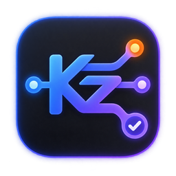
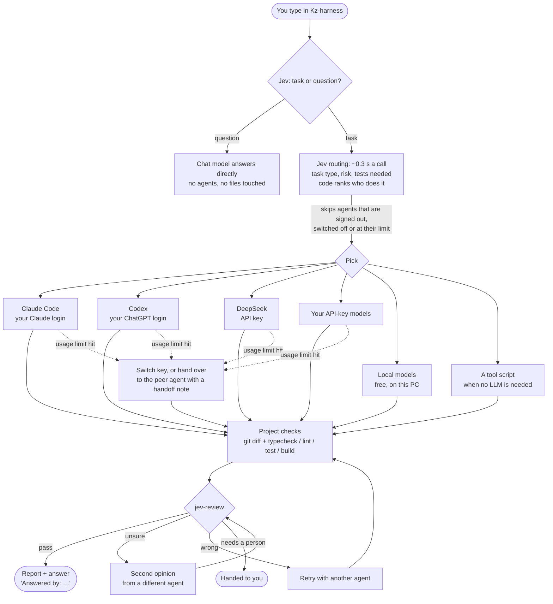
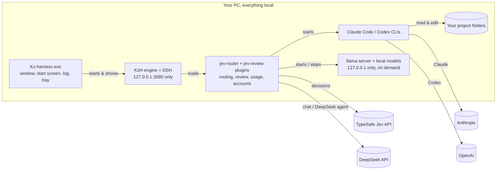

<p align="center"></p>

<h1 align="center">Kz-harness (KzH)</h1>

<p align="center">One desktop app for Claude Code, Codex, DeepSeek and your own API-key models. You type; <a href="https://docs.typesafe.ai/introduction">Jev</a> reads the task and the router picks who handles it, the project's own checks verify the work, and Jev reviews the result before you see it.</p>

---

Kz-harness is a reskin and a set of plugins on top of [DSH](https://www.npmjs.com/package/@deepseek-ai/dsh) (DSH, the engine). It is shared as-is for anyone to use, fork, copy and change; see [License](#license).

## How it works



**In words:**

1. **You type** in the Kz-harness window. The **Jev Auto** model is the default, so every message goes straight to the router, with no chat model in front of it.
2. **Jev sorts it:** is this *work in the project* or *a question*? Questions get a direct answer from a chat model. The **No project** workspace is chat-only.
3. **The router picks who does the work.** Code strikes out first: an agent that is signed out, switched off, out of quota, too small for the task's context, or missing a tool or modality the task needs is never a candidate, and no model is ever asked about it.
   What is left is ranked in code on what it is good at, what a job on it would really cost, and how much of your plan is left.
   Jev is asked what the task is and how to organise the work, not who does it.
   Once a routing domain has been right often enough, on outcomes that were actually verified, its local classifier answers in place of Jev whenever it is confident and the input looks familiar.
   Jev's routing questions are batched into calls, so a call is skipped only when every domain it carries answers locally; see [It learns: adaptive routing](#it-learns-adaptive-routing).
4. **The agent works** inside your project folder. If it hits its usage limit mid-task, an API-key agent switches to your next key; a subscription agent (Claude ↔ Codex) hands the task to its peer, along with a **handoff note** (`.kz-harness/handoff.md`).
5. **Deterministic checks run:** the git diff, plus your project's `typecheck`, `lint`, `test` and `build` scripts. A check that passed before must still pass.
6. **Jev reviews** with small yes/no questions (did it do the task? all of it? anything unrelated? regression risk? does it need a person?). Code decides from those answers: pass, second opinion, retry, or hand it to you.
7. **You get the answer and a report**, ending with who took part, e.g. `Answered by: Jev (jev-1.13.0) → deepseek (deepseek-flash) · claude (opus), reviewer`. The **Jev inspector** shows every decision.

### What runs where



Only the model and API calls you choose go online. KzH switches off DSH's data collection (see [Privacy](#privacy)).

## What you get

- **Kz-harness.exe:** its own window, name and icon, a start screen with a live log, a colored log window (Ctrl+Shift+L), a tray icon, and DevTools on F12. Closing it stops everything it started.
- **Header like Claude desktop:** buttons for **Terminal**, **Background tasks**, **Browser** and **Jev inspector**, plus a **⋮** menu (Files, Usage, focus mode, settings). Every action has a hotkey you can change in **Settings → Shortcuts**.
- **Right sidebar** (opens at 24% width; change it in Settings → Shortcuts):
  - **Jev inspector:** timings, the pick and its reasons, every step with that agent's own answer, and every question Jev was asked with its probabilities.
  - **Overview:** the whole session as one time-ordered ledger: your messages and the assistant's, tool calls, context and compaction, then the routed runs, background tasks and subagents. Filter chips by kind, and every row expands to the inspector's own detail (see [The work board, history and feedback](#the-work-board-history-and-feedback)).
  - **Background tasks:** Jev runs, background jobs and subagents, each with a live timer, output and **Stop**.
  - **Usage:** each account's 5-hour and weekly limits, DeepSeek balance and Jev spend; editable per-account limits; recent runs; and **Saved by Jev (estimate)**, covering money, time and tokens compared with a chat model making the same decisions.
  - **Browser:** a real browser pane, sandboxed in its own session.
  - **Files:** the project's files.
- **Agent chips:** switch agents on and off with one click (only Claude, GPT + DeepSeek, …), or type `/use claude ds`.
- **Accounts** (Settings → Jev setup): log Claude and ChatGPT in and out; keep several DeepSeek, Jev and API-key-model keys; pick the active key. Keys are typed once and never shown again.
- **No project** workspace: plain chat without a project folder.
- **Tools without an LLM:** Jev runs one of your scripts when it fully covers the task.

## Install (new PC)

KzH runs on **any Windows 10/11 PC**, not just the one it was built on. One path is built in: `C:\HarnessProjects`, the default folder for your projects, which the installer creates and the tray menu opens. `Start-KzH.ps1 -Workspace <path>` overrides it. Nothing else hardcodes a machine, a user folder or a drive. It is Windows only, though, and deliberately so. The launcher is a packaged Electron app for `win32-x64`, the installer and starter are PowerShell, and the shortcuts are Desktop and Start menu entries. There is no macOS or Linux build, and none is planned here.

Two things never travel with the repo, by design: your keys (they live in `~/.kzh/.env`, outside the repo) and the local model binaries (`models/` and `engine/` are ignored; only `config/local-models.json` is committed, and the installer downloads from it). A fresh clone therefore needs step 2 and, if you want local models, the `-LocalModels` flag in step 3.

**You need:** Windows 10/11, [Node.js](https://nodejs.org) 22.19+ (24 recommended), [Git](https://git-scm.com), and at least one of:

| Agent | Install | Sign in |
|---|---|---|
| Claude Code | `npm i -g @anthropic-ai/claude-code` | run `claude`, then `/login` |
| Codex | `npm i -g @openai/codex` (or the Codex app) | `codex login`, then Sign in with ChatGPT |
| DeepSeek | nothing | an API key from https://platform.deepseek.com/api_keys |

Also get a Jev key from https://console.typesafe.ai/keys. Without it, KzH still works; it uses a fixed default agent and says so.

**1. Get the code.** The scripts assume `C:\Harness`.

```powershell
git clone https://github.com/kz-95/kz-harness.git C:\Harness
```

**2. Add your keys** to `C:\Users\<you>\.kzh\.env`. It must be in `.kzh`, never in the repo. You can add more keys later in the app.

```
TYPESAFE_API_KEY="your Jev key"
DEEPSEEK_API_KEY="your DeepSeek key"
```

**3. Run the installer.** It is safe to re-run; it only does what is missing.

```powershell
powershell -ExecutionPolicy Bypass -File C:\Harness\scripts\Install-Harness.ps1
```

The installer:
- checks your tools;
- installs the packages;
- installs the engine with the Claude and Codex connectors;
- writes the KzH settings, including the privacy switches, and backs up anything it replaces;
- makes Jev Auto the default model;
- builds **Kz-harness.exe**;
- creates **Kz-harness** shortcuts on the Desktop and in the Start menu;
- lists any keys or CLIs still missing;
- lists the optional local models; it downloads them only with `-LocalModels <ids|all>` (see [Local models & offline](#local-models--offline)).

**4. First start.**

1. Double-click **Kz-harness**. The start screen shows the log; the app opens after about 40 s, most of it the engine loading its plugin bundle, and longer on a first run while it fetches the engine.
2. **Settings → Jev setup:** every agent you use should show a green dot. A red dot tells you what to run; do it, then click **Recheck logins**.
3. Pick a workspace (a project folder) or **No project**, and type.

Start it from the icon. Double-clicking a `.ps1` file opens Notepad on purpose; don't change that. `Start-KzH.cmd` starts the engine in a console and your browser, if you ever need to run it without the app.

## Everyday use

- Type a task (`Fix the bug in the user lookup function and make sure the tests pass.`) or a question (`how does the login flow work?`).
- Force an agent with `/claude …`, `/codex …` or `/deepseek …`. `/auto …` lets Jev choose from any model. `/use claude ds` switches which agents may run.
- The model menu's **Jev** section lists **Jev Auto** and one entry per enabled agent - **Claude Code**, **Codex (GPT)**, **DeepSeek agent**, plus any local or custom agent. Picking an agent sends every message to it with no routing question; the checks, the review and the queue still run. Switching an agent off takes it out of the menu.
- Once you install a local model, three more Jev rows appear, in order from the most off-machine to the least. They all let Jev route; they differ only in how wide the field of agents is.

  | Row | Picks from | Jev call |
  |---|---|---|
  | **Jev Auto** | everything enabled | yes |
  | **Jev Auto · Online** | cloud and subscription agents only, never this PC | yes |
  | **Jev Auto · Local** | the local models on this PC only | yes |
  | **Offline · Local only** | the local models, by a fixed rule | no |

  **Online** is for when you do not want to wait on your own hardware. Being offline, or picking a `local-*` effort on a single message, still overrides it: those say what the machine can do, while Online only says what it should prefer. With no local model installed none of these rows appear, because Jev Auto already has nothing but cloud agents to choose from.
- **Export chat as Markdown** (Ctrl+Alt+M, or the header's ... menu): copy it, or save a `.md`. Tool calls and their output are included, folded into `<details>` blocks; untick that to export just the conversation.
- **Show all transcripts** (top bar, next to the Jev inspector button; rebindable in Settings -> Shortcuts, empty by default): opens or closes every reasoning and tool transcript in the conversation at once, including ones that arrive afterwards. The label and `aria-expanded` follow the state, and the button is disabled when the conversation has none.
- **Effort** (the model menu): `Auto` lets Jev pick from the task's complexity and risk. Picking a level by hand applies to background work only - the conversation stays responsive at every level.
  - **Ultra** gives each background executor its own top mode: Claude Code Opus 5, Sonnet 5 and Fable get `ultracode`; Codex on GPT-5.6 or newer (Astra, Sol, Terra, Luna) gets `ultra`; DeepSeek gets `max`. Local models and registered tools get no synthetic effort - they use their own configured mode. An older or unknown Codex model is capped at what that model actually supports rather than being sent a value it would reject.
- **Final status:**
  - `ACCEPTED` means done.
  - `ANSWERED` means it was a question.
  - `NEEDS HUMAN` means look at it yourself.
  - `STOPPED` means the retry limit was hit.
  - `PAUSED` means every agent is at its limit. The handoff note is saved, and asking to *continue* later picks it up.

## What it costs

With `routing.enabled: false`, Jev is told what each agent costs at the hour it is choosing, and prefers an agent on its cheap rate when the choice is otherwise even.
It is a preference, not a rule: a task that needs a particular agent still goes there.
Under adaptive routing, the default, the ranking in code does not weigh the hour yet: the Usage tab shows which rate is in force, and nothing in the ranking reads it.

DeepSeek bills by the UTC clock, twice the price inside its weekday business hours and at its cheap rate the rest of the time, so every evening and the whole weekend is already cheap. The dear hours are config, not code - `pricing.peak` in the plugin's Config, keyed by agent id:

```yaml
- id: jev-router
  config:
    pricing:
      peak:
        deepseek:
          windowsUtc: [{ fromUtc: '01:00', toUtc: '04:00' }, { fromUtc: '06:00', toUtc: '10:00' }]
          daysUtc: [1, 2, 3, 4, 5]
```

The windows are the **dearer** hours; anything outside them is off-peak. An end at or before the start wraps past midnight, and `daysUtc` is the UTC day, 0 = Sunday, defaulting to Monday to Friday. Check the hours against [DeepSeek's pricing page](https://api-docs.deepseek.com/quick_start/pricing) and edit them there if they move; add an entry for any other agent whose provider charges by time of day. Subscription agents (Claude Code, Codex) are flat-rate, so they have no entry.

## Subscription first

A subscription is free per token but **not** free per percent: its weekly window is the thing
that runs out. So the harness spends the window on the work that needs it, and moves bulk work
to the metered API only once a subscription is far enough through its week.

Past its gate, an agent stops taking **execution** work and stays available for **review**, where
few tokens buy the most judgement. Work prefers another subscription that is still under its own
gate, and only reaches the API agent when every subscription is past one.

```yaml
- id: jev-router
  config:
    policy:
      gateAtPercent:
        default: 80
        claude: 90      # Max
        codex: 80       # Plus
```

**Set this to match your plan**: Claude Pro 80 / Max 90, Codex Plus 80 / Pro 90. It is not
detected for you on purpose. The live usage endpoint reports no plan name, and the cached
credential (`~/.claude/.credentials.json`, `subscriptionType`) lags a plan change, so an upgrade
would keep gating you at the old number and push paid work you did not need to pay for.

Three deliberate choices:

- **Unknown never gates.** On a cold start, or when a usage fetch fails, the weekly percent is
  unknown. Unknown is treated as under the gate. Guessing "over" would send paid traffic every
  cold start; guessing "under" only spends subscription faster, and the existing `stopAtPercent`
  and limit-error paths are still the real ceiling.
- **Evaluated once per run.** Re-reading per attempt costs a usage snapshot each time and could
  land a retry on a different agent than the primary, which means two agents editing one working
  tree. Crossing the gate mid-task is invisible until the next task; crossing the real limit keeps
  its existing handoff behaviour.
- **The window is found by length, not by name.** Both providers label it `weekly` today, but the
  gate reads the longest window (>= 1 day) so a relabelled window cannot silently switch it off.

A forced agent (`/claude`, or picking one in the model menu) is never swapped: an explicit choice
beats the policy. When the gate does move work, the report says so, and the reasoning line reads
`claude is 92% into its weekly window (gate 90%): codex takes the work, claude stays for review`.
The gate moves work only to an agent that can actually do it. When nothing under the gate can (only
the gated agent reads the attached image, say), the gate yields and the report says `Kept claude
despite its weekly gate: nothing ungated can do this request`, because saving a subscription window
is not worth routing a job to an agent that cannot do it.

### When an agent runs out mid-task

Nothing is lost. The harness writes `.kz-harness/handoff.md` from the evidence so far, hands the
task to another agent with that note in its prompt, and carries on.
The replacement for work is the agent's peer (Claude Code and Codex are each other's by default; an agent's own `peer` overrides that) when the peer can do the job and is not itself past its weekly gate.
Otherwise it is the next agent by Jev's ranking that can do the job, preferring one that is not past its gate, and only when every such agent is past its gate does one of them take the work.
A review hand-over follows the same order among the agents no fact rules out, other than the one whose work is under review, and ignores the gate, because judging is what a gated agent is kept for.
If no agent that can take over is left, the run pauses with the handoff saved and asking to *continue* later picks it up.

### API keys get two tiers as well

A metered key is protected the way a subscription is, so it cannot be drained without warning:

```yaml
limits:
  deepseek:
    handoffAtBalance: 10   # soft: work in small steps, keep the handoff current, hand over
    minBalance: 5          # hard: never start
```

In the key's own currency. Below the soft figure the agent behaves exactly as one near a
subscription limit: Jev prefers others, and the agent is told to work in small steps and keep the
handoff updated, so a handover loses nothing. Both are editable per agent in the Usage tab.

## Background tasks

A task you type in a project does **not** hold the chat. Jev queues it, answers with the line

> Queued -> claude as **jev-3** (2nd in line for HarnessProjects). Keep chatting - the result posts here when done.

and you carry on: ask a question, start a task in another project, read the inspector.

When the task finishes, its result is posted into that chat **as its own message**, headed with the task name, its id, the agent, the model and the status - never merged into, and never in front of, whatever the assistant is saying. If an answer is streaming when the task lands, delivery waits for that answer to finish, so nothing interrupts it. A result counts as **unread** until your browser reports that it actually rendered the row, so the badge means "you have not seen this yet"; if the message could not be posted it stays on offer and is retried, and an appended result is never posted twice. Each result is a collapsed `Context injection · jev-router` row, which is the engine's own notice row rather than a bespoke card. That is deliberate: the slot the card needed is keyed, not chained, so taking it replaced the row for every other producer too and flattened five structured bodies. Open the row for the raw text, or the **Overview** tab in the right sidebar to read the same report rendered as Markdown, on a surface KzH owns outright.

- **One at a time per project folder.** Two agents never edit the same folder at once; a second task for the same folder waits its turn.
  Different folders run in parallel, up to the resource budget's **Tasks at once** when one is set (see [Local models & offline](#local-models--offline)).
- **Every state is on the record**: waiting, choosing executor, running, verifying, reviewing, and then completed, failed, stopped, needs input or paused by limit. A completed row gets a check mark and a struck-through title; failed, stopped, needs-input and paused rows keep their own icon, a text label (never colour alone) and the reason.
- **Every terminal outcome reports**, including a task you stopped yourself: its message says `Status: Stopped` and why, because the report is where the explanation lives. Nothing is quietly closed without being shown.
- **A finished result held for display is visible without touching the answer.** If a task settles while an answer is still streaming, its message waits for that answer to end; until it goes out, the top bar's Background button marks it (`N result(s) waiting to be posted`). The active answer is never modified to say so.
- **Interrupted work is reconciled.** If the app closes mid-task, that row comes back as stopped with the reason and the last progress line it had, instead of showing work that can never finish.
- **The task list** is the Jev inspector's **Background** tab (Ctrl+Alt+B). It shows the row's phase, place in line, agent, model, effort, elapsed time, the last router line, and the full report once you open a finished row.
- **Stop** cancels a running or queued task; work already written to the project stays. **Run next** moves a waiting task to the front of its folder's line. **Clear** removes finished rows from the list and the saved log; results already posted in the chat stay.
- Questions, `/auto`, `/claude` and the other forced-agent commands still answer in line, as before - only routed project work is queued.
- Task records are kept in `~/.kzh/jev-router/tasks.jsonl` (the last 100). If the engine has no job service, tasks run in the chat exactly as they did before.

## The work board, history and feedback

These are plugin features (`plugins/jev-router/client.js`), loaded by the engine: a harness restart picks them up, not a rebuilt exe.

- **The work board** is a sticky card at the top of the conversation, per session: this session's background tasks as a checklist. The header reads `N/M completed` and names each non-completed terminal state that occurred (`1 failed`, `2 stopped`, and so on), because only `completed` counts as done. Each row shows its state in words plus the agent, model, effort and elapsed time, and a live row ticks once a second. **Stop all** stops every live task after a confirmation naming them and what is kept; the control is hidden while nothing is live. A session with no tasks renders nothing at all. Every row reuses the Tasks panel's own row model, so the words in the board, the panel and the delivered result cannot drift apart.
- **Composer history:** ArrowUp recalls your previous input, ArrowDown walks forward, and the draft you were typing is restored once you walk past the newest entry. The entries are this session's own user messages (the newest 50), and the arrows work only while the composer is on screen and the caret is on the draft's first or last line.
- **Left sidebar file tree:** a toggle beside the Workspaces search icon opens a VS Code style tree of the open session's project folder. One directory level loads at a time as you expand it (capped at 400 rows); a directory opens and closes, and clicking a file opens it in the right sidebar the same way the shipped Files tab does. The honest limit: it roots at the **open session's** folder, because the engine exposes no independent selected workspace, so it follows the session, not a separately highlighted workspace row.
- **Answer feedback:** every answer carries **Like** and **Dislike**. A verdict can take an optional tag and an optional one-line **Why?**; a dislike also gets a **should have been** picker naming another enabled agent.
  - The routing tags (`wrong agent`, `misread my question`, `wrong scope`, `good pick`) are statements about the pick and may move the pick's probabilities within a bounded bias (weight 0.15, ramped over the first three votes).
    The bias reads the newest verdicts from every session, up to 20 verdicts' worth of weight, each weighted by how well the task type of the run it judged matches the current task: fully for the same type, a quarter for any other.
    A verdict whose run's task type cannot be told counts only in its own session.
    An untagged verdict votes too.
  - The answer-only tags (`not enough detail`, `too slow`, `good answer`) never move a pick; with `routing.enabled: false` their text and tag still ride the routing call as context.
  - With `routing.enabled: false` a written reason reaches the routing call, with its tag in front when one was picked.
    Under adaptive routing, the default, no routing call carries it, so it never leaves this PC.
  - A `should have been` suggestion is stronger and can switch the pick outright, but only to an agent this run could really have used: enabled, capable, not past its weekly gate, and not one the router is conserving for harder work. Clearing a verdict appends a tombstone row, so an earlier verdict is never lost by a clear.
    Typed reasons and suggestions come only from this session.
  - A verdict is also capability evidence about the agent that answered, recorded once, when it is given, for the run its answer came from.
    Every routed answer ends with an invisible run mark and the verdict is sent with it, so it lands on exactly that run, even after newer runs in the session.
    An answer from before the mark falls back to the run an earlier form of the same verdict was credited to, else the last run of the session that had ended when that answer was first judged.
    Changing it replaces what it counted; clearing it, or re-tagging it `too slow`, withdraws it, with learning off too; uninstalling the agent that answered does not.
    The same verdict relabels that run's routing decisions: a `misread my question` teaches the task classifier that run was misread.
  - Verdicts are stored locally, one append-only row each, in `<DSH_HOME>/jev-router/feedback.jsonl` (`~/.kzh/jev-router/feedback.jsonl`). The bias is small and ramped, so a handful of clicks will not change picks: no accuracy improvement is measurable until real verdicts accumulate.

## How Jev decides

Jev is TypeSafe's System One model. It answers typed questions with calibrated probabilities and never writes code. KzH follows the [Jev docs](https://docs.typesafe.ai/introduction): each call batches all its questions, each question is one judgment, and **code** makes the decision. Jev is also the teacher: once a routing domain's local classifier has been right often enough on verified outcomes, it answers that domain's questions itself ([It learns](#it-learns-adaptive-routing)).
Even a mature domain still sends an unconfident or unfamiliar case to Jev.
Questions are asked in whole groups (`decision.js` `GROUP_DOMAINS`): the task type rides with the skill and the rest of the task profile.
The strategy and the second opinion, the one judgment Jev is still asked, are two groups that share the second call, each asked only while its own domain needs Jev.
The frontier review is a rule in code, and conservation is a hard limit, not a judgment.
So a mature domain's question is still asked while another domain in its group needs Jev, and a call is made only when some domain it serves needs Jev: the calls below are what a cold router does, not a fixed price.

- **Before running** (at most two calls, batched): first what the task *is* - its type, complexity, risk, what a resource would need to be good at, whether tests must pass, whether any tool fits exactly (and its arguments), whether it continues an earlier handoff, whether a person should inspect the result, and **what kind of outcome the request needs** (below).
  **Whether a question also asks for work** (below) is not asked here: it rides the separate, earlier call that sorts a message into a question or a task.
  Then, knowing that, how to organise the work across resources and whether a second opinion is worth it.
  **Which resource takes the work is not asked.** Comparing capability against cost against scarcity is arithmetic over numbers, which is the one thing a snap-judgment classifier cannot do, so code ranks the candidates instead.
  Whether the strongest should review the result is a rule in code too, reading the task's risk against the policy's cuts, and keeping easy work off a most capable resource whose allowance is being used up is a hard limit (see [It learns](#it-learns-adaptive-routing)).
  A call is skipped only when every routing domain it serves answers locally for that task: the first serves task classification and skill selection, the second the execution strategy and the second opinion.
  Only small facts are sent, and each call carries only what its questions read.
  The first carries the task, the branch, file-type counts, script and dependency names, up to 30 uncommitted file names, and the first 3000 characters of the folder's handoff note when it has one, which quotes the previous task's answer and so can carry code from it.
  The second carries the task, plus the task profile's numbers when it asks the strategy question, and nothing about the candidates, other tasks or past runs.
  Whole source files are never sent.
  With `routing.enabled: false` the older single call is made instead, and it names the agents and carries their history and track record (see [Privacy](#privacy)).
- **After each attempt** (one call per attempt, over the diff, the checks and the latest answer, so a run with a retry or a second review makes more than one; a plan step, an attempt stopped by a usage limit, a reviewer that failed and a plain question get none): addressed, complete, unrelated changes, regression risk, needs a person, and which agent should review or fix next.
  Under adaptive routing those two picks are made over an anonymous candidate table that rides this call and no other: the run's candidates and every other agent the router may hand the job to, each under its own key, with why it is out when it is not a candidate for the work.
  The key Jev chooses is turned back into an agent in code.

### One message can do both

A message is not forced to be either a question or a task. Ask *"what does the parser do, and also fix the typo in it?"* and Jev answers the question now while queueing the fix behind it, in the same message:

```text
<the answer>
Queued -> codex as jev-7 (starting now in Harness). Keep chatting - the result posts here when done.
```

The two judgments are asked separately (is this a question to answer, and does it also ask for work), because one choice between them could not express a message that is both. Work is only queued when Jev is at least 0.7 sure the message really asks for it: a wrong guess costs a background run of something you only asked about.

### What the request needs (capabilities)

Every executor on this machine declares what it can do, and **code decides who is capable before Jev is asked**.
Code then ranks those candidates and picks one, and checks the pick afterwards against what the task needs.
An agent excluded by `routing.disabledResources` or `allowedResources` counts as unavailable here too, so it is never offered as able, and a `LOCAL_FIRST` strategy's local step is dropped for the pick when it cannot do what Jev named.
Every move the router makes of its own (the capability swap, the tie-break, the weekly-gate swap, feedback, a retry, the `LOCAL_FIRST` hand-over) goes only to an agent that can do the job.
A capability outranks conservation and the weekly gate, so when only a conserved or gated agent can do it, that agent takes the work.
Jev is offered only the capabilities some agent in the run can carry out, so it cannot name one nobody here has: in **Jev Auto · Local** a look-up (`web_research`) is classified as something a local model can do and runs on it, rather than being refused.
This is what lets non-code work be routed at all: the old question was only "question or coding task", which has nowhere to put OCR, a document or a look-up.

| Capability | Example | Preferred path |
|---|---|---|
| `quick_answer` | Greeting or a short factual answer | fastest capable local chat model |
| `reasoned_answer` | A multi-step explanation | a model that declares reasoning, local first |
| `ocr` | Text in an image or scan | an image-capable executor, never a text-only one |
| `image_inspection` | Describe or check an image | an executor that really reads images |
| `document_processing` | Read or transform a PDF or spreadsheet | an executor that accepts the file |
| `web_research` | Current information with sources | an executor with the network |
| `deterministic_tool` | An exact conversion a script does | the registered script, ahead of any model |
| `project_read` | Explain how the repo behaves | a read-only project agent |
| `project_change` | Implement or fix something | a mutating agent, with checks and review |
| `human_required` | A missing permission or a choice only you can make | the request stops and asks you |

Nothing is delegated that code can settle: availability, sign-in, limits, modality support, write permission, input size, price and arithmetic stay in code. A request whose input, file changes or size nothing here can handle says so instead of running anyway, and `human_required` stops the run rather than letting an agent guess at an answer it is not allowed to give. A capability below its confidence threshold still runs normally, and picking an agent by hand always wins.

### It learns: adaptive routing

Jev starts as the teacher, not the permanent decision maker.
Every routing decision and every verified outcome is recorded, and each of the seven **routing domains** (task classification, skill selection, resource selection, execution strategy, second opinion, frontier escalation and outcome disposition) can earn the right to decide for itself once it has been right often enough, except resource selection, whose ranking in code decides at every rung.
Two of them, resource selection and frontier escalation, never ask Jev: a rule in code decides them wherever their local classifier does not.
Full reference: [`docs/adaptive-routing.md`](docs/adaptive-routing.md).

- **No kind of work is assigned to a provider in code.** There is no "frontend goes to Claude" rule and no "architecture goes to GPT" rule. What each model family is believed to be good at lives in [`config/capability-priors.json`](config/capability-priors.json) as scores with a confidence on each, per dimension (coding, first-pass quality, code review, security review, system design, explanation, reliability, and so on).
  Speed and cost are not priors and the file refuses them: the governor reads a latency class from whether a resource is local, an API or a subscription, and a cost from its funding and how scarce its quota is.
  They are **evidence, not rules**: every run this harness verifies is more evidence, and a family that keeps failing a dimension loses it, whatever the file says.
  Add a provider by adding a row.
  A few things are still decided by name: a `claude-code` or `codex` provider makes an agent a subscription (cost routing reads only the billing kind that follows), which failure text counts as a usage limit, and which agents can take an attached image; at a usage limit the agents with ids `claude` and `codex` hand over to each other by default, unless an agent sets its own `peer`.
  [`docs/adaptive-routing.md`](docs/adaptive-routing.md) lists where.
  The capability benchmark (below) adds benchmark evidence to the priors and this harness's own runs, for every agent that finishes all its tasks.
  A whole run weighs on a dimension as three observations at 0.7 of a run's own checks, 1.89 when fresh against 4.8 for an owner prior at confidence 0.6, so it moves a prior only as far as a few observations can.
  Only the newest run per model and benchmark counts, a model known only by a name stops counting a run after 45 days, and a benchmark alone leaves a model new (cold).
  Benchmark rows are not runs: the Router tab shows them as the benchmark's pass rate, `benchmark 75% (9 of 12 tasks)`, and they are never counted as verified runs or observations.
- **The classifier never sees a brand in the candidate table.**
  Candidates reach it, and reach Jev in the review call, as `RESOURCE_A`, `RESOURCE_B`, described only by their measured numbers - so what it learns is "the one that is strong at review and has quota left", never "the one called Claude".
  A new model is a new candidate, not a new code path.
  The task text, the handoff note and, at review, the answer and the diff are not anonymised, so a name that appears in the work itself still reaches Jev.
- **Quota is read per provider and normalised.** Each provider's adapter keeps its own semantics (a rolling 5-hour window, a weekly window, a prepaid balance, nothing at all) and reports one shape: used, remaining, ratio, when it resets, and where each number came from.
  A figure worked out rather than measured carries its own source and a lower confidence: DeepSeek reports only the balance, so its share spent is labelled an estimate and weighed as one.
  The measured balance, read against the floors you set, is the floor of the reading: an estimate that says less was spent is ignored, and one that says more raises the reading only as far as it is trusted, so a guess can make a shortage look worse, never better.
  The inspector's Router tab shows each figure with its own source and confidence, so the estimated share reads as an estimate.
- **The governor spends the plan on purpose.** It knows how close a window is to resetting, so 88% used with twenty minutes to go is not the same emergency as 88% used on a Monday, and it prices a job as what it will really cost - the attempt, the likely retry, the review and the chance of escalation - before choosing. Subscription first, but not subscription-wasteful: with the default weights a subscription stops looking cheaper than an unpressured metered key at 65% of its binding limit (60% on a Pro or Plus plan, 74% on Max or Team).
- **The skill decision and the conservation limit act.** The skill the work mainly calls for is written into the worker's instructions (and the planner's, when a strategy plans first) and shown in the report as `Skill:`.
  Conservation is a hard limit in code, not a judgment.
  It moves easy work (complexity under 0.5 and risk under `riskForReview`) off the most capable resource when the governor reads that resource's allowance as being used up, and another resource whose known tier meets the task's floor exists.
  The work moves to that resource; the router's own tie-break, feedback and weekly-gate swaps do not hand it back, the conserved resource stays available to review, and the report says `Work kept off <id> to conserve it for harder work; it stays available to review`.
  A local resource, one with no marginal cost, and one on an allowance the governor calls healthy (unknown usage included) are never conserved.
  And a capability is a hard fact, so when only the conserved resource can do what the task needs, it does the work anyway.
- **Model versions are real only for local models.** A local model's record is keyed by the SHA-256 of its weights. Claude Code, Codex and API models report no version they served, so they are keyed by model name, and a silent upgrade behind the same name inherits the old record for at most 45 days.
- **Earning it is slow and losing it is fast.** A domain climbs `JEV_PRIMARY → SHADOW → GUARDED_LOCAL → LOCAL_ONLY`, never skipping a rung.
  Every rung needs a minimum number of verified samples, and SHADOW needs only that and a trained classifier.
  GUARDED_LOCAL and LOCAL_ONLY also need holdout and recent accuracy and macro F1 above a floor, recall on every significant class above a floor, calibration error under a ceiling, and almost no confident mistakes.
  LOCAL_ONLY also needs a minimum share of outcome-backed labels (proved by a run or a person, not the teacher agreeing with itself), a minimum holdout size and enough samples in every significant class. Anything high-risk needs far more of all of it. One critical failure, a drift in what tasks look like, a task unlike anything it was trained on, or a plain accuracy regression pulls the privilege back to a lower rung or all the way to Jev, and re-earning it needs new evidence plus two good windows in a row.
- **Facts are never voted on.** Availability, sign-in, exhausted quota, context length, a missing tool or modality, and admin switches are filtered in code before any classifier or any Jev call sees the field. A confident model cannot route a task to an agent that is signed out.
- **Watch it.** The inspector's **Router** tab shows every domain, its state, how many samples it has, what it is still waiting on, and what pulled it back if something did; a domain a rule in code decides says so at its rung.
  Each run says who was picked, every move the router made after that and where it went, and when the weekly gate yielded.
  `node scripts/kzh-routing-demo.mjs --learn 60` runs the whole thing headless and prints the same picture.

Turn it off with `routing.enabled: false` (the router asks Jev the way it always did, over named agents), or keep the routing and stop the learning with `routing.learn: false`. With routing off, Jev picks agents from their `description`, and the default descriptions now say only what each agent is and how it is paid for (a local model's: which model, on this PC, free, private, offline), so on defaults that legacy pick has little but cost and the track record to go on. If you route that way, write your own descriptions.

### Capability benchmark

The **Capability benchmark** card in the Jev inspector's Router tab measures what each agent you pick can do, on 27 fixed small Node.js tasks in nine skills (implementation, debugging, refactor, testing, review, security, performance, simple change and investigation), three levels each, after a one-file first task that shows the agent can run a command in its folder.
Each agent runs forced, at high effort (Codex at normal speed) whatever Settings say, with one attempt and no review, one task at a time, each task in a new folder that is deleted once it is graded.
A task is graded by code only, never by a model: by checks the agent never sees, by planted mutants its own tests must catch, by planted defects its review must find, or by a fixed answer.
It does not measure architecture, documentation, frontend, backend, database, tool use or vision, which keep their priors, nor long context: a task that does not fit the window KzH gives a local model is not run and records nothing for that model ([`docs/benchmark.md`](docs/benchmark.md) 3.9), since the window is KzH's setting and not the model, and a local model whose window cannot hold even the first task cannot be picked.
A pass rate over three tasks per skill is not a precise figure, and the card says so under its results.
It runs only from a chat in the KzH scratch workspace, `kzh-scratch` beside the harness folder (`C:\kzh-scratch` for `C:\Harness`), which `Start-KzH.ps1` adds to the project list as **KzH scratch**, and never inside a git repository; a normal task sent there is refused.
It spends real usage, which the Usage tab marks `benchmark` and leaves out of Saved by Jev and of the estimates of your own runs.
Nothing runs until you confirm, and the confirmation says what each agent would spend as far as KzH has measured it (its last benchmark's spend, else the tokens and time of its runs on your work), says when that is not known, and never invents a price.
A confirmation starts one run at most, within 30 minutes of being shown; after that, or once it has started one, the card asks you to review the plan again.
Every agent that finishes all its tasks records `source: benchmark` rows in `capability-evidence.jsonl`, unless learning is off; **Stop** asks first, and an agent that did not finish records nothing.
It is built and tested with stub agents only, and has not yet run with real ones.
The design and every line it writes are in [`docs/benchmark.md`](docs/benchmark.md) section 3.

### After the run

| Situation | Action |
|---|---|
| The agent failed, a passing check now fails, or required checks fail | retry (never accepted) |
| "needs a person" ≥ 0.6 | human |
| quality ≥ the accept bar | accept (a second opinion first when routing asked for one: the second-opinion routing decision, whether or not code changed; with no routing decision, `thresholds.secondOpinion` on changed code) |
| quality ≤ 0.3 | retry with another agent |
| in between | second opinion, then human |

- **Quality:** `min(addressed, complete, 1 − unrelated changes, 1 − regression risk)`.
- **Accept bar:** scales with the task's risk: 0.55 (risk < 0.25), 0.70 (< 0.6), 0.85 above that.
- **Limits:** 3 attempts, 2 reviews, 5 rounds.
- **Model:** Jev is pinned to `jev-1.13.0`, so the thresholds keep their meaning.
- **Parallel second opinion:** when a strategy has a second resource answer the same request alongside the first, the report compares the two answers word by word, in any script and with short numbers counted, and says whether they agree (a word comparison, not a judgment), that a side sent nothing back, or that both answered but could not be compared. It also says whose answer is shown: the last attempt that answered, and the second opinion only when nothing else did.

## Usage limits and handoff

- **Where the numbers come from:**
  - Claude: its 5-hour and weekly limits.
  - Codex: its 5-hour and weekly limits.
  - DeepSeek: the balance for each key.
  - Jev: counted locally at $0.042 per million input tokens.
- **Your limits, per account** (Usage tab):
  - **handoff at** (default 85%): agents are told to work in small steps and keep the handoff note updated.
  - **stop at** (default 97%): no new tasks go to that account.
  - For API keys, a **minimum balance** plays the same role.
- **A real limit error always counts.** API keys rotate to your next key; subscriptions hand the task to their peer agent. With no agent left, the run pauses with the note saved.
- **Local models** have no quota and no key: the Usage tab shows them as *free, local*.

## Local models & offline

KzH can run open models on your own PC with [llama.cpp](https://github.com/ggml-org/llama.cpp)'s `llama-server`. The jev-router plugin starts it on demand on **127.0.0.1 only**, with a new random API key each start (so other programs on the PC can't use it), and stops it after 10 idle minutes (Settings) and when KzH closes. Nothing is installed by default.

**Install:** type `/install-llm` in any chat.
A picker checks this PC (GPU and VRAM, NVIDIA driver, RAM, CPU, free disk), rates every model (*runs fully on GPU*, *splits GPU + CPU* with a speed estimate, *CPU only*, or *won't fit*; on a GPU whose memory Windows reports only as "4 GB or more", a model too big for 4 GB is rated with a speed range instead of a made-up size) and preselects its suggestions: official and stable releases that were tested with this engine first, then what runs at a usable speed, then quality.
Once an installed model has a speed reading that stands for its next load (the speed benchmark, below), the picker and `/install-llm` show its figure as measured, for example `Splits GPU + CPU (29 of 37 layers on the GPU): 8.4 tokens/s measured on this PC on 25 Sep, 8,192 tokens into a conversation (about 6 words/s)`, and every other figure keeps `est.`.
It installs the matching engine build first (CUDA 12 or 13 by driver version, Vulkan for other GPUs, CPU otherwise).
`/remove-llm` opens the same list for removal, behind a confirmation that names every file and its size.
Typed forms work too: `/install-llm qwen3-8b`, `/install-llm all`, `/remove-llm qwen3-8b confirm`.
The installer can do it as well: `Install-Harness.ps1 -LocalModels qwen3-8b,gemma4-e4b` (or `all`).
Every file comes from the model's own organization (or llama.cpp's own GitHub releases), resumes if interrupted, and must match the size and SHA256 in the manifest.

**What is there now** ([`config/local-models.json`](config/local-models.json)):

| Module | Agent | On a 4 GB GPU (RTX 3050 Laptop, 24 GB RAM) |
|---|---|---|
| Qwen3 8B, Q4_K_M, `Qwen/Qwen3-8B-GGUF` (4.7 GB) | `qwen-local` | 18 of 37 layers on the GPU, ~8 tokens/s; best local tool calling |
| Gemma 4 E4B, QAT Q4_0, `google/gemma-4-E4B-it-qat-q4_0-gguf` (4.8 GB) | `gemma-local` | all 43 layers on the GPU, ~47 tokens/s |
| Gemma 4 E4B vision add-on (0.9 GB, optional) | `gemma-local` reads images | runs on the CPU (not tested yet) |

**What they do:** once a model is installed, its agent appears in Jev setup and switches on.
It is a candidate like any other agent: under adaptive routing it competes on its capability priors (the `local-small` family in `config/capability-priors.json`) and its own record, with no marginal cost and nothing to conserve; with `routing.enabled: false` Jev reads its description, which says only what it is: the model and its quantisation, running on this PC through llama.cpp, free, private and working offline.
The installed model also answers direct questions when DeepSeek fails (before an agent is asked), and it shows in the model picker as *Local (llama.cpp)*.
Thinking is off and the context is 16,384 tokens (12,288 on PCs with less than 12 GB RAM), so a local agent's run can hit the context limit on big tasks.
A RAM budget may size it down further, to 12,288 at least (below).

**Resource budget** (Settings → Jev setup → Local models, the **Resource budget** table): how much of this PC KzH may use.
There are four limits, **VRAM** (GB), **RAM** (GB), **Cores** and **Tasks at once**, and a blank field is no limit.
Each row shows the budget, what is in use **Now**, and the **Estimated peak** of the next load, and a field saves when it loses focus.
For **Tasks at once**, Now is how many agent runs hold a slot, across every workspace (`0` when nothing runs), with `N waiting` beside it when a cap is set and runs wait for a free slot; lowering the cap stops no run already going, so Now can be above it for a while.
A decimal comma is read as a point only with one or two digits after it, so `4,096` is refused rather than read as 4.096.

- **VRAM** is held by llama.cpp's `--fit-target`, which keeps free everything the GPU has beyond the budget, so the layers that do not fit run from RAM.
  It cannot be held with GPU layers pinned by hand, or on a GPU whose size is unknown or read through the 32-bit field that stops at 4 GB, and then the page says `VRAM budget not applied`.
- **Cores** sets llama-server's `-t`, capped at the logical processors this PC has.
  Left blank, it leaves the rest of the PC at least a quarter of its cores, and at least two from three cores up: `max(1, min(n - 2, floor(3n / 4)))` threads, where n is the physical core count, or half the logical processors when that is unknown.
- **Tasks at once** counts every agent run across every workspace, a foreground `/auto`, `/<agent>` or `jev_route` run as much as a background task, and a workspace still runs one task at a time.
  A run that has to wait says why, in its task row, in a foreground run's live lines and in the log: `Waiting: another task is running in this workspace` or `Waiting for a free slot: the resource budget caps how many tasks run at once`.
- **RAM is not a hard cap**: nothing KzH can use stops a process's memory from growing.
  The context is sized down first: a model starts with the largest context, in whole k down to 12,288, whose memory figure fits the RAM budget, and the page says `The budget reduced its context from <X> to <Y>, the largest that fits it.`
  Only a model over the budget even at that 12k floor is refused before it loads, with the figure and the budget named.
  A model already loaded is not restarted when the budget changes; its context follows the budget once it unloads.
  A watchdog reads the loaded model's working set every 5 seconds and unloads it once it has stayed over the budget for 30 seconds.
  Its next load is sized below the context it was unloaded at, and it is refused only when no smaller context is left, until the RAM budget, the VRAM budget or the GPU layers setting is saved with a different value.
  The figure is measured once a run with the same GPU room and layers has reported it, estimated until then, and the page says which; each model's memory line gives the day a measured figure was taken, `(measured on 25 Sep)`.
  The app window and its browser view are never capped and are not in the figures, so leave room for them.

A model the budget refuses shows an **over budget** pill with the refusal word for word and reads `(over budget)` in the model pickers; it cannot be picked as the chat model, and with no model left that fits, the chat model select says `None fits the budget`.
A context below 12k (12,288 tokens) gets a warning, because the system prompt and the tool list take about 8.6k tokens, and below roughly 12k a local model stops mid-chat with a context-exceeded error that looks like a fault in the model.

**Speed benchmark** (Settings → Jev setup → Local models; built and tested against a fake llama-server only, not yet run against the real one): **Benchmark** on a model's row measures that model, and **Benchmark all** in the card's head measures every installed chat model, one after another.
Each is loaded afresh at the context its runs get, llama-server reads an 8,192-token prompt, about the size of an agent's first call, and 128 generated tokens after it are timed three times with llama-server's own timings.
The median generation speed and the prompt reading speed are kept in `local.json` under `speed`, per model and context, beside the memory reading of the same load, and the model loaded before is loaded again after.
A speed run is free and asks for no confirmation.
It is refused while a local model answers, a local agent works on a task, Laya answers a call, or a capability benchmark still has a local agent's task to run; a capability benchmark with a local agent picked is refused while it runs.
It skips a model this PC or the budget cannot run, one whose context is below 8,321 tokens, and one beside which Laya was loaded or unloaded during its measurement, each with the reason, and records nothing for it.
It holds local agents back until it ends, and their runs say `Waiting for the speed benchmark to finish (<model>, <k> of <n>).`; the wait counts neither against the task's time limit (`agentTimeoutMs`, 20 minutes by default) nor into its attempt's recorded time, which keeps it apart as `waitedMs`.
**Cancel** stops it and keeps the readings already taken; once every model is measured and the run is putting the engine back as it was, Cancel is disabled and says why, since that restore must run.
A speed reading stands only for a load of the same weights (the manifest's SHA-256 of the model's file) with the same context, GPU room, GPU layers setting, thread count, engine build and depth, and the same Laya beside it: the one resident when the model loaded, held or not, against a held one now, since a Laya nothing holds gives way when a model loads.
When one of them changes, the model's speed line on the card says which, asks for a new run, and gives the estimate for the next load until then.
Each installed model's row on the card has a speed line: the measured speeds with the day, the GPU split and the threads, or why the reading does not stand, or the estimate.
It does not measure generation deeper than 8,192 tokens, prompt reading with a warm cache, speed while another program uses the GPU, cloud agents, Laya, or models that are not installed.
The design and every line it writes are in [`docs/benchmark.md`](docs/benchmark.md) section 2.

**Offline:** KzH checks `api.typesafe.ai` (2.5 s timeout, cached 30 s). When it does not answer:
- only local agents can run; Jev is not asked;
- questions (a question mark or a question word) go to the local chat model; tasks go to `qwen-local`, else `gemma-local`;
- the review uses the checks only (the git diff and your project's scripts);
- the report says **OFFLINE: local models only**.

Claude Code, Codex, DeepSeek and API-key models need the internet and are skipped.

**Add another model** by adding an entry to `config/local-models.json` (then `/install-llm` offers it):

| Field | Meaning |
|---|---|
| `id`, `name` | Short id (lowercase) and display name |
| `kind` | `model`, `vision` (a `--mmproj` add-on; `for` names its model) or `engine` (`variant`: `cuda12`, `cuda13`, `vulkan`, `cpu`; `minCuda` for CUDA builds) |
| `source`, `file`, `size`, `sha256` | Official download URL (`https://huggingface.co/<org>/<repo>/resolve/main/<file>` from the model's **own** organization, or a llama.cpp GitHub release asset), file name, bytes, and SHA256 (Hugging Face: `lfs.oid` from `/api/models/<repo>/tree/main`; GitHub: the asset `digest`) |
| `license`, `notes` | Shown in the picker |
| `reliability`, `verified`, `verifiedOn` | `official-stable`, `official-preview` or `community`; `verified: true` only after it ran here with tool calls working. Only `official-stable` + verified modules are suggested |
| `role`, `rank`, `hfRepo` | `best-quality`, `fast` or `vision-addon`; lower rank = better quality; Hugging Face repo for the download-count tie-breaker |
| `minVramGB`, `recommendedVramGB`, `minRamGB` | Fit hints: `recommendedVramGB` = VRAM to run fully on the GPU (plus ~0.8 GB for the desktop), `minRamGB` = below this it won't fit |
| `chatTemplate`, `contextSize`, `maxContext`, `gpuLayers` | Template note (the GGUF's own, with `--jinja`), default and maximum context, `auto` or a number of GPU layers |
| `agent` | `{ id, description }`: the router agent this model backs. Say what it is, not what it is good at. With `routing.enabled: false` the description is what Jev reads when choosing; adaptive routing shows it to Jev only for the review and retry picks of a run with no decision record (a forced agent, or a run whose decision engine fell back) |

Only add GGUF files published by the model's own organization; if there is none, don't add a random uploader's copy.

## Laya Auto: a decision model on this PC

[Laya](https://github.com/NandhaKishorM/laya) is an open decision model (Apache-2.0) that answers the same kind of typed questions as Jev, and runs on this PC.
KzH runs its official server, `python -m laya.serve` (PyPI `laya` 0.3.20, the English checkpoint), in a Python sidecar on **127.0.0.1 only**, with a new random key each start, supervised by the jev-router plugin beside llama-server and never inside it.
Nothing is installed by default. Install it from **Settings → Jev setup → Laya decision model → Install Laya…** (GPU or CPU), or with `Install-Harness.ps1 -Laya`; it downloads Python, PyTorch, Laya and its model once and then works offline.
The design, with every string and number, is [`docs/laya-auto.md`](docs/laya-auto.md).

It is used three ways:

- **Laya Auto**, a row in the model picker right after Jev Auto, offered once Laya is installed, switched on (`laya.enabled`), its settings are valid and adaptive routing is on.
  Laya answers every question Jev would be asked (task or question, the routing calls and every review), and **no Jev call is made**; offline it keeps routing, to the local models.
  The agent it picks still sees your task and code, and a question is answered by the chat model as in Jev Auto.
  The code-taught domains (the resource ranking, the frontier review) stay with their rules, exactly as in Jev Auto.
- **The comparison in Jev Auto** (`Answer beside Jev in Jev Auto` on the card, on by default): while Laya is running, it answers the same questions as Jev in the background, and both answers are recorded side by side.
  The inspector's **Decisions** tab shows Laya's answer beside each of Jev's, and the **Router** tab has `Jev and Laya, side by side`.
  It never delays a Jev Auto run, never starts Laya and never keeps it loaded: when Laya is busy, starting, not running or giving its memory to a local model, that comparison is skipped and counted.
- **`/laya <task>`** sends one task to Laya from any session, a Jev Auto one included.

What a Laya Auto run shows: the heading `**Laya router** · AUTO (Laya and routing rules decided)`, lines such as `Laya route: 20/20 questions in 950 ms on the GPU` and `Starting Laya on this PC: loading the model on the GPU (12 s)…`, and, where Laya's answer was too flat to act on, which fields the routing rules filled.
Laya is zero-shot on KzH's questions and ships over-confident, so its bars are its own and lean toward the error that is cheaper to recover from (a higher accept bar, checks always required; the table is `docs/laya-auto.md` 2.6), its confidence is read as its top probability, and an answer too flat to mean anything is filled by the rules and said so.
The card's **Test Laya** runs fixed calls through Laya and shows the timings on this PC and which yes/no questions separate a clear yes from a clear no.

**When Laya cannot be asked, Laya Auto refuses and never switches to Jev.**
Not installed, switched off, invalid settings, adaptive routing off, stopped after an error, or still starting after 300 s: the reply says which, ends `Nothing was run.`, and points at the card.
Laya's pinned versions (`config/laya.json`, a harness file) that cannot be read are said as such, with `run Update-Harness.ps1`, since no setting puts them back.
A stopped Laya is started by the next Laya Auto message, which waits with the `Starting Laya` line.
Once a run has started, one Laya call that does not answer falls to the rules, and the report says `Laya did not answer: ...`.

**What Laya decides is kept apart from what KzH learns from Jev.**
A Laya-decided run writes its samples to `laya-samples.jsonl`, never to `routing-samples.jsonl`, which refuses a Laya row; no local classifier reads Laya's samples; a Laya run changes no routing domain's state; its capability evidence is only whether each attempt completed; and a verdict on a Laya-decided run relabels Laya's samples only.
Laya's calls are usage rows at $0, and "Saved by Jev" and Jev's spend never count them.

**Memory.** Laya takes about 2.5 GB of GPU memory or 3.3 GB of RAM while loaded, and counts in the resource budget's RAM beside the local model.
It stops after 30 idle minutes (`Unload after idle`), and a Laya that nothing holds gives its memory up when a local model starts.
`Keep Laya loaded` holds it, and so does an open Laya Auto run; `Start Laya when KzH starts` loads it in the background at start. Both switches are off by default.
Device is Auto (the GPU when it has room), GPU or CPU.

**Configuration** is a `laya` block in the jev-router row (below). A bad value there takes only Laya out: Laya Auto leaves the picker, the comparison stops, the card says what is wrong, and Jev Auto runs on.

## Updating

**Kz-harness → Check for updates…** pulls new KzH code (fast-forward only) and refreshes packages. If the desktop app itself changed, close it and run the installer again to rebuild the exe.

The engine (DSH) is **pinned** in `Start-KzH.ps1` and does not need updates: it runs locally, and starts never contact the npm registry. Only update it if Claude Code or Codex change in a way the pinned connectors can't follow, or for a security fix:

```powershell
powershell -ExecutionPolicy Bypass -File C:\Harness\scripts\Update-Harness.ps1 -BumpDsh
```

If that breaks startup, `git checkout Start-KzH.ps1` goes back.

## Branding

The app, the tab title and the text injected into every prompt say **Kz-harness**, not "DeepSeek Harness" or "DSH". `scripts/patch-dsh-branding.mjs` rewrites that wording in the thirteen installed engine files whose text a person or a model actually sees (system prompt, sandbox-policy line, Web GUI note, product title, tab title, local-build badge, Settings blurb). `Start-KzH.ps1` runs it on every start, because npx reinstalls those packages when the pinned version changes; it is a no-op once applied and only warns if a file is gone.

Names that are not wording stay as they are, because changing them would break the install: the `@deepseek-ai/*` package names, the `dsh` CLI, the `DSH_HOME` variable, the `deepseek` provider id and `DEEPSEEK_API_KEY`. Source comments that describe how the engine works keep calling it DSH, since that is what it is.

The data folder **did** move. `Start-KzH.ps1` sets `DSH_HOME` to `~/.kzh`, so keys, chats, settings and the installed profile live there instead of the engine's default `~/.dsh`. Every script here reads `DSH_HOME`, and the launcher is the only thing that starts the engine (the desktop app runs it too), so the one line covers every way in. An engine started by hand without `DSH_HOME` still defaults to `~/.dsh` and would look empty.

## API keys

A key's value lives in **exactly one place: `~/.kzh/.env`**. Everything else refers to it by variable name, so there is never a second copy to find, rotate or leak.

```ini
# ~/.kzh/.env
DEEPSEEK_API_KEY=sk-...        # the DeepSeek agent, the chat model and the balance check
TYPESAFE_API_KEY=tsk_...       # Jev, the router's judgment model
KZ_KEY__deepseek__default=sk-...   # the named key the Accounts UI switches between
```

`DEEPSEEK_API_KEY` is the key in use. `KZ_KEY__<provider>__<name>` is one stored key you can switch to; activating it in **Settings -> Jev setup -> Accounts** copies it over `DEEPSEEK_API_KEY`. Adding a key through that screen writes both lines for you, so hand-editing is only needed when you would rather not paste a secret into a browser field.

**The harness restarts to pick up a key.** `.env` is read once at launch, so after editing it, or after switching the active key, use the menu's **Restart harness**. The Accounts screen says so too.

Nothing writes a key anywhere else. In particular the engine's own credential store (`~/.kzh/.credentials.yaml`) is *cleared* rather than written, because a value there would take precedence over `.env` and you would be editing a file the app ignores. Keys are masked in the harness log, and the Markdown export redacts anything key-shaped before it leaves the app.

To remove a key: delete its lines from `~/.kzh/.env` and restart. `~/.kzh/jev-router/accounts.json` keeps only names and dates, never values.

Claude Code and Codex do not use keys at all: they sign in with your own accounts, stored in `~/.claude` and `~/.codex`.

## Privacy

KzH has no telemetry of its own: there is no KzH endpoint and nothing here phones home.
That is not the same as "little leaves this machine".
The work itself goes out: your prompts and code go to whichever model you pick, and **every message you type also goes to TypeSafe**, so the router can classify it, along with the task text, a slice of your real `git diff` when a run is reviewed, the agent's own answer to that task (first 2500 characters), your project's check output (test, lint, typecheck and build stdout, which prints whatever the run had in its environment), and the folder's handoff note (`.kz-harness/handoff.md`) on the routing call that asks what the task is, once one exists, which quotes the previous task's answer verbatim and so routinely carries code from an earlier, unrelated task.
What that means in full is the list below.

What was switched off is genuinely off, not just asked to be off: the DSH data features below were audited in the running app, and no hidden telemetry was found anywhere else. They are turned off in `config/cordis.patch.yml` and `Start-KzH.ps1`:

| Switched off | What it did |
|---|---|
| `session-telemetry-otel` + `DSH_TELEMETRY_DISABLED=1` | Uploaded the whole conversation to DeepSeek's telemetry server when you clicked 👍/👎 or used `/feedback` |
| `plugin-package-inventory-deepseek` | Sent the list of installed plugins with every DeepSeek request |
| `session-log-deepseek` | Session-log upload with DeepSeek requests (off by default; pinned off) |
| `client-hmr` | Developer reload channel |
| `ui-message-feedback`, `message-feedback`, `command-feedback` | The engine's own 👍/👎 buttons, the feedback dialog and `/feedback` (the feed for the telemetry upload above). KzH's own Like/Dislike is a separate plugin control, stored locally (see [The work board, history and feedback](#the-work-board-history-and-feedback)) |
| `llm-deepseek` (official DeepSeek connector) | Sent an anonymous installation ID (`x-deepseek-harness-user-id`, from `~/.kzh/.anonymous-user-id`), the session ID and a compaction flag with every DeepSeek request |
| `CLAUDE_CODE_DISABLE_NONESSENTIAL_TRAFFIC=1` | Claude Code telemetry and error reporting in KzH runs |
| `skill-badge` | Bundled `dsh-badge` skill that told the model to add a "powered by dsh" badge to pull requests and documents |

What stays:
- The engine listens on **127.0.0.1 only**: nothing outside this PC can reach it. Whether it also demands a login token was not verified, so assume any program running on this PC can talk to it.
- The app refuses debug ports and inspectors unless started with `KZH_DEBUG=1`. The exe's Electron "fuses" block Node mode, `NODE_OPTIONS` and `--inspect`.
- The harness page gets no camera, microphone or notifications.
- Keys and tokens are masked in logs, in the Markdown export, and in everything sent to Jev.
  Every text the router cuts before sending it is scrubbed first, so a key the cut would split cannot go out as an unrecognisable piece: the handoff note before its 3000-character cut, an executor's thrown error before its 300-character cut, check output before its tail is taken, and a harness-written handoff note's last-answer and earlier-note excerpts before their 2000-character cuts.
  One exception is known: a configured tool's output is cut first (its answer to the last 8000 characters, its diagnostic to the last 500) and scrubbed after, so a key straddling that cut can reach the review call as a fragment.
  Check output is scrubbed where it is read (`workspace.js` `runChecks`), so keys are masked in it wherever the router shows it too, retry prompts included.
- **The router's candidate table carries no provider or model names, but it does send numbers the older named routing call never did: capability scores with their confidence, scarcity, minutes to a reset, an expected cost figure, a reliability score, a verified-run count and each one's fit for the task.**
  Under adaptive routing the anonymous candidate table goes out only in the review call, for the reviewer and fixer picks: no routing call carries it, and Jev is never asked which resource should take a task.
  There the candidates go out as `RESOURCE_A`, `RESOURCE_B`, with only their measured properties on them: capability scores and tier, how scarce each is, how long until it resets, whether it is a subscription, an API key or local, its relative cost, latency and reliability, and how many verified runs back it.
  No account name, no key, no plan name or price, no balance, no model id, no file path.
  Only the review call names anything by key: it names earlier attempts by key, and a tool step keeps its `tool:<id>`.
  At review, a resource that is not a candidate for the work goes out under a key as well, with why it is out (a hard fact, or policy and judgment such as the weekly gate or conservation) and, when it may still review, the same measured properties.
  Free text in those channels (error diagnostics, and the reason a resource is out) is masked: an agent's id, display name or model id, the model a CLI agent really runs by its own config, or a vendor word such as `claude`, `qwen` or `grok`, reads as a key or `[resource]`, and so does a vendor word with a version on it (`qwen2.5`, `gpt-4o`) or a model id with a point release after it (`grok-2.1`).
  Only specific names are masked, so categories such as `local`, a task type or a cost tier are left alone, while a short model id such as `o3` is masked like any other.
  That is as far as the anonymity goes: the task text, the workspace facts, the handoff note (a harness-written one lists earlier attempts by agent id) and, at review, the answer, the diff and the check output go out with their keys masked but nothing else changed, so a name in the work itself reaches Jev.
  The same anonymised table is what the local classifier is trained on, which is why it cannot learn a brand preference from it.
- **What the router learns stays here.** `routing-samples.jsonl`, `capability-evidence.jsonl`, the trained classifiers under `classifiers/`, the domain states under `domains/` and `known-resources.json` are files on this PC and are never uploaded. They hold routing features only: task type, complexity, risk, requirement scores, quota ratios, agent ids, which resource ran and whether the outcome was verified. Your diffs, your answers and your file contents are not in them, and the task text is not stored either - the classifier needs a bag of words, so what is written down is word and word-pair counts hashed into 2048 anonymous buckets, which is not the sentence you typed and cannot be turned back into it.
- **Your run history does hold your words.** `history.jsonl` keeps, per routed run, the task text as you typed it, the workspace's full path, up to 30 uncommitted file paths, each attempt's error diagnostic and changed file paths, and the first 1000 characters of each attempt's answer.
  `tasks.jsonl` keeps the task text of the last 100 background tasks and each finished report, clipped to 20,000 characters, which includes the answer.
  Nothing redacts a key out of the task text or the answers in either, or out of a reason typed into `feedback.jsonl`.
  An executor's thrown error is scrubbed before it becomes the attempt's diagnostic that `history.jsonl` keeps; other diagnostics are kept as the executor gave them.
  A handoff note the harness writes (`.kz-harness/handoff.md`) has keys masked in its last-answer and earlier-note excerpts.
  All of them stay on this PC in `~/.kzh/jev-router/` and are never uploaded, but they are plain text on disk.
- Summaries drawn from the history go to TypeSafe only with `routing.enabled: false`, in the legacy named call.
  That call carries, per past run in this folder, the task type, the agent that ran it, how many attempts and how it ended (`recent_outcomes`), and per agent its attempt count, accepted rate here, average seconds, limit hits, cost tier and availability (`agent_track_record`, `agent_availability`), plus the derived answer feedback: per agent the Like/Dislike counts and up to three recent reasons from this session, so a reason you type can leave with the next routing call.
  Key-shaped strings in it are masked, names are not, and it carries no task text and no file contents from old runs.
  Under adaptive routing, the default, none of that history, track record or availability rides any call, so your typed reasons do not leave this PC.
  Answer feedback itself lives only on this PC, in `~/.kzh/jev-router/feedback.jsonl`: your verdict, its optional tag and the reason you typed, and its Like/Dislike counts still move picks locally.
  The one earlier-task text that does leave is the handoff note above: it lives in the project (`.kz-harness/handoff.md`), not in these logs, and its first 3000 characters, with key-shaped strings masked before the cut, ride only the call that asks what the task is (the adaptive task call, or the legacy named call), not every routing call.
- DeepSeek now runs through DSH's generic pi-ai connector (provider `deepseek`, same `DEEPSEEK_API_KEY`, `https://api.deepseek.com`). A request carries your key, the conversation, and generic headers only: `User-Agent: deepseek-harness/<version>` (DSH has no switch for it) and the OpenAI SDK's `x-stainless-*` platform headers (OS, CPU, Node version). No user or session ID.
- DeepSeek web search (`web_search`) sends your key, the search query and `User-Agent: deepseek-harness/0.0.1`; nothing else.
- Online, besides the model calls:
  - a `git fetch` against this repo's own remote at every start (`safeUpdate` in `app/main.js`), which fast-forwards a clean tree and refuses if `package.json` or `app/` changed. It contacts wherever you cloned from and nowhere else, and it is skipped when there is no remote;
  - the Jev/TypeSafe router calls, described above;
  - a connectivity probe to `api.typesafe.ai` (never DeepSeek), to tell "offline" from "no key": a HEAD request with no key and no content (2.5 s timeout, cached 30 s);
  - the DeepSeek balance check (Usage tab), which sends your DeepSeek key;
  - the Claude usage check, which reads your Claude OAuth token from `~/.claude/.credentials.json` and sends it to `api.anthropic.com/api/oauth/usage` (skipped while the oh-my-claudecode statusline cache is fresh);
  - `huggingface.co` catalog lookups for the local-model list, plus the model and engine downloads themselves;
  - Claude Code and Codex talking to their own services under your logins.
- Neither web tool is switched off by the config patch: the agent's **WebFetch** tool fetches any URL the model picks, and DeepSeek **`web_search`** (above) runs the queries it writes. The **Browser** tab in the right sidebar is a real browser view: whatever you open there goes to that site, in its own session.
- **Laya runs on this PC.** In Laya Auto no routing, intent or review question leaves the PC, and no TypeSafe host is contacted, not even to learn whether the internet is there: Laya Auto probes `laya.connectivityUrl` instead.
  Laya is sent exactly what Jev would be sent, after the same scrubbing, on 127.0.0.1 with a key that exists only in memory for that start, and it runs with Hugging Face's offline and no-telemetry switches on.
  Installing it downloads from GitHub, PyPI, download.pytorch.org (for the GPU) and huggingface.co once; after that it needs no network.
  The comparison file holds answers and numbers, never a task, an answer text, a tool description or a tool option key.
- **The capability benchmark** sends a cloud agent only the synthetic task's files and prompt, the router's usual lines and the scratch folder's path, and the card says when that path holds your Windows account name.
  It makes no Jev or Laya call and no connectivity probe, so nothing of it reaches TypeSafe.
  A task's checks run with the environment the engine gives the agents' processes, with no variable whose name holds KEY, PASSWORD, SECRET or TOKEN and no `DSH_` variable, and its grader runs with `PATH`, `SystemRoot`, `TEMP`, `TMP` and `BENCH_WORKSPACE` only.
  Every git call the benchmark makes runs with that same scrubbed environment, and a task folder's git repository is kept outside the scratch workspace, so a git filter an agent names in its folder never runs.
  Nothing stops an agent reading the rest of the disk, including the graders in the harness folder.
- `.anonymous-user-id` is no longer read by anything. It can sit in two places, `~/.kzh/` and `~/.dsh/` (the engine's default home when `DSH_HOME` is unset); delete both if you like.

What the switch to the generic connector costs (all minor): images go inline (base64) instead of through DeepSeek's Files API; the DeepSeek-V41-Flash "system prompt update in history" cache trick is gone, so a changed system prompt re-reads the conversation once; old chats started on the official connector need their model re-picked (the picker shows **DeepSeek** models).

### Bringing back the official DeepSeek connector

Only needed for DeepSeek models or features that the generic connector cannot serve (e.g. Files-API images, future image/video models). Re-enabling brings the identity headers back (anonymous user ID, session ID, compaction flag on every DeepSeek request).
1. In `~/.kzh/profiles/web/cordis.patch.yml` (and `config/cordis.patch.yml`), delete the block under `# Official DeepSeek connector: remove this block to bring it back.`
2. Point KzH back at it: in the `jev-router` config set `agents` → `deepseek` → `llm.provider: deepseek-official`, and set both `auxModel.provider: deepseek-official` and `auxModel.model`, or change the defaults in `plugins/jev-router/index.js`.
3. Optionally remove the `llm-pi-ai` DeepSeek route block too, so the picker does not list DeepSeek twice.

## Configuration

KzH settings live in `~/.kzh/profiles/web/cordis.patch.yml`; the installer writes it from [`config/cordis.patch.yml`](config/cordis.patch.yml). Omitted fields use the defaults in `plugins/jev-router/index.js`. Edits reload live. A patch replaces a row's whole `config`, so restate every nested field you change.

```yaml
- insert:
    - id: jev-router
      name: 'C:/Harness/plugins/jev-router/index.js'
      config:
        limits: { maxAttempts: 3, maxReviews: 2, maxRounds: 5 }
        thresholds:
          accept: { low: 0.55, medium: 0.7, high: 0.85 }
          secondOpinion: 0.6                                # only for a run with no routing decision
          humanReview: 0.7
          needsTests: 0.5
          tool: 0.5
        checks: { enabled: true, scripts: [typecheck, lint, test, build] }
        routing:                                            # the adaptive router
          enabled: true                                     # false: ask Jev every time, as before
          learn: true                                       # false: no routing samples, no local authority
          disabledResources: []                             # agent ids the router may never pick
          allowedResources: []                              # when set, the only agent ids it may pick
          capabilityTiers: { standard: 0.5, strong: 0.75, frontier: 0.88 }   # the defaults
          minimumReview: { riskForReview: 0.6, riskForFrontierReview: 0.8 }  # the defaults; see below
          # gates, governor, retrain, drift, minClassRecall and priorsFile all default from routing-policy.js
        resources:                                          # what a provider's API does not report
          plans: { claude: max, codex: plus }               # agent id -> plan: picks the conservation curve
          economics: { deepseek: { marginalCost: metered } }  # agent id -> none, low or metered
        productionWorkspaces: ['C:\Work\production-app']   # Jev is told these are production-critical
        savings:                                            # assumptions behind "Saved by Jev"
          baseline: { name: 'Chat LLM front desk', inputPerMTok: 0.28, outputPerMTok: 1.10, outputTokens: 300, latencyMs: 4000 }
        tools:
          - id: run-tests
            description: Run the project's test suite and report the result, nothing else
            command: npm test
        laya:                                               # Laya, the decision model on this PC; every key optional
          enabled: true                                     # false: no Laya Auto, no comparison, Laya never started
          port: 8091                                        # the first 127.0.0.1 port tried
          connectivityUrl: http://www.msftconnecttest.com/connecttest.txt   # what Laya Auto probes; never a TypeSafe address
          thresholds: { accept: { low: 0.65, medium: 0.8, high: 0.9 } }     # Laya's own bars (docs/laya-auto.md 2.6)
```

- **Tools** get their parameters as `JEV_ARG_<NAME>` and the task text on stdin, never in the command line.
- **`thresholds`** holds every bar Jev's answers are read against, each defaulting to the value the code has always used: the review's accept bars, `reject` and `needsPerson`, and the cut-offs that used to be constants (`minQuestionConfidence`, `alsoWork`, `supportingSkill`, `verificationChecks`, `continueHandoff`, `toolArgConfidence`, `humanRequired`, `judgmentYes`, `easyComplexity`, `requirementWanted`, `riskBands`, `effortBands`). `verificationChecks` and `needsTests` also take `always`. `riskForReview` and `riskForFrontierReview` stay under `routing.minimumReview`.
- **`laya`** is checked by the plugin itself rather than by the app, so a bad value there never stops Jev Auto: `enabled`, `port`, `connectivityUrl`, `deadlines` (`floorMs`, `ceilingMs`, `hardMs`, `startWaitMs`), `shadow` (`maxQueue`, `maxAgeMs`, `chunkRows`), `temperatureCorrections`, `minTopMargin` and `thresholds`, Laya's own bars. `connectivityUrl` must be an http or https address on no TypeSafe host, or Laya is off until it is fixed. `docs/laya-auto.md` 2.2 and 2.6 say what each does. The card's switches (device, start with KzH, keep loaded, idle time, the comparison) are per PC, in `~/.kzh/jev-router/laya.json`.
- **`routing`** tunes the adaptive router.
  Every threshold it can take has a default in `plugins/jev-router/routing-policy.js`, which is the single place any of them is written down; anything omitted here keeps that default.
  Only the key names in `routing-policy.js` do anything, and most blocks are passed through unchecked, so a misspelt key is accepted and silently ignored: check the name there before relying on it.
  `gates` is per risk class (`LOW`, `MEDIUM`, `HIGH`) and decides how much evidence a routing domain needs before it may decide without Jev - raising them makes the router slower to trust itself, never less correct.
  `minimumReview` is the rule for the review questions when nobody else answers them: for the second opinion when neither Jev nor a trusted local classifier does, risk at or above `riskForReview` asks for one before any accepted work result, changed code or not; for the frontier review, which Jev is never asked, wherever its local classifier does not decide, risk at or above `riskForFrontierReview` (or at or above `riskForReview` on work that asks for frontier capability or leans on security review) adds a review by the strongest other resource.
  `riskForFrontierReview` also decides when the fallback strategy is `CHEAP_EXECUTE_FRONTIER_REVIEW`, and `riskForReview` is where the conservation limit stops.
  Neither steers the resource pick, which the ranking makes at any risk, and neither forces a second opinion when Jev has answered.
  The `governor` values and the rollback destinations are checked at start-up, and one the arithmetic cannot use stops the plugin with the key's name.
  `minClassRecall` (default 0.85) is the per-class recall floor for promotion; a value under `gates.<RISK>.minClassRecall` holds the domains of that risk class to their own floor instead.
  `disabledResources` and `allowedResources` apply even with `enabled: false`.
  [`docs/adaptive-routing.md`](docs/adaptive-routing.md) explains what each one means.
- **`resources.plans`** names an agent's plan (`pro`, `plus`, `max`, `team`) when its provider does not report one. Claude's never does, so without an entry here Claude uses the default conservation curve, not the Max one. Codex reports its own plan.
- **`resources.economics`** says how a job on an agent is funded (`none`, `low` or `metered`) when its billing kind gets that wrong.
  It reaches every reader of the funding: the agent's resource snapshot, the decision engine's fallback for an agent with no snapshot, the executor registry's cost class that orders the capability swap, the low-confidence tie-break, and the cost tier in the track record that the legacy named call (`routing.enabled: false`) sends Jev.
- **API-key agents** are added in the app (Settings → Models, then Jev setup); other subagent providers are added under `agents`.
- **Conversation compaction** is the engine's (`compaction-basic` in `config/cordis.patch.yml`): KzH has it summarise a conversation at 97% of its model's context window instead of the engine's 80%, keeping the newest 16% word for word, with a 1,024-token summary on local models so the summary request fits their small windows.
- **`auxModel`** is the chat model for direct answers, session titles and compaction. Unset, it follows this machine: the installed local chat model first, else the first enabled agent that pins a provider and model. Set both to pin one, and titles, compaction and direct answers then run on that model rather than DeepSeek.

## Where things live

Everything with state in it is under **`~/.kzh`** (`C:\Users\<you>\.kzh`), set by `Start-KzH.ps1`. Only `profiles/` is regenerable: it is links into the npm cache, rebuilt by `dsh plugin --profile web install` if it is ever lost.

| What | Where |
|---|---|
| Keys | `~/.kzh/.env`, and nowhere else (see [API keys](#api-keys)). The Claude and Codex logins stay in `~/.claude` and `~/.codex`. |
| KzH settings | `~/.kzh/profiles/web/cordis.patch.yml`, `~/.kzh/settings.yaml` |
| Accounts, limits, switches, hotkeys | `~/.kzh/jev-router/` (`accounts.json`, `agents.json`, `hotkeys.json`) |
| History and usage | `~/.kzh/jev-router/history.jsonl` (per routed run: the task text as typed, the workspace path, changed file paths, the routing decision and the first 1000 characters of each answer) and `usage.jsonl` (per agent attempt and Jev call: tokens, cost, quota) |
| What the router learned | `~/.kzh/jev-router/routing-samples.jsonl` (one row per decision and its verified outcome; with the shipped gates each domain keeps its newest 10000 samples and its newest 10000 verified ones, and the file grows by up to that many rows again before it is compacted), `capability-evidence.jsonl` (what each resource turned out to be good at), `classifiers/` (the trained models, each with a checksum), `domains/` (how far each routing domain has got) and `known-resources.json` (the agent ids the resource domain has seen). Deleting them is safe: the router falls back to Jev and starts learning again. |
| Background tasks | `~/.kzh/jev-router/tasks.jsonl` (the last 100 tasks: their text and, once finished, their reports) |
| Capability benchmark | `~/.kzh/jev-router/benchmark.jsonl` holds every capability benchmark run: a run row; a folder row before each task, which also lists the names at the top of the scratch workspace as the task begins, so a start after KzH stopped mid-task can delete what appeared since, which its confirmation names first; a task row per task and attempt (outcome, reason, duration, tokens, the subject it ran as, the checks, the grade's detail, the patch and up to 1,000 characters of the answer); an agent row per agent, whose `recorded` is the number of evidence rows it wrote; and an end row. The task folders live in `kzh-scratch` beside the harness folder and are deleted once graded; their git repositories live apart in `~/.kzh/jev-router/benchmark-git/`, outside the scratch workspace, and go with them. |
| Answer feedback | `~/.kzh/jev-router/feedback.jsonl` (your Like/Dislike verdicts, their tags and reasons) |
| Chats (what the export reads) | `~/.kzh/sessions/<workspace>/<session>/session.v3.jsonl.zstd`, written by the engine |
| Projects | `C:\HarnessProjects` by default. `C:\Harness\no-project` is the chat-only workspace. `C:\kzh-scratch`, beside the harness folder, is the KzH scratch workspace, where the capability benchmark makes and deletes its task folders. |
| Local models | `C:\Harness\engine\llama` (llama.cpp) and `C:\Harness\models` (GGUF files), both gitignored; the list is `config/local-models.json`. Chat model, idle stop, GPU layers, the resource budget and the measured memory readings: `~/.kzh/jev-router/local.json`. |
| Laya | `C:\Harness\engine\laya` (Python, PyTorch and Laya) and `C:\Harness\models\laya` (its model, a plain Hugging Face cache), both gitignored; the pins are `config/laya.json`. The card's switches, the measured speed and the last Test Laya: `~/.kzh/jev-router/laya.json`; its log: `~/.kzh/jev-router/laya/laya-serve.log`. What Laya decided: `laya-samples.jsonl`; the comparisons with Jev: `laya-shadow.jsonl` (answers and numbers only, no text); Laya's standing: `laya-standing.jsonl`. Removing Laya keeps those three. |

## Troubleshooting

| You see | Do this |
|---|---|
| Start screen: another harness is already running | A `Start-KzH.cmd` console or a second Kz-harness is open. Close it, then click **Retry**. |
| Start screen: a Kz-harness engine is still running on port 3080, left behind by an app that is no longer open | Click **Use it here**: it stops that orphaned engine and everything it started, then starts this app's own. It re-checks the holder at the click, and it refuses to stop a process that is not this harness, or a harness still under another running Kz-harness; close that one and click **Retry**. This button is app source (`app/main.js`, `app/ui/console.js`), so it reaches **Kz-harness.exe** only after a rebuild (run the installer). |
| Jev setup shows a red dot | Do what the line under it says, then **Recheck logins**. |
| "all available agents are at their usage limits" | Wait for the reset time shown, raise that account's **stop at** in Usage, or add another API key. |
| Report says **JEV UNAVAILABLE** | The Jev key is missing or TypeSafe is unreachable; fix it and use **Restart harness**. |
| Codex can't read files, or "windows sandbox helper … not found" | The helper comes with the Codex app; `Start-KzH.ps1` puts it on PATH. Open the Codex app once if the launcher warns. |
| Report says **OFFLINE: local models only** | Neither TypeSafe nor DeepSeek answered. Check the connection; with no local model installed, nothing can run offline (`/install-llm` while online). |
| A local agent is missing or has a red dot | Its model isn't installed or failed its SHA256 check: `/install-llm`. |
| A header button, sidebar tab or Jev Auto is missing | **Kz-harness → Restart harness**; if it's still missing, re-run the installer. |

## Project layout

| Path | What |
|---|---|
| `app/` | The Electron app. `main.js` starts and stops the engine and holds the security switches, the in-app browser and updates. `preload.js` is a narrow bridge. `ui/` is the start screen and log. `package.mjs` builds `Kz-harness.exe`. |
| `plugins/jev-router/` | Routing (`router.js`), Jev questions (`jev.js`), the Jev Auto model and direct answers (`adapter.js`), usage and savings (`usage.js`), accounts and keys (`accounts.js`), login checks (`setup.js`), git and checks (`workspace.js`), and the browser half (`client.js`: inspector, task list, setup, shortcuts, header, brand, local-model pickers), local models and offline mode (`local.js`), the background-task queue (`tasks.js`), and the Markdown export (`export.js`). |
| `plugins/jev-router/`, adaptive routing | Every threshold in one file (`routing-policy.js`), the feature schema and the anonymiser (`features.js`), provider quota adapters (`resources.js`), conservation and expected job cost (`governor.js`), capability priors and evidence (`profiles.js`), the local classifier with its calibration and artifacts (`classifier.js`), the training store (`training.js`), the maturity ladder with drift, OOD and rollback (`domains.js`), the decision engine (`decision.js`) and the strategy broker (`broker.js`). Reference: [`docs/adaptive-routing.md`](docs/adaptive-routing.md). |
| `plugins/jev-router/`, the benchmark | The speed benchmark of local models (in `local.js`), the capability benchmark's runner, grading, estimate and confirmation (`benchmark.js`) and its fixed task set with graders and reference solutions (`benchmark-tasks/`). Reference: [`docs/benchmark.md`](docs/benchmark.md). |
| `plugins/jev-router/`, Laya | The decision providers and their bars (`providers.js`), Laya's supervisor (`laya-sidecar.js`), its install (`laya-install.js`, `laya/`), the questions rendered for Laya (`laya-questions.js`), Test Laya (`laya-selfcheck.js`), the one client every Laya call goes through (`laya-client.js`), the comparison with Jev (`shadow.js`, `shadow-stats.js`) and the RAM budget shared with llama (`residency.js`). Reference: [`docs/laya-auto.md`](docs/laya-auto.md). |
| `plugins/jev-review/` | Review policy (`createReview`), imported directly by `router.js`. It provides no service and takes no config of its own: review thresholds are the jev-router row's `thresholds`. |
| `config/cordis.patch.yml` | KzH settings and privacy switches, used by the installer |
| `config/local-models.json` | The local-model manifest: engine builds and models, with official source, size and SHA256 |
| `config/capability-priors.json` | What each model family is believed to be good at, per dimension, with a confidence on each. Starting evidence for the router, overridden by what it measures here. |
| `scripts/` | `Install-Harness.ps1`, `Update-Harness.ps1`, `ensure-no-project.mjs`, `Set-TypeSafeKey.ps1`, `patch-codex-effort.mjs`, `patch-dsh-branding.mjs`, `kzh-routing-demo.mjs` (the router, headless, with no engine and no network) |
| `Start-KzH.ps1` / `.cmd` | Starts the engine: pinned version, privacy settings, Codex helper, branding patch, "No project" and "KzH scratch" workspaces |
| `docs/` | [`docs/README.md`](docs/README.md) is the index: what each document covers and when to reach for it. [`docs/handoff.md`](docs/handoff.md) is the living handoff, and the place to start when picking the work up cold. |

Tests: `cd plugins\jev-router` then `npm test`.
They cover routing, review policy, tools, limits and handoff, accounts, usage and savings, direct answers, process handling, hotkeys, background tasks and their queue, the subscription-first gate, time-of-day pricing, the Markdown export, the work board's row model, composer history, the file tree, answer feedback, the Overview ledger, local models / offline mode (no network, no real llama-server), the resource budget and its settings card, the speed benchmark over a fake llama-server, the capability benchmark (every task graded by its real graders, and run through the real run path by stub agents), and the adaptive router end to end: provider quota adapters, the governor's conservation and expected cost, capability evidence, the local classifier with its calibration and out-of-distribution checks, the training store, the maturity ladder with every promotion gate, drift and rollback, and what the inspector is allowed to show.
Some are tripwires rather than behaviour tests: they fail if an animation-frame scheduler comes back into `client.js` (it never fires in this renderer) or if the keyed `context` chat node is registered again.

## UI checks without Playwright

The app draws its window on the GPU, so a Windows screen grab (GDI) comes back blank even while the UI is right there on screen. To see or check the real UI, drive the running app over its DevTools protocol instead. `scripts/kzh-ui-test.mjs` does that with Node's built-in `fetch` and `WebSocket`, so there is nothing to install.

Start the app with a debug port (it refuses one otherwise):

```powershell
$env:KZH_DEBUG='1'; Remove-Item Env:ELECTRON_RUN_AS_NODE -ErrorAction SilentlyContinue
& "C:\Harness\app\dist\Kz-harness-win32-x64\Kz-harness.exe" --remote-debugging-port=9222
```

Then, from the repo root:

```powershell
node scripts/kzh-ui-test.mjs list                       # pages on the debug port
node scripts/kzh-ui-test.mjs shot shot.png              # screenshot of the real rendered page
node scripts/kzh-ui-test.mjs eval "document.title"      # run an expression in the page
node scripts/kzh-ui-test.mjs keys "Ctrl+B"              # a real key down and key up
node scripts/kzh-ui-test.mjs wait "#app" --timeout 5000 # non-zero exit if it never appears
```

`--wait <selector>` waits for the selector before any action, and a wait that times out exits 3, so a UI check can be a script rather than a guess. `keys` sends the events through `Input.dispatchKeyEvent` with the real `code`, `key` and modifiers, because handlers that read `event.code` ignore a synthetic `KeyboardEvent`. `--help` lists the modes and exit codes; the port defaults to 9222 and can be set with `--port` or `KZH_CDP_PORT`.

## License

[MIT No Attribution](LICENSE): anyone may use, copy, change, fork and share this, anywhere, with no conditions. Kz-harness is a sharing project, a reskin and plugins on top of other people's software. DSH (@deepseek-ai/dsh), Claude Code, Codex, Jev, DeepSeek and Electron keep their own licenses and terms.
