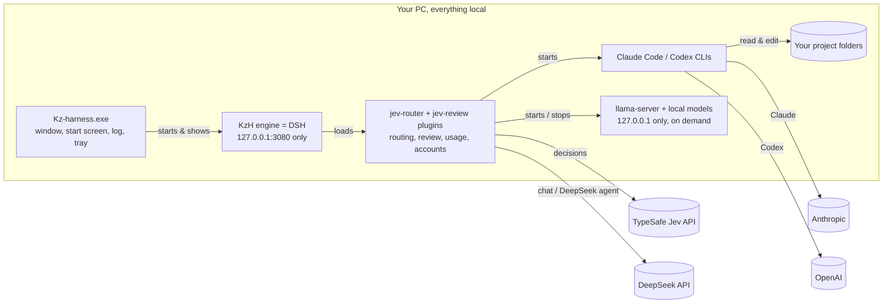

<p align="center"></p>

<h1 align="center">Kz-harness (KzH)</h1>

<p align="center">One desktop app for Claude Code, Codex, DeepSeek and your own API-key models. You type; <a href="https://docs.typesafe.ai/introduction">Jev</a> decides who handles it, the project's own checks verify the work, and Jev reviews the result before you see it.</p>

---

Kz-harness is a reskin and a set of plugins on top of [DeepSeek Harness](https://www.npmjs.com/package/@deepseek-ai/dsh) (DSH, the engine). It is shared as-is for anyone to use, fork, copy and change; see [License](#license).

## How it works


**In words:**

1. **You type** in the Kz-harness window. The **Jev Auto** model is the default, so every message goes straight to the router, with no chat model in front of it.
2. **Jev sorts it:** is this *work in the project* or *a question*? Questions get a direct answer from a chat model. The **No project** workspace is chat-only.
3. **Jev routes the work** in a single fast call. It picks the agent, reads the task type, complexity and risk, and decides whether tests must pass and whether a second opinion or a person is worth it. Agents that are signed out, switched off or at your usage limit are never picked.
4. **The agent works** inside your project folder. If it hits its usage limit mid-task, an API-key agent switches to your next key; a subscription agent (Claude ↔ Codex) hands the task to its peer, along with a **handoff note** (`.kz-harness/handoff.md`).
5. **Deterministic checks run:** the git diff, plus your project's `typecheck`, `lint`, `test` and `build` scripts. A check that passed before must still pass.
6. **Jev reviews** with small yes/no questions (did it do the task? all of it? anything unrelated? regression risk? does it need a person?). Code decides from those answers: pass, second opinion, retry, or hand it to you.
7. **You get the answer and a report**, ending with who took part, e.g. `Answered by: Jev (jev-1.13.0) → deepseek (deepseek-flash) · claude (opus), reviewer`. The **Jev inspector** shows every decision.

### What runs where



Only the model and API calls you choose go online. KzH switches off DSH's data collection (see [Privacy](#privacy)).

## What you get

- **Kz-harness.exe:** its own window, name and icon, a start screen with a live log, a colored log window (Ctrl+Shift+L), a tray icon, and DevTools on F12. Closing it stops everything it started.
- **Header like Claude desktop:** buttons for **Terminal**, **Background tasks**, **Browser** and **Jev inspector**, plus a **⋮** menu (Files, Usage, focus mode, settings). Every action has a hotkey you can change in **Settings → Shortcuts**.
- **Right sidebar** (opens at 20% width; change it in Settings → Shortcuts):
  - **Jev inspector:** timings, the pick and its reasons, every step with that agent's own answer, and every question Jev was asked with its probabilities.
  - **Background tasks:** Jev runs, background jobs and subagents, each with a live timer, output and **Stop**.
  - **Usage:** each account's 5-hour and weekly limits, DeepSeek balance and Jev spend; editable per-account limits; recent runs; and **Saved by Jev (estimate)**, covering money, time and tokens compared with a chat model making the same decisions.
  - **Browser:** a real browser pane, sandboxed in its own session.
  - **Files:** the project's files.
- **Agent chips:** switch agents on and off with one click (only Claude, GPT + DeepSeek, …), or type `/use claude ds`.
- **Accounts** (Settings → Jev setup): log Claude and ChatGPT in and out; keep several DeepSeek, Jev and API-key-model keys; pick the active key. Keys are typed once and never shown again.
- **No project** workspace: plain chat without a project folder.
- **Tools without an LLM:** Jev runs one of your scripts when it fully covers the task.

## Install (new PC)

**You need:** Windows 10/11, [Node.js](https://nodejs.org) 22.19+ (24 recommended), [Git](https://git-scm.com), and at least one of:

| Agent | Install | Sign in |
|---|---|---|
| Claude Code | `npm i -g @anthropic-ai/claude-code` | run `claude`, then `/login` |
| Codex | `npm i -g @openai/codex` (or the Codex app) | `codex login`, then Sign in with ChatGPT |
| DeepSeek | nothing | an API key from https://platform.deepseek.com/api_keys |

Also get a Jev key from https://console.typesafe.ai/keys. Without it, KzH still works; it uses a fixed default agent and says so.

**1. Get the code.** The scripts assume `C:\Harness`.

```powershell
git clone git@github.com:kz-95/kz-harness.git C:\Harness
```

**2. Add your keys** to `C:\Users\<you>\.dsh\.env`. It must be in `.dsh`, never in the repo. You can add more keys later in the app.

```
TYPESAFE_API_KEY="your Jev key"
DEEPSEEK_API_KEY="your DeepSeek key"
```

**3. Run the installer.** It is safe to re-run; it only does what is missing.

```powershell
powershell -ExecutionPolicy Bypass -File C:\Harness\scripts\Install-Harness.ps1
```

The installer:
- checks your tools;
- installs the packages;
- installs the engine with the Claude and Codex connectors;
- writes the KzH settings, including the privacy switches, and backs up anything it replaces;
- makes Jev Auto the default model;
- builds **Kz-harness.exe**;
- creates **Kz-harness** shortcuts on the Desktop and in the Start menu;
- lists any keys or CLIs still missing;
- lists the optional local models; it downloads them only with `-LocalModels <ids|all>` (see [Local models & offline](#local-models--offline)).

**4. First start.**

1. Double-click **Kz-harness**. The start screen shows the log; the app opens after 10–20 s.
2. **Settings → Jev setup:** every agent you use should show a green dot. A red dot tells you what to run; do it, then click **Recheck logins**.
3. Pick a workspace (a project folder) or **No project**, and type.

Start it from the icon. Double-clicking a `.ps1` file opens Notepad on purpose; don't change that. `Start-KzH.cmd` starts the engine in a console and your browser, if you ever need to run it without the app.

## Everyday use

- Type a task (`Fix the bug in the user lookup function and make sure the tests pass.`) or a question (`how does the login flow work?`).
- Force an agent with `/claude …`, `/codex …` or `/deepseek …`. `/auto …` lets Jev choose from any model. `/use claude ds` switches which agents may run.
- **Final status:**
  - `ACCEPTED` means done.
  - `ANSWERED` means it was a question.
  - `NEEDS HUMAN` means look at it yourself.
  - `STOPPED` means the retry limit was hit.
  - `PAUSED` means every agent is at its limit. The handoff note is saved, and asking to *continue* later picks it up.

## How Jev decides

Jev is TypeSafe's System One model. It answers typed questions with calibrated probabilities and never writes code. KzH follows the [Jev docs](https://docs.typesafe.ai/introduction): each call batches all its questions, each question is one judgment, and **code** makes the decision.

- **Before running** (one call): which agent, the task type, complexity and risk, whether a second opinion, a person or passing tests are needed, whether any tool fits exactly (and its arguments), and whether the task continues an earlier handoff. Only small facts are sent (the task, file-type counts, script and dependency names, changed file names, recent outcomes); source files never are.
- **After each run** (one call over the diff, the checks and the answer): addressed, complete, unrelated changes, regression risk, needs a person, and which agent should go next.

| Situation | Action |
|---|---|
| The agent failed, a passing check now fails, or required checks fail | retry (never accepted) |
| "needs a person" ≥ 0.6 | human |
| quality ≥ the accept bar | accept (a second opinion first, if routing asked for one and code changed) |
| quality ≤ 0.3 | retry with another agent |
| in between | second opinion, then human |

- **Quality:** `min(addressed, complete, 1 − unrelated changes, 1 − regression risk)`.
- **Accept bar:** scales with the task's risk: 0.55 (risk < 0.25), 0.70 (< 0.6), 0.85 above that.
- **Limits:** 3 attempts, 2 reviews, 5 rounds.
- **Model:** Jev is pinned to `jev-1.13.0`, so the thresholds keep their meaning.

## Usage limits and handoff

- **Where the numbers come from:**
  - Claude: its 5-hour and weekly limits.
  - Codex: its 5-hour and weekly limits.
  - DeepSeek: the balance for each key.
  - Jev: counted locally at $0.042 per million input tokens.
- **Your limits, per account** (Usage tab):
  - **handoff at** (default 85%): agents are told to work in small steps and keep the handoff note updated.
  - **stop at** (default 97%): no new tasks go to that account.
  - For API keys, a **minimum balance** plays the same role.
- **A real limit error always counts.** API keys rotate to your next key; subscriptions hand the task to their peer agent. With no agent left, the run pauses with the note saved.
- **Local models** have no quota and no key: the Usage tab shows them as *free, local*.

## Local models & offline

KzH can run open models on your own PC with [llama.cpp](https://github.com/ggml-org/llama.cpp)'s `llama-server`. The jev-router plugin starts it on demand on **127.0.0.1 only**, with a new random API key each start (so other programs on the PC can't use it), and stops it after 10 idle minutes (Settings) and when KzH closes. Nothing is installed by default.

**Install:** type `/install-llm` in any chat. A picker checks this PC (GPU and VRAM, NVIDIA driver, RAM, CPU, free disk), rates every model (*runs fully on GPU*, *splits GPU + CPU* with a speed estimate, *CPU only*, or *won't fit*) and preselects its suggestions: official and stable releases that were tested with this engine first, then what runs at a usable speed, then quality. It installs the matching engine build first (CUDA 12 or 13 by driver version, Vulkan for other GPUs, CPU otherwise). `/remove-llm` opens the same list for removal, behind a confirmation that names every file and its size. Typed forms work too: `/install-llm qwen3-8b`, `/install-llm all`, `/remove-llm qwen3-8b confirm`. The installer can do it as well: `Install-Harness.ps1 -LocalModels qwen3-8b,gemma4-e4b` (or `all`). Every file comes from the model's own organization (or llama.cpp's own GitHub releases), resumes if interrupted, and must match the size and SHA256 in the manifest.

**What is there now** ([`config/local-models.json`](config/local-models.json)):

| Module | Agent | On a 4 GB GPU (RTX 3050 Laptop, 24 GB RAM) |
|---|---|---|
| Qwen3 8B, Q4_K_M, `Qwen/Qwen3-8B-GGUF` (4.7 GB) | `qwen-local` | 18 of 37 layers on the GPU, ~8 tokens/s; best local tool calling |
| Gemma 4 E4B, QAT Q4_0, `google/gemma-4-E4B-it-qat-q4_0-gguf` (4.8 GB) | `gemma-local` | all 43 layers on the GPU, ~47 tokens/s |
| Gemma 4 E4B vision add-on (0.9 GB, optional) | `gemma-local` reads images | runs on the CPU (not tested yet) |

**What they do:** once a model is installed, its agent appears in Jev setup and switches on. Jev may pick it like any other agent; its description says it is free, private and offline-capable but weaker, so it gets simple edits, explanations and summaries. The installed model also answers direct questions when DeepSeek fails (before an agent is asked), and it shows in the model picker as *Local (llama.cpp)*. Thinking is off and the context is 8,192 tokens (4,096 on PCs with less than 12 GB RAM), so a local agent's run can hit the context limit on big tasks.

**Offline:** KzH checks `api.typesafe.ai` and `api.deepseek.com` (2.5 s timeout, cached 30 s). When neither answers:
- only local agents can run; Jev is not asked;
- questions (a question mark or a question word) go to the local chat model; tasks go to `qwen-local`, else `gemma-local`;
- the review uses the checks only (the git diff and your project's scripts);
- the report says **OFFLINE: local models only**.

Claude Code, Codex, DeepSeek and API-key models need the internet and are skipped.

**Add another model** by adding an entry to `config/local-models.json` (then `/install-llm` offers it):

| Field | Meaning |
|---|---|
| `id`, `name` | Short id (lowercase) and display name |
| `kind` | `model`, `vision` (a `--mmproj` add-on; `for` names its model) or `engine` (`variant`: `cuda12`, `cuda13`, `vulkan`, `cpu`; `minCuda` for CUDA builds) |
| `source`, `file`, `size`, `sha256` | Official download URL (`https://huggingface.co/<org>/<repo>/resolve/main/<file>` from the model's **own** organization, or a llama.cpp GitHub release asset), file name, bytes, and SHA256 (Hugging Face: `lfs.oid` from `/api/models/<repo>/tree/main`; GitHub: the asset `digest`) |
| `license`, `notes` | Shown in the picker |
| `reliability`, `verified`, `verifiedOn` | `official-stable`, `official-preview` or `community`; `verified: true` only after it ran here with tool calls working. Only `official-stable` + verified modules are suggested |
| `role`, `rank`, `hfRepo` | `best-quality`, `fast` or `vision-addon`; lower rank = better quality; Hugging Face repo for the download-count tie-breaker |
| `minVramGB`, `recommendedVramGB`, `minRamGB` | Fit hints: `recommendedVramGB` = VRAM to run fully on the GPU (plus ~0.8 GB for the desktop), `minRamGB` = below this it won't fit |
| `chatTemplate`, `contextSize`, `maxContext`, `gpuLayers` | Template note (the GGUF's own, with `--jinja`), default and maximum context, `auto` or a number of GPU layers |
| `agent` | `{ id, description }`: the router agent this model backs; the description is what Jev reads when choosing |

Only add GGUF files published by the model's own organization; if there is none, don't add a random uploader's copy.

## Updating

**Kz-harness → Check for updates…** pulls new KzH code (fast-forward only) and refreshes packages. If the desktop app itself changed, close it and run the installer again to rebuild the exe.

The engine (DSH) is **pinned** in `Start-KzH.ps1` and does not need updates: it runs locally, and starts never contact the npm registry. Only update it if Claude Code or Codex change in a way the pinned connectors can't follow, or for a security fix:

```powershell
powershell -ExecutionPolicy Bypass -File C:\Harness\scripts\Update-Harness.ps1 -BumpDsh
```

If that breaks startup, `git checkout Start-KzH.ps1` goes back.

## Privacy

KzH itself collects nothing. It turns off DSH's data features in `config/cordis.patch.yml` and `Start-KzH.ps1`:

| Switched off | What it did |
|---|---|
| `session-telemetry-otel` + `DSH_TELEMETRY_DISABLED=1` | Uploaded the whole conversation to DeepSeek's telemetry server when you clicked 👍/👎 or used `/feedback` |
| `plugin-package-inventory-deepseek` | Sent the list of installed plugins with every DeepSeek request |
| `session-log-deepseek` | Session-log upload with DeepSeek requests (off by default; pinned off) |
| `client-hmr` | Developer reload channel |
| `ui-message-feedback`, `message-feedback`, `command-feedback` | 👍/👎 buttons, the feedback dialog and `/feedback` (the feed for the telemetry upload above) |
| `llm-deepseek` (official DeepSeek connector) | Sent an anonymous installation ID (`x-deepseek-harness-user-id`, from `~/.dsh/.anonymous-user-id`), the session ID and a compaction flag with every DeepSeek request |
| `CLAUDE_CODE_DISABLE_NONESSENTIAL_TRAFFIC=1` | Claude Code telemetry and error reporting in KzH runs |

What stays:
- The engine listens on **127.0.0.1 only**, behind a login token.
- The app refuses debug ports and inspectors unless started with `KZH_DEBUG=1`. The exe's Electron "fuses" block Node mode, `NODE_OPTIONS` and `--inspect`.
- The harness page gets no camera, microphone or notifications.
- Keys and tokens are masked in logs.
- Your run history and usage logs stay in `~/.dsh/jev-router/` and are never sent anywhere.
- DeepSeek now runs through DSH's generic pi-ai connector (provider `deepseek`, same `DEEPSEEK_API_KEY`, `https://api.deepseek.com`). A request carries your key, the conversation, and generic headers only: `User-Agent: deepseek-harness/<version>` (DSH has no switch for it) and the OpenAI SDK's `x-stainless-*` platform headers (OS, CPU, Node version). No user or session ID.
- DeepSeek web search (`web_search`) sends your key, the search query and `User-Agent: deepseek-harness/0.0.1`; nothing else.
- Online, besides the model calls: the DeepSeek balance check (Usage tab) and the Jev/TypeSafe router calls. Claude Code and Codex talk to their own services under your logins.
- `~/.dsh/.anonymous-user-id` is no longer read by anything; delete it if you like.

What the switch to the generic connector costs (all minor): images go inline (base64) instead of through DeepSeek's Files API; the DeepSeek-V41-Flash "system prompt update in history" cache trick is gone, so a changed system prompt re-reads the conversation once; old chats started on the official connector need their model re-picked (the picker shows **DeepSeek** models).

### Bringing back the official DeepSeek connector

Only needed for DeepSeek models or features that the generic connector cannot serve (e.g. Files-API images, future image/video models). Re-enabling brings the identity headers back (anonymous user ID, session ID, compaction flag on every DeepSeek request).
1. In `~/.dsh/profiles/web/cordis.patch.yml` (and `config/cordis.patch.yml`), delete the block under `# Official DeepSeek connector: remove this block to bring it back.`
2. Point KzH back at it: in the `jev-router` config set `agents` → `deepseek` → `llm.provider: deepseek-official`, and `auxModel.provider: deepseek-official` (or change the defaults in `plugins/jev-router/index.js`).
3. Optionally remove the `llm-pi-ai` DeepSeek route block too, so the picker does not list DeepSeek twice.

## Configuration

KzH settings live in `~/.dsh/profiles/web/cordis.patch.yml`; the installer writes it from [`config/cordis.patch.yml`](config/cordis.patch.yml). Omitted fields use the defaults in `plugins/jev-router/index.js`. Edits reload live. A patch replaces a row's whole `config`, so restate every nested field you change.

```yaml
- insert:
    - id: jev-router
      name: 'C:/Harness/plugins/jev-router/index.js'
      config:
        limits: { maxAttempts: 3, maxReviews: 2, maxRounds: 5 }
        thresholds:
          accept: { low: 0.55, medium: 0.7, high: 0.85 }
          secondOpinion: 0.6
          humanReview: 0.7
          needsTests: 0.5
          tool: 0.5
        checks: { enabled: true, scripts: [typecheck, lint, test, build] }
        productionWorkspaces: ['C:\Work\production-app']   # Jev is told these are production-critical
        savings:                                            # assumptions behind "Saved by Jev"
          baseline: { name: 'Chat LLM front desk', inputPerMTok: 0.28, outputPerMTok: 1.10, outputTokens: 300, latencyMs: 4000 }
        tools:
          - id: run-tests
            description: Run the project's test suite and report the result, nothing else
            command: npm test
```

- **Tools** get their parameters as `JEV_ARG_<NAME>` and the task text on stdin, never in the command line.
- **API-key agents** are added in the app (Settings → Models, then Jev setup); other subagent providers are added under `agents`.
- **`auxModel`** is the chat model for direct answers, session titles and compaction (default `deepseek` / `deepseek-flash`).

## Where things live

| What | Where |
|---|---|
| Keys | `~/.dsh/.env` and DSH's credential store. The Claude and Codex logins stay in `~/.claude` and `~/.codex`. |
| KzH settings | `~/.dsh/profiles/web/cordis.patch.yml`, `~/.dsh/settings.yaml` |
| Accounts, limits, switches, hotkeys | `~/.dsh/jev-router/` (`accounts.json`, `agents.json`, `hotkeys.json`) |
| History and usage | `~/.dsh/jev-router/history.jsonl`, `usage.jsonl` |
| Projects | `C:\HarnessProjects` by default. `C:\Harness\no-project` is the chat-only workspace. |
| Local models | `C:\Harness\engine\llama` (llama.cpp) and `C:\Harness\models` (GGUF files), both gitignored; the list is `config/local-models.json`. Chat model, idle stop and GPU layers: `~/.dsh/jev-router/local.json`. |

## Troubleshooting

| You see | Do this |
|---|---|
| Start screen: another harness is already running | A `Start-KzH.cmd` console or a second Kz-harness is open. Close it, then click **Retry**. |
| Jev setup shows a red dot | Do what the line under it says, then **Recheck logins**. |
| "all available agents are at their usage limits" | Wait for the reset time shown, raise that account's **stop at** in Usage, or add another API key. |
| Report says **JEV UNAVAILABLE** | The Jev key is missing or TypeSafe is unreachable; fix it and use **Restart harness**. |
| Codex can't read files, or "windows sandbox helper … not found" | The helper comes with the Codex app; `Start-KzH.ps1` puts it on PATH. Open the Codex app once if the launcher warns. |
| Report says **OFFLINE: local models only** | Neither TypeSafe nor DeepSeek answered. Check the connection; with no local model installed, nothing can run offline (`/install-llm` while online). |
| A local agent is missing or has a red dot | Its model isn't installed or failed its SHA256 check: `/install-llm`. |
| A header button, sidebar tab or Jev Auto is missing | **Kz-harness → Restart harness**; if it's still missing, re-run the installer. |

## Project layout

| Path | What |
|---|---|
| `app/` | The Electron app. `main.js` starts and stops the engine and holds the security switches, the in-app browser and updates. `preload.js` is a narrow bridge. `ui/` is the start screen and log. `package.mjs` builds `Kz-harness.exe`. |
| `plugins/jev-router/` | Routing (`router.js`), Jev questions (`jev.js`), the Jev Auto model and direct answers (`adapter.js`), usage and savings (`usage.js`), accounts and keys (`accounts.js`), login checks (`setup.js`), git and checks (`workspace.js`), and the browser half (`client.js`: inspector, setup, shortcuts, header, brand, local-model pickers), local models and offline mode (`local.js`). |
| `plugins/jev-review/` | Review policy (the `jevReview` service). |
| `config/cordis.patch.yml` | KzH settings and privacy switches, used by the installer |
| `config/local-models.json` | The local-model manifest: engine builds and models, with official source, size and SHA256 |
| `scripts/` | `Install-Harness.ps1`, `Update-Harness.ps1`, `ensure-no-project.mjs`, `Set-TypeSafeKey.ps1` |
| `Start-KzH.ps1` / `.cmd` | Starts the engine: pinned version, privacy settings, Codex helper, "No project" workspace |

Tests: `cd plugins\jev-router` then `npm test`. They cover routing, review policy, tools, limits and handoff, accounts, usage and savings, direct answers, process handling, hotkeys, and local models / offline mode (no network, no real llama-server).

## License

[MIT No Attribution](LICENSE): anyone may use, copy, change, fork and share this, anywhere, with no conditions. Kz-harness is a sharing project, a reskin and plugins on top of other people's software. DeepSeek Harness, Claude Code, Codex, Jev, DeepSeek and Electron keep their own licenses and terms.
