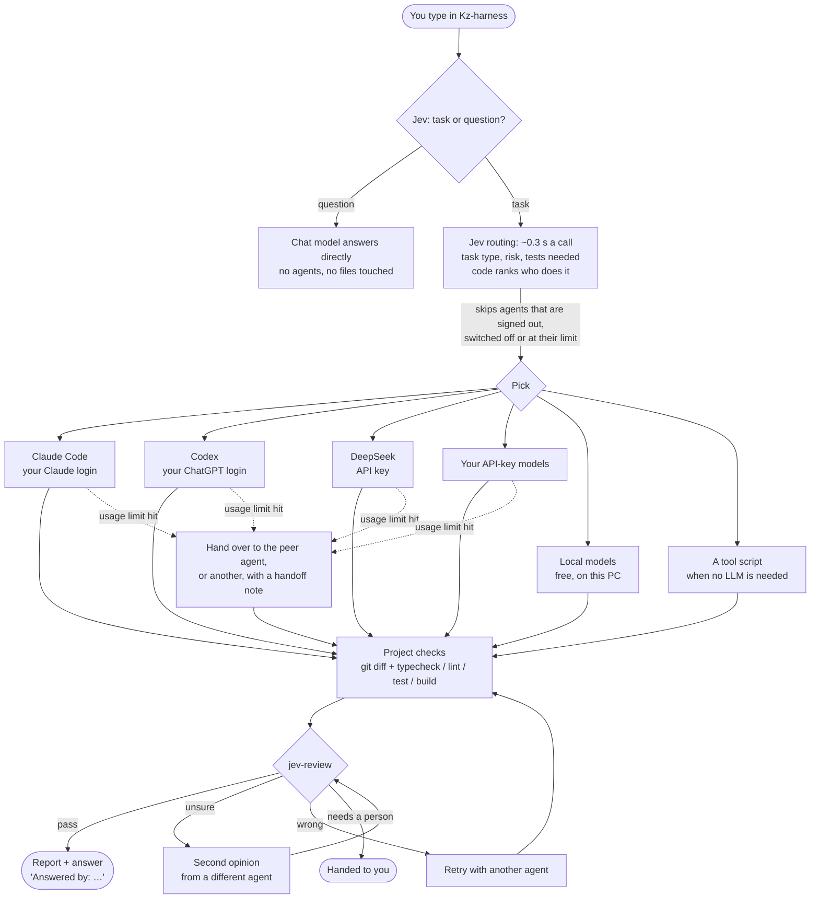
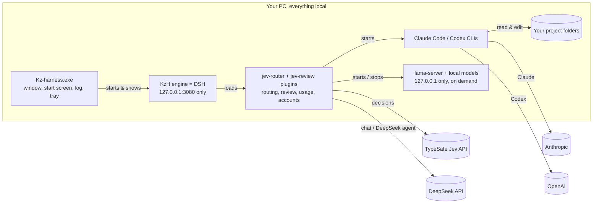

<p align="center"></p>

<h1 align="center">Kz-harness (KzH)</h1>

<p align="center">One desktop app for Claude Code, Codex, DeepSeek and your own API-key models. You type; <a href="https://docs.typesafe.ai/introduction">Jev</a> reads the task and the router picks who handles it, the project's own checks verify the work, and Jev reviews the result before you see it.</p>

---

Kz-harness is a reskin and a set of plugins on top of [DSH](https://www.npmjs.com/package/@deepseek-ai/dsh) (DSH, the engine). It is shared as-is for anyone to use, fork, copy and change; see [License](#license).

## How it works


```mermaid
flowchart TD
    U([You type in Kz-harness]) --> K{Jev: task or question?}
    K -- question --> Q[Chat model answers directly<br/>no agents, no files touched]
    K -- task --> R[Jev routing: ~0.3 s a call<br/>task type, risk, tests needed<br/>code ranks who does it]
    R -->|skips agents that are signed out,<br/>switched off or at their limit| P{Pick}
    P --> C[Claude Code<br/>your Claude login]
    P --> X[Codex<br/>your ChatGPT login]
    P --> D[DeepSeek<br/>API key]
    P --> B[Your API-key models]
    P --> LM[Local models<br/>free, on this PC]
    P --> T[A tool script<br/>when no LLM is needed]
    C & X & D & B & LM & T --> V[Project checks<br/>git diff + typecheck / lint / test / build]
    V --> J{jev-review}
    J -- pass --> OK([Report + answer<br/>'Answered by: …'])
    J -- unsure --> S[Second opinion<br/>from a different agent] --> J
    J -- wrong --> RT[Retry with another agent] --> V
    J -- needs a person --> H([Handed to you])
    C & X & D & B -. usage limit hit .-> L[Hand over to the peer agent,<br/>or another, with a handoff note]
    L --> V
```

**In words:**

1. **You type** in the Kz-harness window. The **Jev Auto** model is the default, so every message goes straight to the router, with no chat model in front of it.
2. **Jev sorts it:** is this *work in the project* or *a question*? Questions get a direct answer from a chat model. The **No project** workspace is chat-only.
3. **The router picks who does the work.** Code strikes out first: an agent that is signed out, switched off, out of quota, too small for the task's context, or missing a tool or modality the task needs is never a candidate, and no model is ever asked about it.
   What is left is ranked in code on what it is good at, what a job on it would really cost, and how much of your plan is left.
   Jev is asked what the task is and how to organise the work, not who does it.
   Once a routing domain has been right often enough, on outcomes that were actually verified, its local classifier answers in place of Jev whenever it is confident and the input looks familiar.
   Jev's routing questions are batched into calls, so a call is skipped only when every domain it carries answers locally; see [It learns: adaptive routing](#it-learns-adaptive-routing).
4. **The agent works** inside your project folder. If it hits its usage limit mid-task, it is out until the limit resets and the task goes to its peer (Claude ↔ Codex) or another agent that can do it, along with a **handoff note** (`.kz-harness/handoff.md`). A spent DeepSeek key is marked, and your next key takes over after a restart (see [Usage limits and handoff](#usage-limits-and-handoff)).
5. **Deterministic checks run:** the git diff, plus your project's `typecheck`, `lint`, `test` and `build` scripts. A check that passed before must still pass.
6. **Jev reviews** with small yes/no questions (did it do the task? all of it? anything unrelated? regression risk? does it need a person?). Code decides from those answers: pass, second opinion, retry, or hand it to you.
7. **You get the answer and a report**, ending with who took part, e.g. `Answered by: Jev (jev-1.13.0) → deepseek (deepseek-flash) · claude (opus), reviewer`. The **Jev inspector** shows every decision.

### What runs where


```mermaid
flowchart LR
    subgraph PC[Your PC, everything local]
      APP[Kz-harness.exe<br/>window, start screen, log, tray]
      DSH[KzH engine = DSH<br/>127.0.0.1:3080 only]
      PL[jev-router + jev-review plugins<br/>routing, review, usage, accounts]
      CLI[Claude Code / Codex CLIs]
      LL[llama-server + local models<br/>127.0.0.1 only, on demand]
      PRJ[(Your project folders)]
      APP -- starts & shows --> DSH
      DSH -- loads --> PL
      PL -- starts --> CLI
      PL -- starts / stops --> LL
      CLI -- read & edit --> PRJ
    end
    PL -- decisions --> JEV[(TypeSafe Jev API)]
    PL -- chat / DeepSeek agent --> DS[(DeepSeek API)]
    CLI -- Claude --> AN[(Anthropic)]
    CLI -- Codex --> OA[(OpenAI)]
```

Only the model and API calls you choose go online. KzH switches off DSH's data collection (see [Privacy](#privacy)).

## What you get

- **Kz-harness.exe:** its own window, name and icon, a start screen with a live log, a colored log window (Ctrl+Shift+L), a tray icon, and DevTools on F12. Closing its window leaves the harness running in the tray; quitting it (from the tray or the app menu) stops everything it started.
- **Header like Claude desktop:** buttons for **Terminal**, **Background tasks**, **Browser** and **Jev inspector**, plus a **⋮** menu (Files, Usage, focus mode, settings). Every action has a hotkey you can change in **Settings → Shortcuts**.
- **Right sidebar** (opens at 24% width; change it in Settings → Shortcuts):
  - **Jev inspector:** timings, the pick and its reasons, every step with that agent's own answer, and every question Jev was asked with its probabilities.
  - **Overview:** the whole session as one time-ordered ledger: your messages and the assistant's, tool calls, context and compaction, then the routed runs, background tasks and subagents. Filter chips by kind, and every row expands to the inspector's own detail (see [The work board, history and feedback](#the-work-board-history-and-feedback)).
  - **Background tasks:** Jev runs, background jobs and subagents, each with a live timer, output and **Stop**.
  - **Live:** watch an agent work on a task, its text, tool calls and reasoning as they stream (see [Live agent view](#live-agent-view)).
  - **Usage:** each account's 5-hour and weekly limits, DeepSeek balance and Jev spend; editable per-account limits; recent runs; and **Saved by Jev (estimate)**, covering money, time and tokens compared with a chat model making the same decisions.
  - **Browser:** a real browser pane, sandboxed in its own session.
  - **Files:** the project's files.
- **Agent chips:** switch agents on and off with one click (only Claude, GPT + DeepSeek, …), or type `/use claude ds`.
- **Accounts** (Settings → Jev setup): log Claude and ChatGPT in and out; keep several DeepSeek, Jev and API-key-model keys; pick the active key. Keys are typed once and never shown again.
- **No project** workspace: plain chat without a project folder.
- **Tools without an LLM:** Jev runs one of your scripts when it fully covers the task.

## Install (new PC)

KzH runs on **any Windows 10/11 PC**, not just the one it was built on. One path is built in: `C:\HarnessProjects`, the default folder for your projects, which the installer creates and the tray menu opens. `Start-KzH.ps1 -Workspace <path>` overrides it. Nothing else hardcodes a machine, a user folder or a drive. It is Windows only, though, and deliberately so. The launcher is a packaged Electron app for `win32-x64`, the installer and starter are PowerShell, and the shortcuts are Desktop and Start menu entries. There is no macOS or Linux build, and none is planned here.

Two things never travel with the repo, by design: your keys (they live in `~/.kzh/.env`, outside the repo) and the local model binaries (`models/` and `engine/` are ignored; only `config/local-models.json` is committed, and the installer downloads from it). A fresh clone therefore needs step 2 and, if you want local models, the `-LocalModels` flag in step 3.

**You need:** Windows 10/11, [Node.js](https://nodejs.org) 22.19+ (24 recommended), [Git](https://git-scm.com), and at least one of:

| Agent | Install | Sign in |
|---|---|---|
| Claude Code | `npm i -g @anthropic-ai/claude-code` | run `claude`, then `/login` |
| Codex | `npm i -g @openai/codex` (or the Codex app) | `codex login`, then Sign in with ChatGPT |
| DeepSeek | nothing | an API key from https://platform.deepseek.com/api_keys |

Also get a Jev key from https://console.typesafe.ai/keys. Without it, KzH still works; it uses a fixed default agent and says so.

**1. Get the code.** The scripts assume `C:\Harness`.

```powershell
git clone https://github.com/kz-95/kz-harness.git C:\Harness
```

**2. Add your keys** to `C:\Users\<you>\.kzh\.env`. It must be in `.kzh`, never in the repo. You can add more keys later in the app.

```
TYPESAFE_API_KEY="your Jev key"
DEEPSEEK_API_KEY="your DeepSeek key"
```

**3. Run the installer.** It is safe to re-run; it only does what is missing.

```powershell
powershell -ExecutionPolicy Bypass -File C:\Harness\scripts\Install-Harness.ps1
```

The installer:
- checks your tools;
- installs the packages;
- installs the engine with the Claude and Codex connectors;
- writes the KzH settings, including the privacy switches, and backs up anything it replaces;
- makes Jev Auto the default model;
- builds **Kz-harness.exe**;
- creates **Kz-harness** shortcuts on the Desktop and in the Start menu;
- lists any keys or CLIs still missing;
- lists the optional local models; it downloads them only with `-LocalModels <ids|all>` (see [Local models & offline](#local-models--offline)).

**4. First start.**

1. Double-click **Kz-harness**. The start screen shows the log; the app opens after about 40 s, most of it the engine loading its plugin bundle, and longer on a first run while it fetches the engine.
2. **Settings → Jev setup:** every agent you use should show a green dot. A red dot tells you what to run; do it, then click **Recheck logins**.
3. Pick a workspace (a project folder) or **No project**, and type.

Start it from the icon. Double-clicking a `.ps1` file opens Notepad on purpose; don't change that. `Start-KzH.cmd` starts the engine in a console and your browser, if you ever need to run it without the app.

To have a coding agent such as Claude Code or Codex set KzH up on this PC, or find out what is wrong with it, point it at [docs/AI_SETUP.md](docs/AI_SETUP.md).
It is written for the agent: the PowerShell commands, every route of the plugin with what it answers, where the logs are, and what it must ask you before it downloads, installs or deletes anything.

## Everyday use

- Type a task (`Fix the bug in the user lookup function and make sure the tests pass.`) or a question (`how does the login flow work?`).
- Force an agent with `/claude …`, `/codex …` or `/deepseek …`. `/auto …` lets Jev choose from any model. `/use claude ds` switches which agents may run.
- `/now jev-5` starts a waiting task at once, and `@jev-5 …` or `/steer jev-5 …` adds your words to it before it starts, or gives them to its agent while it works ([Send now and Steer](#send-now-and-steer)).
- The model menu's **Jev** section lists **Jev Auto** and one entry per enabled agent - **Claude Code**, **Codex (GPT)**, **DeepSeek agent**, plus any local or custom agent. Picking an agent sends every message to it with no routing question; the checks, the review and the queue still run. Switching an agent off takes it out of the menu.
- Once you install a local model, three more Jev rows appear, in order from the most off-machine to the least. They all let Jev route; they differ only in how wide the field of agents is.

  | Row | Picks from | Jev call |
  |---|---|---|
  | **Jev Auto** | everything enabled | yes |
  | **Jev Auto · Online** | cloud and subscription agents only, never this PC | yes |
  | **Jev Auto · Local** | the local models on this PC only | yes |
  | **Offline · Local only** | the local models, by a fixed rule | no |

  **Online** is for when you do not want to wait on your own hardware. Being offline, or picking a `local-*` effort on a single message, still overrides it: those say what the machine can do, while Online only says what it should prefer. With no local model installed none of these rows appear, because Jev Auto already has nothing but cloud agents to choose from.
  While Laya Auto is offered, **Laya Auto · Online** and **Laya Auto · Local** follow it, the same two lines drawn with Laya deciding on this PC and no Jev call ([Laya Auto](#laya-auto-a-decision-model-on-this-pc)).
- **Export chat as Markdown** (Ctrl+Alt+M, or the header's ... menu): copy it, or save a `.md`. Tool calls and their output are included, folded into `<details>` blocks; untick that to export just the conversation.
- **Show all transcripts** (top bar, next to the Jev inspector button; rebindable in Settings -> Shortcuts, empty by default): opens or closes every reasoning and tool transcript in the conversation at once, including ones that arrive afterwards. The label and `aria-expanded` follow the state, and the button is disabled when the conversation has none.
- **Effort** (the model menu): `Auto` lets Jev pick from the task's complexity and risk. Picking a level by hand applies to background work only - the conversation stays responsive at every level.
  - **Claude Code speed** (Settings → Jev setup → Effort, beside Codex speed) is `Normal` or `Fast`: Fast asks for Claude's fast mode for each Claude Code run, which costs more, as the card says (Claude bills it to your usage credits).
    It reaches a run only through the engine patch the Live agent view card names, and an account or model without fast mode runs at normal speed; the task list says `high, fast mode` where Codex says `high 1.5x`.
  - **Ultra** gives each background executor its own top mode: Claude Code Opus 5, Sonnet 5 and Fable get `ultracode`; Codex on GPT-5.6 or newer (Astra, Sol, Terra, Luna) gets `ultra`; DeepSeek gets `max`. Local models and registered tools get no synthetic effort - they use their own configured mode. An older or unknown Codex model is capped at what that model actually supports rather than being sent a value it would reject.
- **Final status:**
  - `ACCEPTED` means done.
  - `ANSWERED` means it was a question.
  - `NEEDS HUMAN` means look at it yourself.
  - `STOPPED` means the retry limit was hit.
  - `PAUSED` means every agent is at its limit. The handoff note is saved, and asking to *continue* later picks it up.

## What it costs

With `routing.enabled: false`, Jev is told what each agent costs at the hour it is choosing, and prefers an agent on its cheap rate when the choice is otherwise even.
It is a preference, not a rule: a task that needs a particular agent still goes there.
Under adaptive routing, the default, the ranking in code does not weigh the hour yet: the Usage tab shows which rate is in force, and nothing in the ranking reads it.

DeepSeek bills by the UTC clock, twice the price inside its weekday business hours and at its cheap rate the rest of the time, so every evening and the whole weekend is already cheap. The dear hours are config, not code - `pricing.peak` in the plugin's Config, keyed by agent id:

```yaml
- id: jev-router
  config:
    pricing:
      peak:
        deepseek:
          windowsUtc: [{ fromUtc: '01:00', toUtc: '04:00' }, { fromUtc: '06:00', toUtc: '10:00' }]
          daysUtc: [1, 2, 3, 4, 5]
```

The windows are the **dearer** hours; anything outside them is off-peak. An end at or before the start wraps past midnight, and `daysUtc` is the UTC day, 0 = Sunday, defaulting to Monday to Friday. Check the hours against [DeepSeek's pricing page](https://api-docs.deepseek.com/quick_start/pricing) and edit them there if they move; add an entry for any other agent whose provider charges by time of day. Subscription agents (Claude Code, Codex) are flat-rate, so they have no entry.

## Subscription first

A subscription is free per token but **not** free per percent: its weekly window is the thing
that runs out. So the harness spends the window on the work that needs it, and moves bulk work
to the metered API only once a subscription is far enough through its week.

Past its gate, an agent stops taking **execution** work and stays available for **review**, where
few tokens buy the most judgement. Work prefers another subscription that is still under its own
gate, and only reaches the API agent when every subscription is past one.

```yaml
- id: jev-router
  config:
    policy:
      gateAtPercent:
        default: 80
        claude: 90      # Max
        codex: 80       # Plus
```

**Set this to match your plan**: Claude Pro 80 / Max 90, Codex Plus 80 / Pro 90. It is not
detected for you on purpose. The live usage endpoint reports no plan name, and the cached
credential (`~/.claude/.credentials.json`, `subscriptionType`) lags a plan change, so an upgrade
would keep gating you at the old number and push paid work you did not need to pay for.

Three deliberate choices:

- **Unknown never gates.** On a cold start, or when a usage fetch fails, the weekly percent is
  unknown. Unknown is treated as under the gate. Guessing "over" would send paid traffic every
  cold start; guessing "under" only spends subscription faster, and the existing `stopAtPercent`
  and limit-error paths are still the real ceiling.
- **Evaluated once per run.** Re-reading per attempt costs a usage snapshot each time and could
  land a retry on a different agent than the primary, which means two agents editing one working
  tree. Crossing the gate mid-task is invisible until the next task; crossing the real limit keeps
  its existing handoff behaviour.
- **The window is found by length, not by name.** Both providers label it `weekly` today, but the
  gate reads the longest window (>= 1 day) so a relabelled window cannot silently switch it off.

A forced agent (`/claude`, or picking one in the model menu) is never swapped: an explicit choice
beats the policy. When the gate does move work, the report says so, and the reasoning line reads
`claude is 92% into its weekly window (gate 90%): codex takes the work, claude stays for review`.
The gate moves work only to an agent that can actually do it. When nothing under the gate can (only
the gated agent reads the attached image, say), the gate yields and the report says `Kept claude
despite its weekly gate: nothing ungated can do this request`, because saving a subscription window
is not worth routing a job to an agent that cannot do it.

### When an agent runs out mid-task

Nothing is lost. The harness writes `.kz-harness/handoff.md` from the evidence so far, hands the
task to another agent with that note in its prompt, and carries on.
The replacement for work is the agent's peer (Claude Code and Codex are each other's by default; an agent's own `peer` overrides that) when the peer can do the job and is not itself past its weekly gate.
Otherwise it is the next agent by Jev's ranking that can do the job, preferring one that is not past its gate, and only when every such agent is past its gate does one of them take the work.
A review hand-over follows the same order among the agents no fact rules out, other than the one whose work is under review, and ignores the gate, because judging is what a gated agent is kept for.
If no agent that can take over is left, the run pauses with the handoff saved and asking to *continue* later picks it up.

### API keys get two tiers as well

A metered key is protected the way a subscription is, so it cannot be drained without warning:

```yaml
limits:
  deepseek:
    handoffAtBalance: 10   # soft: work in small steps, keep the handoff current, hand over
    minBalance: 5          # hard: never start
```

In the key's own currency. Below the soft figure the agent behaves exactly as one near a
subscription limit: Jev prefers others, and the agent is told to work in small steps and keep the
handoff updated, so a handover loses nothing. Both are editable per agent in the Usage tab.

## Background tasks

A task you type in a project does **not** hold the chat.
Jev queues it and answers with a start reply that says what runs, and you carry on: ask a question, start a task in another project, read the inspector.
Every sentence of it is fixed wording filled in with what the router really picked (`plugins/jev-router/reply-words.js`); no model writes any of it.

```text
OK, I'll run Claude Code with claude-opus-4-1 (effort high) in the background as jev-4 in HarnessProjects, and Codex reviews it before it's accepted. I'll report back here when it's done. Keep chatting.

> Picked by Jev in 2.4 s: a code change, medium risk, so effort high.
```

- **The plan, when it is known.**
  The reply names the agent doing the work, its model (`its own default model` when none is set) and the effort its first attempt starts at, which is what the task's row in the Background tab then shows: the agent from the pick on, the effort once that attempt starts, and the model once it ends, since only its end records the model it ran.
  It names the reviewer and the planner when the plan has them, and says `If the local model can't finish it, a stronger agent takes over.` when a local model works first and the agent the router picked takes over if it fails.
  A forced agent (its own row in the model menu, or a Local effort) is known as it is queued, so it is named at once, with where it waits when it has to: `It waits 2nd in line (another task is running there).`
  For any other task that starts at once, the reply waits for the router's pick, up to 15 s by default (Settings → Jev setup → **Chat replies** → **Wait for the pick before replying**, from `Reply at once (no wait)` to 60 s), unless a quick reply has been earned (below).
- **The credit line** under it says who picked and how long it took: `Picked by Jev in 2.4 s`, `Picked by Laya on this PC in 1.9 s`, `Picked on this PC in 0.4 s, no Jev call` when nothing was asked before the pick (the local router, or the offline rule), or `Picked by the routing rules in 0.3 s, since Jev could not pick (...)`.
  It names who the agent strip under the reply names, so when Jev was asked and answered no part of the routing, as when its routing calls fail, it reads `Picked by the routing rules in 0.3 s, since Jev could not pick (Error: 503 Service Unavailable)`, or `Picked on this PC in 0.4 s, since Jev could not pick (...)` when the local router picked, and never `no Jev call` once a call was made.
  It goes on with what the decider made of the task and why that effort: `a code change, medium risk, so effort high` for Auto, which reads the larger of the task's complexity and risk, or `effort xhigh (your pick in the model menu)`, `(the default in Settings)` or `(set for this agent in Settings)`.
  An Auto effort your ratings moved a step (see Rate the pick) names them instead: `a code change, medium risk; effort medium (Auto, lowered one step by your ratings)`.
  A forced agent's reads `You picked Claude Code; effort high (Auto in Settings).`, and `Your feedback moved it off Codex.` follows when your verdicts moved the pick.
  A pick that gives the work to a tool names no effort, since the tool runs at none.
- **A task that waits its turn** is answered at once: `OK, **jev-5** is queued: 2nd in line for HarnessProjects (another task is running there, about 4 min left). Jev picks the agent when it starts; I'll say which here, and report back when it's done. Keep chatting.`
  The task joins its folder's line as it is queued, so where it stands is read off the line itself (`tasks.get(jobId).waiting`), a foreground run in it counted as much as a task, and the time left is there only when past runs give a figure for it (the wait estimate, below).
  The other places read `2nd in line for HarnessProjects (an earlier task there is waiting for a free slot)` and `next for a free slot to start in HarnessProjects (the resource budget caps how many tasks run at once)` (`2nd for a free slot` when another folder's task takes the next one first), followed by the sentences on **Tasks at once** the task's row shows.
  When a run started from the chat holds the folder (an `/auto`, `/<agent>`, `jev_route` or answer run, none of which has a row on the work board), it reads `2nd in line for HarnessProjects (a run started from the chat is using it)`, and the task's row says `Waiting: a run started from the chat is using this workspace`.
  Once the guess at the pick has been right 16 of the last 20 times (How Jev replies, below), it also names the agent likely to run the task: `Jev picks the agent when it starts, likely **Claude Code** (effort medium); I'll say which here, and report back when it's done.`
- **A pick that takes longer than the wait**: `OK, **jev-4** is starting in HarnessProjects, and Jev is still choosing the agent (15 s so far). I'll say here which one it picks, and report back when it's done. Keep chatting.`
- **A task that ends before its pick**: `**jev-4** ended before Jev picked its agent (Failed). Its result is posted here as its own message.`
  A task Jev reads as needing a person (`human_required`, [below](#what-the-request-needs-capabilities)) is one of these: no agent starts on it, so its reply says `(Needs input)` and names none, and no started notice follows, not even for one that waited its turn.
  The router's own line for it, in the reply's wait and wherever else the router's lines show, reads `Jev read this as needing a person: no agent runs`, and its result's head reads `Agent: Jev picks`, as for any task no agent was picked for.
- **A quick reply**, once the guess at the pick has earned it (How Jev replies, below), tells a task that starts at once the guessed agent before routing picks: `OK, I'll run **Claude Code** with **claude-opus-4-1** (effort high) in the background as **jev-4** in HarnessProjects. I'll report back here when it's done. Keep chatting.`, with the credit `> Predicted on this PC from your recent tasks (right 47 of the last 50); Jev read the message in 1.2 s. The pick is checked again when it starts.`
  It goes out only while the guesses made under the row's decider have been right 45 of the last 50 times, and only for a guess at least 90% sure whose agent can run now, never for a tool.
  It waits for the pick 600 ms at most, with no reasoning block, and when the pick comes in that time it names that instead, with the credit of whoever made it; with **Reply at once** in Chat replies it does not wait at all.
  The effort it names is the one the first attempt starts at: your pick in the model menu, else the default in Settings, Effort when that is a level, and the guessed one only when both are Auto.
  It never waits for a new check of which agents are ready, which can take seconds, and goes by the last one, so only the first task after the harness starts, or after a change in Jev setup, waits for that check.
  A message read on this PC as a task gets an **instant reply**, with no Jev call before it: `> Instant reply: read and predicted on this PC, no Jev call (right 47 of the last 50). The pick is checked again when it starts.`
  Under Laya Auto, Laya reads every message, so the credit says `Laya read the message on this PC in 1.1 s`, and no reply is instant.
- **While the reply waits**, nothing shows for its first 600 ms, so a quick pick looks instant.
  After that a reasoning block says `Queued as jev-4. Choosing the agent (I reply once it's picked, at most 15 s). Stop here ends this reply only; the task keeps going (stop it on the work board).`, followed by the router's own lines; a message that takes longer than that to sort into a task or a question says `Jev is reading your message (task or question)…` the same way.
  Stop during the wait ends the reply only: the task runs on, and its started notice still comes, before the notice that its work moved to another agent when that happens first.
  A message you type meanwhile is held by the engine until the reply is out, as for any answer.
- **Hidden marks** ride at the end of the reply, as they do at the end of a report: the task by its key, the run once it has begun, and, once the agent is known, the agent strip under the reply (`Jev (jev-1.13.0) → claude (claude-opus-4-1, high)`: who picked, with the model its answers came from, then the worker by its id), so a Like or Dislike on the reply is about the agent it names.
  A quick reply carries no agent strip, since nobody has picked yet, and a rating of it is about the agent that then ran.

**Milestone notices** follow the reply in the chat as collapsed `jev-router` rows, the engine's own notice rows, which start no model turn:

- `jev-5 started: Claude Code, claude-opus-4-1, effort medium` once the router picks for a task whose reply named no plan (a waiting task's, or one answered before the pick); its body adds how long it waited for the folder or for a free slot, and ends `Watch it in the Live tab; the result posts here when it's done.`
- `jev-4 started again as work that writes` when a read pass handed the task back to its folder's line and it started again ([Read-only work](#read-only-work)).
  Its body says why the pass went back: `**jev-4** needed to change files, so it started again as work that writes: ...` when its agent said so or its routing named work that may, and `**jev-4** could not run locked against writing (<the router's reason>), so ...` for any other hand-back, such as an agent that could not be locked.
- `jev-2: effort max instead of high` when a task starts on the agent its reply named at another effort, as when a forced agent's effort was set otherwise in Settings while it waited.
- `jev-4: Codex instead of Claude Code` when a quick reply's guess, or the likely agent of a reply that waited, is not what routing picks: the change of plan counts as the guess's miss, and the reply may ask which was right ([Rate the pick](#rate-the-pick)).
  Its body says why when the routing holds a hard fact about the agent the reply named, `Claude Code is at its usage limit (resets 14:20), so Jev gave the work to Codex (gpt-5.5, effort medium).`, or that it is not signed in, not ready on this PC, past its weekly gate, or that your feedback moved the pick off it.
  Otherwise it says only who picked what: `Jev picked Codex (gpt-5.5, effort medium) when it started.`, or `The local router picked ...` and `The routing rules picked ...` for a pick made on this PC; a tool that takes the work reads `jev-4: the lint tool instead of Claude Code`.
  A likely agent that does run gets the started notice its reply promised, and a reply naming the pick it waited for, or a forced agent, never names another agent; a retry that later moves the work to another agent gets the moved notice below.
- `jev-4 moved to Codex` when a retry moves the work to another agent, with the router's own lines for why.
  Only what sent the work there is among them: the review that did, or the usage limit of the agent it was on, with that agent's credit falling under its floor when that was the limit; a credit that only runs low, or a limit of Jev's own key, keeps the work where it is, so neither is.
  A move later in the same routing posts no second notice; the task's row in the Background tab names the agent the work is on then.

A task gets each kind at most once per routing, remembered in its record (`progressPosted`), so a restart never posts one again.
No notice goes into a streaming answer, none is posted for a task that has ended (its result says the rest), and a notice's summary never holds `·`, so the browser never takes it for a result and it never marks a result read.
**Progress in chat: Start and result only** (Settings → Jev setup → Chat replies) posts one of them only, and the replies then promise only the result.
That one is a guess's change of plan: a quick reply or a likely agent still names its guess then, and when routing gives the work to another agent or to a tool, `jev-4: Codex instead of Claude Code` says so, with its reason, worded as under Milestones, since the reply named an agent that is not the one at work.
Every other notice stays off, the one for a guessed agent that starts at another effort than its reply named included; the ask below still asks which was right, under the reply, while it is on, and the result's head names the agent that ran.
**When the plan changes: Ask which was right** (on by default) lets a start reply ask once which was right when what ran is not what it named ([Rate the pick](#rate-the-pick)).
The settings are kept in `~/.kzh/jev-router/chat-replies.json`.

**How Jev replies** (Settings → Jev setup, under Chat replies) shows what learns in the background to make the start reply sooner, and which replies that has switched on.
The guess at the agent changes a reply only once its record has earned it: right 45 of the last 50 times under the row's decider for a quick reply, and 16 of the last 20 for the likely agent of a task that waits its turn (both set by [`replies`](#configuration)); below that, replies wait for routing again.
Task or question changes one only once it is read on this PC, and then only for a message it is sure is a task: Jev is not asked about that message, so it gets no read-only verdict ([Read-only work](#read-only-work)) and runs as work that writes.
Where no task can run, in the **No project** space and the KzH scratch workspace, it is never read on this PC: Jev reads every message there, so a question is answered, never refused as a task.

- `Start replies: after routing (median 4.2 s this week)`: how long the replies that waited for the pick took this week, until it came or the wait for it ran out (**Wait for the pick before replying** in Chat replies).
  When some ran out first, the line says how many, `...; 3 of 10 went out when the wait ran out, before the pick`.
  A reply for a task that waits its turn, for an agent you picked, or after a read pass handed its task back does not wait the pick out and is not timed; with none timed this week the line says `none timed this week`.
  With the wait set to **Reply at once**, the line reads `Start replies: at once, without waiting for the pick (Reply at once, in Chat replies)`.
- `Task or question: learning, 212 of 750 checked examples (task 190, question 22 of 100 needed); 95% right of the last 100 checked (needs 94%).`: how far the message intent has come toward being read on this PC rather than by Jev ([It learns](#it-learns-adaptive-routing)).
  Each message on a Jev row is recorded as an example, with Jev's answer as the teacher's, and Jev is still asked once per message.
  What the message's run did checks its example: a task when the run was accepted with files changed or was routed as project work, a question when it answered and changed no file.
  It is read on this PC once it has earned the rung that lets it (with the shipped gates, 750 checked examples, 100 of each kind, and the accuracy that rung asks); the line then reads `Task or question: read on this PC when it is sure a message is a task, and by Jev otherwise (812 checked examples); 95% right of the last 225 checked.`, with no bar beside the accuracy, since the one it needed to get there is not what keeps it there.
  The accuracy is cut down, never rounded up, as the rung's bar holds the share itself: 211 right of the last 225 (93.8%) reads `93% right of the last 225 checked (needs 94%)`, and a bar set between two whole percents, such as 94.5%, is given as set, with the accuracy to the same tenth.
  A question answered directly ends with a hidden mark, `[jev-intent]`, naming its example, so a verdict on the answer checks it: a Like checks it as a question, and a Dislike tagged `should have been a task` as a task.
  A start reply disliked as `should have been a question` checks its message's example as a question once its run has ended ([Rate the pick](#rate-the-pick)).
  **Offline · Local only**, a dead network and Laya Auto record no example, and with adaptive routing or its learning off nothing is recorded.
- `Agent and effort prediction: right 41 of the last 50 (quick replies need 45; "likely" needs 16 of the last 20).`: a guess at the agent and effort routing will pick, made as each task is queued and checked once routing picks.
  Once one of its replies has switched on, a line under it says so, `Quick replies on: right 47 of the last 50, so a task that starts at once is told the guessed agent before routing picks.`, with `Instant replies on: a message read on this PC as a task gets its reply with no Jev call.` once task or question is read on this PC, and the first line then reads `Start replies: before routing when the guess has earned it, else after routing (...)`.
  One that has fallen below its gate says `Quick replies paused: right 43 of the last 50 (they need 45), so replies wait for routing again.`, and the likely agent has lines of the same kind (`"Likely" on: ...`, `"Likely" paused: ...`), Laya Auto's after its own record.
  It is trained on this PC, in the background, once 60 tasks that routing picked for are on record, and again after every 25 more; until then the line says how many there are.
  While that first training runs the line says `it is training now`, and a training that failed is tried again after 25 more tasks, which the line says too.
  A start with 60 or more on record and no predictor saved, as with `reply-model.json` deleted, trains one as it first reads the record, not once the next task is routed.
  Laya Auto's picks are guessed and scored apart, on a line of their own once any is scored.
  A predictor with none of Jev's guesses checked yet says `no guess under Jev Auto has been checked yet` while Laya's have a record, and `no guess has been checked yet` only while neither has.
- **Recent replies**, a table of the newest ten: the job, what its start reply named, what then ran, and how the reply came to name it (`after routing`; `quick` or `instant` for one that named the guess before routing picked; `likely` for one that named the likely agent of a task that waited its turn; `wait ran out` for one that went out when its wait for the pick ran out; `at once` for one that went out at once beside a task that starts at once, with Reply at once in Chat replies or as the work asked for beside a question answered directly; `your pick` for an agent picked in the model menu; `waited` for any other that named none, whose task waited its turn or which waited for a pick that did not come).
  A pick that gave the work to a tool is the tool in both columns, `the lint tool`, as its reply named it.
  A task that ended before routing picked anything ran nothing and never will, so what ran reads `nothing ran` with how it ended, `nothing ran (Stopped)` for one removed while it waited and `nothing ran (Needs input)` for one routing read as needing a person; `not routed yet` is only for a task still to run.
  Its last column is how you rated the reply's pick, `Disliked: wrong agent` ([Rate the pick](#rate-the-pick)).
- `Your ratings on replies: 12 liked, 3 disliked`, once you have rated a reply's pick, with **What it changed** under it: the newest ten lines your ratings were answered with, each with its job.

With learning off (`routing.learn: false`) nothing here learns, and the card says so: start replies are not timed, the prediction is off, neither trained nor checked, whatever it learned before, and no start reply is recorded or trained from.
With adaptive routing off (`routing.enabled: false`) and its learning on, the card opens by saying only the guess at the agent learns: task or question is not learned, and Jev reads every message.

A question answered directly while tasks run is told what they are doing now (`Right now in this chat: jev-4 is running on Claude Code (6 min, last: running claude (primary)…); jev-5 waits 2nd in line.`), so asking how a task is going gets a true answer.
A task still starting is said to start on the agent you picked for it, or, when you picked none, to be starting while Jev or Laya chooses its agent.
The milestone notices are left out of what that chat model is sent, since the sentence says what runs now; results stay.

When the task finishes, its result is posted into that chat **as its own message**, headed with the task name, its id, the agent (named as the start reply named it) with its model, its effort and how long the task ran (`Agent: Claude Code · claude-opus-4-1 · effort high · took 7 min`), and the status - never merged into, and never in front of, whatever the assistant is saying.
The effort is the one its working attempt started at, so a task that ends before its first attempt names none, whatever level it was queued at, one sent to an agent picked in the model menu included.
A tool that did the work is named as its reply named it, `Agent: the lint tool · took 3 s`, and so is a local model the plan put to work first, before the agent behind it takes over.
If an answer is streaming when the task lands, delivery waits for that answer to finish, so nothing interrupts it.
A result counts as **unread** until your browser reports that it actually rendered the row, so the badge means "you have not seen this yet"; if the message could not be posted it stays on offer and is retried, and an appended result is never posted twice.
The browser names each result row it rendered by the chat it is in and by the task's id and name, as the row's summary shows them (`jev-3 · Fix sidebar width · Completed`), and names each row once, even when two rows read the same.
A result is marked read only once its message has been posted, and only by a row in its own chat, so a task still waiting or running, or one whose result is still waiting to be posted, is never marked read.
That matters after a restart: the engine counts task ids from 1 again, in every chat, so a chat can hold an older task's result under the id a new task now has, with the same name too when you send the same words again, and that older row cannot mark the new task's result read before it has posted, nor at all from another chat.
A result the app never posted, because the app was closed while its task waited or ran, or before its finished result went out, is not posted after the restart either: it stays an `Unread result` in the Background tab, counted on the top bar's Background button, until you clear it, and its row there gives the reason a task did not complete, and the report when there is one.
A task still running or waiting when the plugin is applied again (a setting changed) is not stopped: the plugin applied again takes it over.
Its row stays at work or in line, a task you send to its folder meanwhile waits for it, and its Live tab, Steer, Send now and Stop go on working.
One that was waiting starts in the plugin applied again, with the changed settings, and says it started as any other; one already at work goes on with the settings it started with.
That holds in the moment between the two plugins as well, while the engine waits for the one that closed to finish closing: a task whose turn comes then waits for the plugin applied again, and a move of a task's work to another agent then is said from there.
A rating of its pick is applied to its run as it ends, routing learns from the run as from any other, and its result is posted once.
The plugin that closed still stops its local models and Laya as it closes, so a run that needs either after that may end on it, and what it ends with is what is posted.
Only work that no plugin takes over within a minute of the close (the plugin switched off rather than applied again) ends as after a restart: its agent may work on to the end, and what it finishes with is not posted.
Each result is a collapsed `Context injection · jev-router` row, which is the engine's own notice row rather than a bespoke card.
That is deliberate: the slot the card needed is keyed, not chained, so taking it replaced the row for every other producer too and flattened five structured bodies.
Open the row for the raw text, or the **Overview** tab in the right sidebar to read the same report rendered as Markdown, on a surface KzH owns outright.

- **One task that writes at a time per project folder.** Two agents never edit the same folder at once; a second task for the same folder waits its turn.
  A task the decider judged only reads the project ([Read-only work](#read-only-work) below) takes a slot of its own and runs beside the task writing there, on an agent locked against writing; it still counts under **Tasks at once**.
  Different folders run in parallel, up to the resource budget's **Tasks at once** when one is set (see [Local models & offline](#local-models--offline)).
  KzH's own git reads of a folder (`status`, `ls-files`, `rev-parse`, `hash-object`) run with `GIT_OPTIONAL_LOCKS=0`, so they leave `.git/index` alone, and an agent's own `git add` or `git commit` there cannot fail on `.git/index.lock` because KzH was reading at that moment.
  `git diff` still rewrites a stat-dirty `.git/index` whatever `GIT_OPTIONAL_LOCKS` says (seen on git 2.43), so KzH's own diffs also set `diff.autoRefreshIndex=false`, and KzH runs `diff` only for work that writes, in a folder whose line that work holds; a read pass runs no `diff` at all: it compares `git status`, file hashes and `HEAD` instead.
  A folder below its repository's top (a package in a monorepo) is read from the top, so its diff names what changed there, and every changed file is hashed by one git process however many there are.
- **Every state is on the record**: waiting, choosing executor, running, verifying, reviewing, and then completed, failed, stopped, needs input or paused by limit. A completed row gets a check mark and a struck-through title; failed, stopped, needs-input and paused rows keep their own icon, a text label (never colour alone) and the reason.
- **Every terminal outcome reports**, including a task you stopped yourself: its message says `Status: Stopped` and why, because the report is where the explanation lives. Nothing is quietly closed without being shown.
- **A finished result held for display is visible without touching the answer.** If a task settles while an answer is still streaming, its message waits for that answer to end; until it goes out, the top bar's Background button marks it (`N result(s) waiting to be posted`). The active answer is never modified to say so.
- **Interrupted work is reconciled.** If the app quits mid-task, that row comes back as stopped with the reason and the last progress line it had, instead of showing work that can never finish.
  A task that was still in line comes back as stopped with `the app restarted while this task waited in line, so it never started`.
- **The task list** is the Jev inspector's **Background** tab (Ctrl+Alt+B). It shows the row's phase, agent, model, effort, elapsed time, the last router line, and the full report once you open a finished row.
  A running row opens to its last six live steps and **Open live view** instead ([Live agent view](#live-agent-view)).
  Its agent, model and effort are the work's own, and a finished task's result names the same ones: the effort the working attempt started at (none for a local model or a tool, whatever level the task was queued at) and the model that attempt ran, never a planner's, a reviewer's or a parallel opinion's.
  A waiting row shows the level the task was queued at, a routed one none until its working attempt starts, and a task that ends before then none, whether it was removed from the line, refused before it was routed or stopped by a restart.
  A row names the model only once the working attempt has ended, since only the attempt's end records the model it ran: none while that attempt works, and none for a task stopped before its first working attempt ended.
  A waiting row's meta says its place instead of a time (`2nd in line`, `next for a free slot`, `2nd for a free slot`), and its line says why it waits, kept current as the line moves (a foreground run's live lines are told again when the reason changes), then, where past runs allow, an estimate with its basis: `Waiting: another task is running in this workspace. Starts in about 4 to 8 min, estimated from 5 past runs of claude at medium effort with no planned review.`
  That line is in the row itself, not only behind the disclosure.
  Between the reason and the estimate it says, in sentences with no figure, what else decides the start, each where it applies: `Tasks at once: 2 of 2 in use (1 background task and 1 capability benchmark task).` (or `Tasks at once: 2 in use, over the 1 now set, so the next to end frees no slot (...).`), `1 task waiting in another workspace takes a free slot before this one.`, and `1 run from the chat waits ahead of it in this line.`
  An estimate that could not be worked out says `No estimate: working it out failed, and the server log says why.`
  When the task leaves the line, its last line becomes `Starting`.
- **Stop** cancels a running task; work already written to the project stays.
  A waiting task's button is **Remove** instead, which takes it out of the line only while it still waits (otherwise `"<task>" started before it could be removed, so it was not stopped. Use Stop on its row to stop it.`), and its message in the chat then says `removed from the line before it started`.
  **Run next** moves a waiting task to the front of its folder's line, and is offered only when another task waits in front of it there. **Clear** removes finished rows from the list and the saved log; results already posted in the chat stay.
- Questions, `/auto`, `/claude` and the other forced-agent commands still answer in the chat rather than as a background task; only routed project work is queued.
  A foreground `/auto`, `/<agent>` or `jev_route` run in a folder where a task is running waits its turn in that folder's line (`Waiting: another task is running in this workspace`) and then runs.
  The one call still refused is `jev_route` from an agent the router started, a child of a chat whose route is running now: `a routed agent must do its task directly, not call jev_route: it would wait for its own run to end`.
- **Up to 32 background tasks per chat**, waiting ones included.
  Each task is one of the engine's background jobs from the moment it is queued until it ends, and the engine allows 10 per chat unless told otherwise, so `config/cordis.patch.yml` sets 32 (its `jobs` row).
  How many run at once is still **Tasks at once**.
  One task more is refused, and the chat answers `jev-router: Too many background tasks in this chat (32). Wait for one to finish or remove a waiting one, then send it again.`
  An install made before this row existed keeps the engine's 10 until the `jobs` block is copied into `~/.kzh/profiles/web/cordis.patch.yml`; `scripts/Update-Harness.ps1` lists it among the settings missing there.
  Copy it while no task is running: taking the new limit can restart the engine's job service, which stops every task it holds.
- Task records are kept in `~/.kzh/jev-router/tasks.jsonl` (the last 100).
  Each has a `key` of its own, which no restart gives to another task the way the engine hands its task ids out again, and a `plan`: what the router picked when it last routed the task, which is the agent doing the work with its model and effort, and the planner and the reviewer when the plan has them.
  The history row of each run a task makes names the task by that key (`taskKey`).
  If the engine has no job service, tasks run in the chat exactly as they did before.

**The wait estimate** is drawn only from history rows that recorded their wall-clock time (`startedAt` and `wallMs`, from the moment a run took its folder's lane to its end), within the provider that decided the running task (Jev or Laya), at the first of these levels with at least 5 runs: the same agent at the same effort with a planned review or without one, as the running task has; the agent at that effort; the agent; the workspace.
Each level keeps its 50 newest runs.
Only runs that lasted longer than the running task has so far count, and the middle half of what they had left is the range.
The figure names the runs it stands on: `estimated from the 5 of 50 past runs of claude at medium effort with no planned review that ran longer than the running task has so far`, or plain `estimated from 6 past runs of ...` when all of them did (`past Laya runs` for a run Laya decided).
When fewer than 5 ran that long, the line says so with no figure: `No estimate: only 2 of the 6 past runs of claude at medium effort with no planned review ran longer than the running task has so far, and an estimate needs 5.`
Each task ahead is counted at what a whole run in this workspace takes under its own decider (Jev or Laya), and each one's middle half is added to the running task's, so a range with tasks ahead is wider than a middle half.
When a run ahead has no known decider or only answers a question, or its decider has fewer than 5 runs in the workspace, the line says only `The running task likely ends in ...; 2 more tasks are ahead of this one.`
When the run holding the folder only answers a question, there is no figure.
A run in which no agent worked (a tool took the work, or a person was asked before anything ran) counts toward its workspace only.
There is no figure at all for a task waiting for a free slot, when another folder's earlier task will take a slot before it, when more tasks run than **Tasks at once** now allows, or with fewer than 5 runs: the row then shows the reason and, where they apply, the sentences above about **Tasks at once**, other lines and runs from the chat, with no estimate.
Stopped runs, runs that hit a usage limit, answer-only runs (an answer asked for in the chat, whether it answered or not) and read passes are not counted.
A place for a free slot counts the other lines' tasks that arrived earlier, a folder whose own task is running included, since the slot that task frees goes to the one waiting behind it: each such task with **Tasks at once** at 1, and each such line once with more (see below).
With **Tasks at once** at 1 the other lines' tasks that take a slot first are counted each, a line of two earlier tasks as two; with more, each such line counts once, since once its first task holds a slot its next waits for that one to end, and this task may get a slot first. For a task behind others in its own folder's line they are counted from when its own turn comes; this folder's own read-only tasks, each waiting for a slot of its own, are said apart (`1 read-only task in this workspace takes a free slot before this one.`).


### Send now and Steer

A waiting task need not wait for its turn, and a running one can be told something as it works.
Its row on the work board and in the Tasks tab, the Live tab and the card under its start reply have **Send now** and **Steer…**, and a running task has **Steer…** beside **Stop** (`plugins/jev-router/tasks.js` `startNow`, `amend` and `noteSteer`, `plugins/jev-router/steer.js`, routes `POST /jev-router/tasks/start-now` and `/jev-router/tasks/steer`).

- **Send now** on a task waiting for a free slot asks `Start jev-5 now?` and says what starting it does, each where it applies: `It runs beside 2 other tasks, over your limit of 2 tasks at once (Settings, Resource budget), so the next task to end frees no slot.`, `jev-3 and jev-4 were ahead of it in kz-harness; they wait for it now.`, `It runs locked against writing, beside the task changing kz-harness.` for a read-only task, `jev-3 runs a local model on this PC; two at once can slow it down a lot.` when another task is running a local model, and `jev-5 runs a local model on this PC; beside other work it can slow down a lot.` when the task itself was sent to a local model and no other one runs.
  **Start now** starts it at once, over **Tasks at once** if need be, which is the only way past it, and `jev-5 started.` says so.
- **A task behind the task changing its folder** cannot start now, since two tasks never write one folder at once.
  Its dialog says `jev-4 is changing kz-harness` and offers **Put first in line**, which is Run next, or **Stop jev-4 and start this**, which asks again (`Stop jev-4? Work it already did stays in kz-harness. jev-5 starts as soon as it has stopped.`) and then starts it the moment jev-4 has let the folder go, whatever **Tasks at once** says.
  Behind a run started from the chat it offers only **Put first in line**: `A run started from the chat is using kz-harness; jev-5 can go first in line after it.`
- **A dialog never does what you did not read.**
  One whose task starts or ends meanwhile closes and says so (`jev-5 has already started.`), and so does one whose task now waits for something else.
  A start refused after a race says why: `jev-5 could not start now: jev-2 is changing kz-harness, and two tasks never write one folder at once. It stays in line; Run next puts it first.`
- **Steer…** on a waiting task adds your words to it before it starts (`Your words are added to the task before it starts. It keeps its place in line.`).
  They go on after a blank line as `Added while it waited: <your words>`, so the decider picks the agent with them, the agent reads them as part of its task, and the run's history row keeps them; the task's record keeps each piece in `steers` (`tasks.jsonl`, clipped to 2,000 characters).
  A read-only task stays locked against writing, and words that ask for a change make its read pass hand it back to its folder's line, where the pass that writes has them too.
  If it starts while you type, the dialog says `jev-5 started while you were typing, so your words were not added. Steer it again: they now go to the running agent.` and keeps them in the box for the choices below.
- **Steer…** on a running task gives your words to the agent at work, which takes them in at its next step: DeepSeek, an API-key agent or a local model through its own inbox, Codex through the engine patch (`Codex takes this in at its next step.`), and Claude Code through its input channel while **Let Steer reach a running Claude Code** is on ([Live agent view](#live-agent-view)), where the dialog says `Claude Code takes this in between tool calls; if it finishes first you'll be told it wasn't used.`
  **Now, while it works**, or Enter in its box, sends them prefixed `(Added by the person while you work on this task.)`, and the toast says `Sent to jev-4: Codex takes it in at its next step.`
  While no agent is at work, as while your checks run or a review is under way, your words wait for the task's next attempt: `jev-4 is running its checks right now, so this goes with its next attempt, if there is one.`
  Words given while the next attempt waits to start, as a local agent does for another task's model, go to its agent as it starts.
  Claude Code with that switch off takes none mid-run, nor does one started before it was turned on, Codex without the engine patch or a configured tool at work: the dialog says why (`Claude Code can't take messages mid-run here (Settings, Jev setup, "Let Steer reach a running Claude Code"). It goes to the next attempt if there is one.`), and **Now, while it works** is off.
  Claude Code says a piece was read once a turn's result names it (`Read by Claude Code at 14:02`), and one it never says it read, as when its input closes first, reads `Sent; Claude Code did not say whether it read it`.
  While an agent reviews the work the dialog says so (`jev-4's work is being reviewed right now, so this goes with its next attempt, if there is one.`), and your words wait for the next attempt.
  Beside **Now, while it works** and **Send now** (below), its two other choices are as before: a follow-up task, `Follow-up to jev-4: <your words>`, on the agent jev-4 works on and first in its folder's line, or **Stop and start again**, which stops jev-4 and starts it again with them, on the same agent and first in line (`<the task>` followed by `The earlier attempt (jev-4) was stopped; its changes are in the working tree. Also: <your words>`), after `Stop jev-4 and start again with your message? What it changed so far stays in kz-harness.`
  The stopped task's result then says `Stopped to start again as jev-6 with your guidance.`, and the new task's started notice tells the chat when it begins.
- **Send now** in a running task's Steer dialog, or Ctrl+Enter in its box, stops the step its agent is on and gives it your words as what it does next, on the same agent, once you confirm `Stop the current step and give it this now? Work already done stays in the folder.`
  DeepSeek, an API-key agent or a local model has its turn cancelled and starts a new one on your words, with the words you steered it that it had not taken in yet put first; Codex is interrupted and goes on with your words on the same thread, at the effort and speed its run started with, together with any you send now again before it has stopped, in the order sent; Claude Code, through its input channel, is interrupted and handed them.
  The toast says `Sent to jev-4 now: Codex stops what it is doing and starts on your words.`, the Live tab reads `Replaced by your message` where the step it stopped ended, never as a stopped model call (`The model call was stopped`), and the words are read as a steer's are (`Read by Codex at 14:02`).
  A command, an edit or another tool call that step still had running ends there as stopped, since it will never finish: `Ran npm test · stopped`, `Did not edit src/app.ts`, or the call's own line followed by `(stopped)`.
  If the step ends before the stop reaches it, as a Codex turn that finishes first, the words were not used (`Not used: Codex finished first`, with **Copy** and **Send as a follow-up**), and the task's next attempt is not given them.
  An agent that refuses them, as Codex between two turns, leaves them for the task's next attempt, as it does a steer's words: `Codex could not take it at this step. It goes to the next attempt if there is one.`
  Where there is nothing it can stop, **Send now** is off and the dialog says why: Claude Code without its input channel (`Send now can't stop Claude Code mid-run here (Settings, Jev setup, "Let Steer reach a running Claude Code").`), Codex without the engine patch, a configured tool, an agent reviewing the work (`Send now has nothing to stop while jev-4's work is being reviewed.`), or no agent at work (`Send now has nothing to stop while jev-4 runs its checks.`); your words stay in the box, and **Stop and start again** still works.
- **Every prompt built after your words carries them**, with all the guidance given before, after `The person added this while the task ran; follow it:`, so a retry, a plan step and a review work to them too; words the agent at work never took in go to the next attempt this way.
- **What became of each piece** shows in the Live tab, as a `You: <your words>` bubble in the attempt it went to, in the task's row in the Tasks tab and in the card under its start reply: `Waiting for its next step`, `Read by Codex at 14:02`, `Goes to the next attempt (Codex, review)`, or `Not used: Codex finished first`, with **Copy** and **Send as a follow-up**.
  Words still waiting for an agent when the task ends, is stopped or KzH restarts were not used.
  The result's head has a line for each piece: `Your guidance "use tabs": read by Codex.`, `Your guidance "run the linter": went to the next attempt (Codex, review).`, `Your guidance "update the changelog": not used (arrived after the work finished).`, and `...: added to the task before it started.` for words added while it waited.
  The task's record keeps each piece with what became of it in `steers` (`tasks.jsonl`, clipped to 2,000 characters), so a restart keeps that too; the agent at work and every prompt after your words get them whole.
- **What is learned from a steered run** leaves out what it cannot show: a run whose agents had your guidance gives no `first_pass_quality` or `instruction_following` evidence, and neither a steered run nor one of an amended task labels how the task was sorted or whether it was a task; its history row says `steered` (how many pieces reached the work) and `amended`.
- **A local model** reads the results of its last step before your words, as its chat template expects, and a system message the engine adds once the conversation has begun goes to it as the user's.
- **In the chat**, `@jev-5 <words>` adds words to a waiting task of this chat without a call to Jev or a model (`jev-5 hasn't started, so I added this to its task.`), gives them to a running one as **Now, while it works** does (`Sent to jev-4: Codex takes it in at its next step.`), `/steer jev-5 <words>` does the same, and `/now jev-5` is Send now.
  For a task that ended the reply says what can be done instead (`jev-4 already finished. Send it without @jev-4 to start a new task.`), and nothing new is queued.
- **The Task queue** the engine keeps of prompts typed while a turn runs has **Send now** on each prompt waiting for the turn to end: the turn under way takes it at its next step.

## Live agent view

You can watch an agent work on a task while it works: its text, its tool calls and its reasoning as they stream, with the router's own steps between them.
It reads the work of DeepSeek, your API-key agents and local models, which run inside the engine, and of Claude Code and Codex through a small patch to their connectors that `Start-KzH` adds at each start (below).
It is read beside the run and never on its way: a view that fails changes no run, and nothing of it reaches `tasks.jsonl`.

- **The Live tab** (right sidebar; **Open Live** in Settings → Shortcuts, with no key until you give it one) shows one task at a time.
  Open it from a row of the work board, from **Open live view** under a start reply or in the Background tab, or pick a task from its list: this chat's live tasks first, a waiting one with what it waits for, then the ones that finished lately.
  Its header reads `jev-3 · DeepSeek agent · deepseek-flash · effort high · 2m 14s · 18.2k tokens · last activity 2 s ago`: the task, its agent, its model, the effort, the time its work has taken (time in line left out), its tokens and how long since its last step.
  The model is the one Claude Code or Codex says served the run, and for other agents the one asked for.
  Below it comes a section per attempt (`Attempt 1 · DeepSeek agent · work`, `Review · Codex`) with the router's lines in grey (`Picked by Jev: DeepSeek agent`, `Checks before start: test pass`, `Review: changes requested`).
  Reasoning shows as a short preview that follows the stream, with **Show all**; text shows as Markdown; each tool call is a row (`Read src/app.ts`, `Searched for useTasks`); an edit carries its diff (`Edited src/app.ts +12 -3`); and each attempt ends with its token use.
  A command reads `Running npm test` while it runs, and once it ends its row (`Ran npm test · exit 1 · 14s`) opens to the last 20 lines of its output.
  Codex streams a command's output as it runs, so its row shows the output as it comes; DeepSeek, API-key and local agents and Claude Code report it only when the command ends.
  A tool call the model began in a call that failed and was tried again never ran, so it leaves the timeline, where the failed call's own line (`The model call failed: ...`) says what came of it.
  A task that ran a read pass shows that pass and then the pass that writes.
  **Follow** keeps the newest step in view; scrolling up turns it off, and **Jump to latest** turns it back on.
  **Open full session** opens the agent's own session (DeepSeek, API-key and local agents), and **Stop** (**Remove** while the task waits in line) stops the task after the same confirmation as on the work board: a dialog whose task starts, ends or goes back to waiting while it is open closes and says so.
  **Send now** (while the task waits) and **Steer…** open the same dialogs as on the work board ([Send now and Steer](#send-now-and-steer)).
  A box under the timeline takes your words for the task (`Steer jev-4: tell Codex something while it works`, or `Add to jev-5 before it starts` while it waits): Enter sends them, as **Now, while it works** or **Add to task** does, and Shift+Enter starts a new line; past an agent that cannot take them it is off and says why.
  The box is the task's own: when the tab turns to another task, what you typed for the one before stays behind.
  Opened with no task, its list moves its clock while a task in it works, so a quiet task's line counts `quiet for N s` on as the work board's does.
  When the task ends, the last line says how it ended and how long its work took: `Finished: Completed in 4m 10s.`, or `Finished: Stopped in 45s.` for one removed while it waited after its read pass.
- **The card under a start reply** shows who works on the task (`DeepSeek agent · deepseek-flash · effort high (14 tool calls)`), what it does now and for how long, its last eight tool calls, the guidance you gave it with what became of each piece, **Open live view**, **Steer…**, **Send now…** while the task waits in line, and **Stop** (**Remove** while it waits).
  Until its agent starts it says what the router does (`Choosing the agent (Jev)`, `Starting DeepSeek agent...`), and once the task ends `Done in 7m 12s · 23 tool calls · 41k tokens`, the time and counts of all its passes.
  A Claude Code or Codex task whose connector the patch is not in shows no tool calls or tokens: its card reads `Working (live detail is off for Claude Code: see Settings, Jev setup, Live agent view)` while its agent works, and `Done in 7m 12s` once the task ends.
  **Stop** and **Remove** ask first, in the work board's words, and a dialog whose task starts, ends or goes back to waiting while it is open closes and says so.
  It reads the task's steps only while the card is on screen and the task waits in line or runs, and once more after it ends, for the last of them.
- **The work board** gives a running task a second line: `Running a command: npm test · 14 tool calls · 18.2k tokens · 31 tokens/s · 1 s ago`, with a dot that pulses while its newest step is under 5 s old.
  The rate is how fast the agent's stream comes over the last 2 s, so it falls to 0 when nothing comes, and after 10 s without a step the line reads `quiet for 15 s` instead of how long ago.
  While an agent works whose steps cannot be heard (Claude Code or Codex without the patch, below), the line gives neither, since its quiet would say nothing of that agent.
  Once the agent's result is in, the line says what the router does next: `Running your checks: test` while your checks run over what it changed, then `Jev is reviewing the changes`.
  A long wait is said plainly, never as stuck: `Waiting on a command for 3m 05s: npm test`, or `No news from DeepSeek agent for 1m 31s. It may still be thinking; Stop is on this row.`
  The Live tab's list gives a live task the same line, but as its rows have **Watch** and no Stop, its silence words end at `It may still be thinking.`
  An agent waiting on a call of any other tool, such as a sub-agent it started, is never said to be silent: its line keeps saying what it waits on (`Delegating to a sub-agent`).
  Clicking a row, or its second line, opens the Live tab on that task; a waiting row keeps its wait words.
- **The Background tab** opens a running row to its last six steps and **Open live view**, and a finished row to its report, as before, with the guidance you gave the task below either.
- **Claude Code and Codex** are read through a patch to their connectors, `scripts/patch-agent-live.mjs`, which `Start-KzH` runs at each start, after the Codex effort patch.
  A start that finds the connectors without it (the first after an install, say) prints `patch-agent-live: live view and steering hooks added to Claude Code and Codex`, and later starts print nothing.
  It hands each Claude Code or Codex run a tap that tells the plugin every message the run reads, and has Claude Code stream its steps as they come; nothing else of a run changes, and a run the plugin does not hand the patch's fields to runs as the connector ships, as every run does while the patch is not in.
  It also adds the hooks Steer and Send now use on a running task: Codex's, and Claude Code's input channel, which a Claude Code task is started with only while **Let Steer reach a running Claude Code** is on.
  - Claude Code streams its text, its tool calls and its edits (`Edited src/app.ts +12 -3`, with the diff), a command's output once it ends, `Retrying the model (attempt 2, in 5 s)` while it waits to try again, and its thinking when Claude shares it; when Claude only counts it, the step reads `Thinking... (about 1.2k tokens)`, and the Live tab says `Claude Code shows thinking only when Claude shares it; text and tool calls always show.`
  - Codex streams its reasoning as short summaries (the Live tab says so), its commands with their output as it comes, a command that only reads or searches as `Read src/app.ts` or `Searched for ...` (the row names the file or the words, and keeps none of what the command printed), its edits, a **Files changed** step with the whole diff of each of its turns, so the turn Send now replaced keeps what it changed, each file counted once (`Files changed: 3 files +40 -12`), and its plan.
  - Their tokens are counted as they work, and go on the run's row in `usage.jsonl`; a Claude Code run on your subscription records what it would have cost on the API as `apiEquivalentUsd`, which is no money spent, and one on an API key records it as `costUsd`.
    The run's history record names the model the provider says served it as `servedModel`.
  - The patch checks the engine version and every place it edits, each connector on its own; if anything does not match exactly (an engine update, say), it writes nothing to that connector and prints `patch-agent-live: NOT APPLIED to Codex: <reason>. Its runs work as before; the Live tab says live detail is off.`
    Such a task's line then reads `Working (live detail is off for Codex: see Settings, Jev setup, Live agent view)`, with nothing of how long since a step, and the Live tab says `Live detail for Codex is off: <the reason>. You still see the router's steps, and the result posts as usual.`
    A copy the harness does not run, in another engine profile or left in the npx cache by an older engine, is said on a line of its own instead, `patch-agent-live: NOT APPLIED to Codex at <its file>: <reason>. That copy works as before; the Live tab reads the web profile's.`, and leaves the Live tab as the web profile's copy has it.
  - To undo it, copy `lib\index.js.kzh-backup` back over `lib\index.js` in each of `%USERPROFILE%\.kzh\profiles\web\node_modules\@deepseek-ai\dsh-subagent-claude-code` and `dsh-subagent-codex`, and delete the `patch-agent-live` line from `Start-KzH.ps1`, or the next start adds it again.
    The backup is taken again each time an unpatched connector is patched, so it is always the one installed (with the Codex effort patch's lines in it), and `kzh-engine-patches.json` beside the profiles says what the last start did with each connector.
- **Settings, Jev setup, Live agent view** says whether live detail is on for Claude Code and for Codex, and if not why, and that DeepSeek, API-key and local agents are always on.
  A connector installed again has it off until the next start patches it again, and one an engine update brings at a new version until KzH is updated for that version.
  It also holds **Keep transcripts** (below) and two Claude Code settings, which a Claude Code task takes as it starts:
  - **Let Steer reach a running Claude Code (experimental)**, off by default: on, each Claude Code task's work starts with an input channel, a stream of messages in place of the one prompt, so **Steer…** and **Send now** reach it as they reach Codex; a task started while it is off has none until its next attempt.
    How Claude Code takes words mid-run is not proven yet: it may fold them into its turn between tool calls, run them as a turn of its own after it, or end without saying whether it read them, and the check below says which.
  - **Claude Code thinking**: `As Claude Code shows it` (the default) asks nothing; `Summarized` asks each Claude Code task, as it starts, to share its thinking as summaries (the SDK's `setMaxThinkingTokens(null, 'summarized')`, which keeps how much it thinks), for a PC where the Live tab shows only `Thinking... (about 1.2k tokens)`.
  These settings are kept in `~/.kzh/jev-router/live.json`.
- **Claude Code steering, checked on the owner's PC: not run yet.**
  Whether **Let Steer reach a running Claude Code** may ever be on by default depends on one Claude Code task run with it on, which only the owner's PC can run: the Claude Code CLI decides what becomes of a message that comes mid-turn.
  1. Turn **Let Steer reach a running Claude Code** on, start a Claude Code task that takes a few minutes (several tool calls), and **Steer…** it with a short instruction while it calls a tool.
  2. Write down what its bubble in the Live tab says once the turn ends: `Read by Claude Code at ...` with the task's next step following it (folded mid-turn), the words followed as a turn of its own after the first ends (a second turn), or `Sent; Claude Code did not say whether it read it` (unknown).
  3. Send another instruction with **Send now**, and write down whether the Live tab reads `Replaced by your message`, which it does only for an interrupted result whose `terminal_reason` starts with `aborted_`, and whether the next step follows the words.
  4. Record what you saw on the line below, with the date and the Claude Code version (`claude --version`).
  Result: not checked yet; the switch stays off by default until a run shows reliable folding.
- **Local models** run with thinking off unless their entry in `config/local-models.json` turns it on, so the Live tab says there is no reasoning to show.
  An answer llama-server stops sending before it says it is done, as when it dies mid-answer, is no longer taken as a finished answer: the model's turn ends with `The model's answer ended early: llama-server closed the stream before the answer was finished`, which the router handles as any failed attempt.
  Where the connection broke off, as a killed llama-server's does, the line also says why, such as `(terminated: other side closed)`.
- **Saved transcripts**: as each run of a task ends, its steps are saved to `~/.kzh/jev-router/live/<task key>.jsonl` (secrets redacted, at most 256 KB a task, the oldest steps left out first), so after a restart the Live tab still shows a finished task, with the note `Saved transcript (last 256 KB). The task's report is in the chat.`
  A read pass's steps stay in the file beside those of the pass that writes, however long the task waited in line between them.
  A transcript goes with its task when the task leaves the task list (**Clear**, or the list's own cap of 100).
  **Keep transcripts** (Settings, Jev setup, Live agent view) is `Last 20 tasks` as shipped: a finished task further back than the task list's newest 20 keeps its row in the list but not its transcript, deleted as each run ends and once as KzH starts.
  `Last 100 tasks` keeps a transcript as long as its task is in the list, as before (a saved `Last 100 tasks` stays); `Off` deletes the transcripts kept so far and saves none after, so a finished task shows in the Live tab only until the plugin lets its run go or KzH restarts.
  A run still going when KzH quits saves none as it ends: from then on the task list, and the transcripts beside it, are the next start's.
  One still going when the plugin is applied again (a setting changed) goes on in the Live tab of the plugin applied again, which takes its task over and keeps its transcript or not as it ends, by its own Keep transcripts, or saves it as it takes the task over when the run ended in between.
  In memory a run keeps at most 1500 steps and 768 KB of text, the oldest dropped first with a line that says so, and the view holds 40 finished runs.

## Read-only work

A task that only reads the project, such as "explain how the parser handles escapes", does not have to wait behind a task changing the same folder.
When the decider judges a message read only, its task takes a slot of its own and runs beside the folder's writer, on an agent locked so that it cannot write.
It still counts under **Tasks at once**, and it waits for a free slot under that cap (`Waiting for a free slot`), never for its folder.
Everything else waits its turn in the folder's line as before.

**Who decides.** The intent call every message already makes asks one more yes/no question, `readOnly`: can everything the message asks for be done by reading the project's files and replying, without creating, changing or deleting any file and without running any command or program?
Running tests, builds, scripts, formatters or installs counts as running a program; writing findings, a plan or code in the reply itself changes no file.
The answer is read against the answering provider's own bar, `thresholds.readOnly`: 0.8 for Jev and 0.9 for Laya (see [Configuration](#configuration)).
Laya is not calibrated yet and is expected to clear 0.9 rarely, so under Laya Auto most tasks will likely still wait in the line; nobody has watched it yet.
A flat answer, an unsure one (Laya could not sort the message), an offline run (a word test, which has no such answer), a forced agent (an agent row in the picker) or a call that did not answer gives no verdict, and the task waits in its folder's line as it always did.
`/auto`, `/claude`, `/codex` and the other chat commands, and `jev_route`, are never judged, so they always run in the line.

**Which agents can be locked.**

- **Claude Code** runs a read pass through a second provider row in plan mode, `claude-code-readonly` (below).
- **DeepSeek, API-key and local agents** start with only the read tools the chat that starts them sees, out of `read`, `glob`, `grep` and `read_image`: `read` must be among them, and `read_image` too when the task carries an image.
  That holds only while their tools are presented natively, not through `run_code`, and while their provider takes a per-start tool filter.
  Once the agent has started, KzH reads again what it can call, and stops it before it works if it can see anything else.
- **Codex** cannot be locked through its provider, so its read-only work waits its turn in the folder's line.

**How a read pass runs.** A task judged read only runs as a read pass when at least one agent this run could pick can be locked now (switched on, allowed in this mode, the one asked for when one was, signed in and not at its usage limit as last read, unless the time it resets has passed); otherwise it waits in the line, and its start reply says why, naming each agent with its reason (`claude: not signed in`, `claude: at its usage limit`, or for a local model `qwen: not ready on this PC (this PC cannot run ...)`).
The read pass is routed as an answer over the whole pool of agents, with no tools, no checks, no review and no handoff note: it neither reads nor writes `.kz-harness/handoff.md`.
The agent is told it is locked to reading, that another agent may be changing files while it reads, and to write `NEEDS-WRITE-ACCESS` on a line of its own if the task cannot be done without changing a file or running a command.
The task goes to its folder's line, and runs once more as work that writes, decided again when it starts, when:

- the routing names a capability that may change files (`project_change`, `document_processing`), and the reason says `which may change files`;
- the routing names `web_research`, since no locked agent is shown to reach the web yet;
- the routing names `other`, since unsure means it may write;
- the agent picked for it cannot be locked, or could not be started locked;
- no agent that can be locked is left to try, at the start or after a usage limit or a failed answer;
- the agent writes `NEEDS-WRITE-ACCESS` on a line of its own, which still counts with Markdown around it on that line (bold, code, a quote or a list mark).

A primary attempt that cannot be started locked, or whose agent breaks off with an error, stops its parallel second opinion.
An opinion whose complete answer had already come back when its primary's lock was refused is the run's answer, as beside a primary that failed; otherwise the task goes to its folder's line, and the hand-back names the opinion's agent as the one that read when it ran locked and no work attempt did.
A Stop pressed while a stopped opinion is still ending is said as the Stop (`stopped by the user`), not as the break-off.
A primary that ends with a failed answer, an empty one or at its usage limit lets the opinion finish: when the opinion answered, its answer is the run's and no retry is paid for on top of it (a locked opinion that writes `NEEDS-WRITE-ACCESS` hands the task back as a primary would), and when it did not, a retry follows.
An empty answer is no answer: beside an opinion that answered it gives way to that answer, as a failed one does, and otherwise a retry follows it.
A read pass never asks an agent again that already tried it (as its primary, a retry or its parallel opinion), a locked agent past its weekly gate included when no other is left; once none is left, the task goes to its folder's line rather than run a locked agent over again.
A parallel opinion stopped because its primary broke off has not tried the task, so it can still be asked as the retry and uses up no attempt; its attempt says `stopped when claude broke off`.
One whose agent's result had already come back (however long its process then took to end), or that was refused its own lock, was not stopped by the break-off: it keeps its own outcome and counts as having tried.
A complete answer stands even when its metered key crossed its floor with that very call (`- Usage limit: deepseek → its answer had come back complete, and it stands`); the limit is still on the record, the agent's next reading shows it below its floor, and the answer is credited as work done.
Such an opinion is then the run's work to everything that learns from runs (the track record, calibration, capability evidence and the routing labels), so the agent that answered is credited and the primary that failed is not.
The report then compares nothing and says whose answer is shown: `the primary did not finish, so there was nothing to compare. The primary did not finish; the answer below is the second opinion from deepseek.`, or `the primary gave no answer, ...` twice over for an empty one.
A primary out of allowance adds `- Usage limit: claude → its second opinion had answered, and that answer stands`; when its locked opinion needs the folder instead, the live line says `claude hit its usage limit: the task goes to its folder's line`, and the task runs on as work that writes.
Either way the pass waits for the opinion to end before a retry or the hand-back to the line, so nothing of the read pass works on beside what comes next.
This holds for every answer with a parallel second opinion, read pass or not.

**The lock check.** After each read pass KzH compares the repository with how it was before the pass: every path `git status` lists as changed or untracked, by content, `HEAD`, and `.git/config` and the files in the hooks folder by content, where a write that got past a lock would run code later.
Each is named where it really is (`.git/hooks/pre-commit`, or `.husky/_/pre-commit` for husky's folder in the working tree), and the folders are compared as the file system really has them, so a workspace reached through a link, a junction or a subst drive, or typed in another case on Windows, reads the same files.
A hooks folder outside the repository, a `core.hooksPath` every repository shares, is left out, since a run in any repository may write there.
Ignored files are not checked: `git status` does not list them, and a folder of build output or `node_modules` would make every check slow and blind.
It counts every other run, other read passes included, in the same repository, in another worktree of it (they share `.git/config` and the hooks), or in a folder that holds it or sits inside it (a folder of projects that is not a repository, a repository holding a clone that is not a submodule), because `git status` sees the whole repository and a run in a folder above it writes into it just the same.
A folder reached through a link or a junction is known both as it was given and as it really is, so a folder of projects moved to another drive and linked back, or a repository opened through a link inside a folder of projects, still counts a run above it.
Links inside a run's folder are not followed: a run in a folder of projects that writes through a link in it into a repository opened where that repository really lives is not counted, and a change it makes there is taken as one made while no other run went on.
If a file changed while no other run went on in the repository, the report warns (`Warning: src/a.ts changed in this repository while this locked run was reading and no other run was going on in it. Either you edited it, or the lock on claude did not hold; claude takes no read-only work until the harness restarts.`), and that agent then takes no read-only work until the harness restarts.
With two locked agents the warning ends `claude and deepseek take no read-only work until the harness restarts`.
A setting changed meanwhile does not end that: the plugin applied again keeps the breach, and so it does one that a run it took over from the plugin that closed finds after the change.
After such a breach each locked attempt's line says `Changed files: none credited to it (it ran locked; see the warning above)`.
A parallel second opinion that could not be started locked, or was stopped before it started, is not listed as having run locked, and is never blamed; its line says which (`Changed files: none (it could not be started locked)` or `Changed files: none (it was stopped before it started)`).
A pass the person stops is checked too, over every agent it had started locked: a Stop is what a person does on seeing files change.
A submodule counts with its superproject, whose `git status` shows the submodule as changed, and a folder below its repository's top is compared from the top, so a change to a file that was already changed is seen.
A changed path git cannot look into (a nested repository, a changed submodule) could hide a change, so when nothing else changed the check says `Lock check: not measured: git cannot see inside vendor/, so a change there would not show`.
A breach measured in a read pass that then hands the task back goes with the task: the report of the pass that writes after it says `- Warning: src/a.ts changed in this repository while the read pass before this run was reading and no other run was going on. Either you edited it, or the lock on claude did not hold; claude takes no read-only work until the harness restarts. This run started from those changes.`, and **Remove** on it says so rather than that nothing changed.
A pass during which any other such run went on (one was going when it started or when it ended, or one started meanwhile) cannot tell the two apart, says `Lock check: not measured: another run was going on in this repository at the same time, so a change there cannot be told from one this run made, and what it read may include that run's unfinished edits`, and distrusts nobody.
A folder that is not a git repository gives `Lock check: not measured: not a git repository`.

**The plan-mode row.** [`config/cordis.patch.yml`](config/cordis.patch.yml) has it: it inserts `subagent-claude-code-readonly` (the same `@deepseek-ai/dsh-subagent-claude-code` package once more) with `providerName: claude-code-readonly`, `permissionMode: plan` and an `env` that keeps Claude Code's own git reads off the index lock a writing agent needs: `GIT_OPTIONAL_LOCKS: '0'` for its `git status`, and `diff.autoRefreshIndex` set to `false` through `GIT_CONFIG_COUNT`, `GIT_CONFIG_KEY_0` and `GIT_CONFIG_VALUE_0` (git 2.31 or later) for the `git diff` plan mode lets it run, which would otherwise rewrite a stat-dirty index.
With that setting `git diff --name-only` also lists files that were only touched, with no change to their content.
The installer writes a profile's patch file only once, so an existing profile gets the row only by hand; `scripts/Update-Harness.ps1` lists the lines your copy is missing.
Without the row, Jev setup says `Read-only work: no, the claude-code-readonly row (Claude Code in plan mode) is not in this profile; config/cordis.patch.yml has it and scripts/Update-Harness.ps1 lists the lines to copy`.
Plan mode is Claude Code's own enforcement, and your own Claude settings (allow rules, hooks, MCP servers) still apply to it, so run the check once, in a test repository with nothing to lose and no other task running there, since another run beside it leaves the lock check unmeasured.
Send a task that is judged read only (its start reply says `Read only: ...`) and whose words also ask Claude to create a file and run `git stash`.
Plan mode held when the lock check measured no change: either the report says `claude ran locked (Claude Code plan mode)` and `Lock check: nothing changed in this repository while it ran (measured ...)`, or Claude wrote `NEEDS-WRITE-ACCESS` (the live line says `Needs the folder after all: ...`), and the report of the pass that writes after it says `Its read pass's lock check: nothing changed in this repository while it ran (measured ...)`.
In the second case that pass then runs as work that writes and really creates the file and stashes, which is why the check belongs in a test repository.
If the start reply does not say `Read only`, the task runs as work that writes from the start.

**What you see.**

- The chat's start reply adds `Read only: Jev judged it only reads the project (93%, its bar is 80%), so it runs on an agent locked against writing, beside any task changing HarnessProjects.`
  With no agent here that can be locked, it says `Read only: Jev judged it only reads the project (93%, its bar is 80%), but no agent here can be locked against writing (codex: Codex cannot be locked through its provider), so it waits for HarnessProjects like work that writes.`, or, when nothing holds the folder, `..., so it runs as work that writes, and a task changing HarnessProjects waits for it.`
- The live lines say `Read only (Jev 93%, bar 80%): runs on an agent locked against writing, beside any task changing this folder; no checks, review or handoff note`, and on a hand-back `Needs the folder after all: <why>. It waits its turn there and is decided again when it starts`.
- A read pass that hands the task back before the router has picked has its start reply say so, as work that writes: `..., but Jev's routing named project_change (71%), which may change files, so it waits for HarnessProjects like work that writes.`
  Once a handed-back task starts again, a notice says `jev-4 started again as work that writes`, with the agent, model and effort it now runs on and why the pass went back: that the task needed to change files, or why it could not run locked.
- The task row's meta says `reads only` while it runs as a read pass.
  A task back in the line shows no running time, in the task list and in the Overview ledger alike, and counts its time in line from when it rejoined.
  Once it runs again or ends, its running time and its duration leave that time in line out: a 30 s read pass, 11 min back in line and a 2 min writer pass read `2 min 30 s`.
  The task keeps the run id of every pass, so the history rows of its read pass and of the pass that writes after it stay the task's own after a restart.
- The report says who judged it and against which bar, what locked each agent and what the lock check measured: `- Read only: Jev judged it only reads the project (93%, bar 80%); claude ran locked (Claude Code plan mode)`, then `- Lock check: nothing changed in this repository while it ran (measured over the files git lists as changed or untracked, HEAD, .git/config and its hooks folder when that is in the repository; ignored files are not checked)`.
  A task that ran as work that writes after a hand-back says `- Judged read only (Jev 93%, bar 80%), then needed the folder: <why>; claude read for 41 s first, locked`, naming the agent that really read and that attempt's own time, then what its read pass's lock check came to (`- Its read pass's lock check: ...`).
  When no agent read (it could not be started locked, or the routing handed the task back first), the line ends at `<why>` and says nothing of reading.
  One no agent could lock says `- Judged read only (Jev 93%, bar 80%), but ran as work that writes: <why>`.
- Jev setup shows one line per agent: `Read-only work: yes, Claude Code plan mode` (`yes, read tools only, checked as each run starts` for a DeepSeek, API-key or local agent) or `Read-only work: no, <why>`.
- The server log says once, the first time a task is judged read only, which agents can take read-only work and how, and which cannot and why.
- **Remove** on a task back in the line asks with `"<task>" ran only a read pass, locked against writing, so nothing in the workspace has changed.`, and the task ends with `removed from the line after its read pass, before it changed anything`.
  After a breach its read pass measured, it asks with `"<task>" ran a read pass, and src/a.ts changed in this repository while it read, so its lock may not have held.` and ends with `removed from the line after its read pass, during which src/a.ts changed in this repository while no other run was going on`.
  **Stop all** counts such a task as one that ran only a read pass (`It ran only a read pass, locked against writing, so nothing in the workspace changes.`), not as one that never started.
  A task that waited there again when the app quit comes back with `the app restarted while this task waited in line again after its read pass, so it changed nothing`.

## The work board, history and feedback

These are plugin features (`plugins/jev-router/client.js`), loaded by the engine: a harness restart picks them up, not a rebuilt exe.

- **The work board** is a sticky card at the top of the conversation, per session: this session's background tasks as a checklist.
  The header reads `N/M completed` and names each non-completed terminal state that occurred (`1 failed`, `2 stopped`, and so on), because only `completed` counts as done.
  Each row shows its state in words plus the agent, model, effort and elapsed time, and a live row ticks once a second.
  A running row has a second line with what its work does now, and clicking a row opens the Live tab on its task ([Live agent view](#live-agent-view)).
  A waiting row shows its time in line instead (`in line 32.0 s`), and a second line under it with why it waits and the estimate, as in the task list.
  Each live row has its own **Stop** (running) or **Remove** (waiting) button with a confirmation in words that fit it: `Remove this task from the line?` says the task has not started, so nothing in the workspace has changed, and `Stop this task?` that work it already did stays.
  A confirmation never changes what its button does: if its task starts, ends or goes back to waiting while it is open, here, in the Background tab or in the card under a start reply, it closes and says so (`"<task>" started while you were confirming, so it was not removed. Use Stop on its row to stop it.`).
  **Stop all** stops every running task and takes every waiting one out of the line, after a confirmation naming them and what is kept; its accessible name and confirmation count the two apart (`Stop all 3 tasks in this session: 1 running, 2 waiting`), and the control is hidden while nothing is live.
  It stops only the tasks it named when it opened, never one queued after.
  The dialog names its body for a screen reader (`aria-describedby`).
  A session with no tasks renders nothing at all.
  Every row reuses the Tasks panel's own row model, so the words in the board, the panel and the delivered result cannot drift apart.
- **Composer history:** ArrowUp recalls your previous input, ArrowDown walks forward, and the draft you were typing is restored once you walk past the newest entry. The entries are this session's own user messages (the newest 50), and the arrows work only while the composer is on screen and the caret is on the draft's first or last line.
- **Left sidebar file tree:** a toggle beside the Workspaces search icon opens a VS Code style tree of the open session's project folder. One directory level loads at a time as you expand it (capped at 400 rows); a directory opens and closes, and clicking a file opens it in the right sidebar the same way the shipped Files tab does. The honest limit: it roots at the **open session's** folder, because the engine exposes no independent selected workspace, so it follows the session, not a separately highlighted workspace row.
- **Answer feedback:** every answer carries **Like** and **Dislike**. A verdict can take an optional tag and an optional one-line **Why?**; a dislike also gets a **should have been** picker naming another enabled agent.
  A background task's start reply carries them too, where they rate the pick it named rather than an answer ([Rate the pick](#rate-the-pick)); a background result, posted into the chat as its own message, carries none, so a task is rated on its start reply.
  A question answered directly adds the dislike tag `should have been a task`, which, as a Like does, checks the example the message was recorded as ([How Jev replies](#background-tasks)).
  - The routing tags (`wrong agent`, `misread my question`, `wrong scope`, `good pick`) are statements about the pick and may move the pick's probabilities within a bounded bias (weight 0.15, ramped over the first three votes).
    The bias reads the newest verdicts from every session, up to 20 verdicts' worth of weight, each weighted by how well the task type of the run it judged matches the current task: fully for the same type, a quarter for any other.
    A verdict whose run's task type cannot be told counts only in its own session.
    An untagged verdict votes too.
  - The answer-only tags (`not enough detail`, `too slow`, `good answer`) never move a pick; with `routing.enabled: false` their text and tag still ride the routing call as context.
  - With `routing.enabled: false` a written reason reaches the routing call, with its tag in front when one was picked.
    Under adaptive routing, the default, no routing call carries it, so it never leaves this PC.
  - A `should have been` suggestion is stronger and can switch the pick outright, but only to an agent this run could really have used: enabled, capable, not past its weekly gate, and not one the router is conserving for harder work. Clearing a verdict appends a tombstone row, so an earlier verdict is never lost by a clear.
    Typed reasons and suggestions come only from this session.
  - A verdict is also capability evidence about the agent that answered, recorded once, when it is given, for the run its answer came from.
    Every routed answer ends with an invisible run mark and the verdict is sent with it, so it lands on exactly that run, even after newer runs in the session.
    A verdict on a background task's start reply judges the pick, not an answer, so it is no one's capability evidence ([Rate the pick](#rate-the-pick)).
    An answer from before the mark falls back to the run an earlier form of the same verdict was credited to, else the last run of the session that had ended when that answer was first judged.
    Changing it replaces what it counted; clearing it, or re-tagging it `too slow`, withdraws it, with learning off too; uninstalling the agent that answered does not.
    The same verdict relabels that run's routing decisions: a `misread my question` teaches the task classifier that run was misread.
  - Verdicts are stored locally, one append-only row each, in `<DSH_HOME>/jev-router/feedback.jsonl` (`~/.kzh/jev-router/feedback.jsonl`). The bias is small and ramped, so a handful of clicks will not change picks: no accuracy improvement is measurable until real verdicts accumulate.

### Rate the pick

Under a background task's start reply, **Like** (`The right agent and effort`) and **Dislike** (`The pick was wrong`) rate the pick the reply named: the agent, its effort, and how the message was read.
A quick reply or a likely agent names its guess before routing picks, and a rating of that reply is about the pick that then ran, even where routing picked another agent than the guess.
Like takes the tag `good pick`; Dislike takes `wrong agent`, `wrong effort`, `misread my question`, `wrong scope` or `should have been a question`, and its reason box asks `What was not accurate?`.
`should have been` names the agent it should have run on, with `wrong agent` or no tag, and `effort should have been` (Low to Max) the effort it should have run at, with `wrong effort`.
`should have been a question` given while the task still runs adds a **Stop jev-4** button beside it, behind the same confirmation as the task's own Stop.

- The rating is bound to the task by its key, never by its job id, which the engine hands out again after a restart, and is applied to the run the reply named the plan of once that run has ended, a run you stopped included.
  Given while the task runs, the line under it says `Saved. It is applied when jev-4 ends.`, and when the run ends its routing samples take your label, which the Router tab then shows as a person's.
  A task can end with no run on record to label, as when it is stopped while it waits, fails before its routing is saved, or a restart stops it: the line then says `Saved. The task ended with no run on record to apply it to.`, and a rating given after says so at once.
- It is stored with the plan it judged, read from the reply's record of the task's first routing: the agent, its model, effort and level, and the task type.
  Given before routing has picked anything, as on the reply of a task waiting in its folder's line, it is stored with that plan as the task's run ends, and from then on counts as one given after the pick.
- It is no one's capability evidence, since it judges the choice, not an answer: `misread my question` and `wrong scope` mark the run's task type wrong for the local classifier, `good pick` confirms the run's pick, and `wrong agent` naming an agent labels that agent as the right pick for the local router and sends the next task in this chat to it unless you pick one.
  `wrong agent` naming no agent, or one that could not be picked when the task was routed (not ready, or at its limit then), marks the pick wrong without naming a better one.
  A run Laya decided is labelled in Laya's samples instead (`laya-samples.jsonl`), as an owner-given label.
- `should have been a question` marks the message an example of a question for task or question.
- Clearing a rating, or changing it, takes back what it labelled: the run gets back the labels its own outcome gives, and where that gives none, as for a stopped run or a direct answer's `should have been a task`, the label is taken off.
- `wrong effort` votes on no agent: three of the last five `wrong effort` ratings of one agent family (Claude Code, Codex or DeepSeek) on one kind of work that agree move its **Auto** effort one step that way, never past Extra high and never below Low, and never a level picked in the model menu or set per agent in Settings.
  The router's line then says so, `effort raised one step for debugging: your ratings`, and so does the start reply's credit, `effort xhigh (Auto, raised one step by your ratings)`, wherever the step changed the effort the agent is sent.
  DeepSeek runs Medium and High alike, and Codex stops at its model's top, so a step there can leave that effort, and the credit, as they were.
  Each rating is read against the level Auto would have chosen without your ratings: one that asks for that level after a step says neither way, so enough of them take the step back, and none moves Auto past it.
- After each save one muted line gives the server's own words for what it changed, such as `Learned: the next task in this chat goes to Codex unless you pick one, and this run's pick is labelled for the local router.` or `Learned: 2 of 3 "effort too high" ratings for Codex on doc edits; at 3, Auto effort there drops one step.`
- **Settings → Jev setup → Effort** lists what your ratings move, `Learned from your ratings: Codex Auto effort one step higher for debugging (3 of your last 4 "wrong effort" ratings).`, with **Reset**, which makes the ratings given so far count no more without deleting any (the time is kept in `effort.json`), and **Let my ratings move Auto effort** (on by default).
- When what ran is another agent than the reply named and nothing was rated, the reply asks once: `It ran on Codex, not Claude Code as I said. Which was right?`, with the two agents, `Doesn't matter` and a small `Don't ask me this`.
  A chat has at most one such question open, it is gone after two more typed messages, a reply is never asked twice, and `Don't ask me this` switches it off (**Chat replies → When the plan changes**, whose switch turns it back on, under the replies already shown too).
  An answer whose rating is not saved leaves the question open, and a tool that ran, or that the reply named, is never named as the agent in the rating.
  A reply names another agent than routing picks only when it named a guess, as a quick reply or a likely agent does, and the guess is named only once it has earned it, by default right 45 of the last 50 times (16 of the last 20 for the likely agent), so the question is seldom asked.
  When it is, it comes under the reply within a few seconds of routing's pick, with no reload.

## How Jev decides

Jev is TypeSafe's System One model. It answers typed questions with calibrated probabilities and never writes code. KzH follows the [Jev docs](https://docs.typesafe.ai/introduction): each call batches all its questions, each question is one judgment, and **code** makes the decision. Jev is also the teacher: once a routing domain's local classifier has been right often enough on verified outcomes, it answers that domain's questions itself ([It learns](#it-learns-adaptive-routing)).
Even a mature domain still sends an unconfident or unfamiliar case to Jev.
Questions are asked in whole groups (`decision.js` `GROUP_DOMAINS`): the task type rides with the skill and the rest of the task profile.
The strategy and the second opinion, the one judgment Jev is still asked, are two groups that share the second call, each asked only while its own domain needs Jev.
The frontier review is a rule in code, and conservation is a hard limit, not a judgment.
So a mature domain's question is still asked while another domain in its group needs Jev, and a call is made only when some domain it serves needs Jev: the calls below are what a cold router does, not a fixed price.

- **Before running** (at most two calls, batched): first what the task *is* - its type, complexity, risk, what a resource would need to be good at, whether tests must pass, whether any tool fits exactly (and its arguments), whether it continues an earlier handoff, whether a person should inspect the result, and **what kind of outcome the request needs** (below).
  **Whether a question also asks for work** (below) is not asked here: it rides the separate, earlier call that sorts a message into a question or a task.
  Then, knowing that, how to organise the work across resources and whether a second opinion is worth it.
  **Which resource takes the work is not asked.** Comparing capability against cost against scarcity is arithmetic over numbers, which is the one thing a snap-judgment classifier cannot do, so code ranks the candidates instead.
  Whether the strongest should review the result is a rule in code too, reading the task's risk against the policy's cuts, and keeping easy work off a most capable resource whose allowance is being used up is a hard limit (see [It learns](#it-learns-adaptive-routing)).
  A call is skipped only when every routing domain it serves answers locally for that task: the first serves task classification and skill selection, the second the execution strategy and the second opinion.
  Only small facts are sent, and each call carries only what its questions read.
  The first carries the task, the branch, file-type counts, script and dependency names, up to 30 uncommitted file names, and the first 3000 characters of the folder's handoff note when it has one, which quotes the previous task's answer and so can carry code from it.
  The second carries the task, plus the task profile's numbers when it asks the strategy question, and nothing about the candidates, other tasks or past runs.
  Whole source files are never sent.
  With `routing.enabled: false` the older single call is made instead, and it names the agents and carries their history and track record (see [Privacy](#privacy)).
- **After each attempt** (one call per attempt, over the diff, the checks and the latest answer, so a run with a retry or a second review makes more than one; a plan step, an attempt stopped by a usage limit, a reviewer that failed and a plain question get none): addressed, complete, unrelated changes, regression risk, needs a person, and which agent should review or fix next.
  Under adaptive routing those two picks are made over an anonymous candidate table that rides this call and no other: the run's candidates and every other agent the router may hand the job to, each under its own key, with why it is out when it is not a candidate for the work.
  The key Jev chooses is turned back into an agent in code.

### One message can do both

A message is not forced to be either a question or a task. Ask *"what does the parser do, and also fix the typo in it?"* and Jev answers the question now while queueing the fix behind it, in the same message:

```text
<the answer>
OK, jev-7 is starting in Harness, and Jev is choosing the agent.
```

The answer is out by then, so nothing waits for the pick: a started notice names the agent once it is picked, and a task that has to wait its turn says where it stands instead (`OK, jev-7 is queued: 2nd in line for Harness (another task is running there).`).
A task judged read only says so after that sentence, as every start reply does ([Read-only work](#read-only-work)): `Read only: Jev judged it only reads the project (93%, its bar is 80%), so it runs on an agent locked against writing, beside any task changing Harness.`

The two judgments are asked separately (is this a question to answer, and does it also ask for work), because one choice between them could not express a message that is both. Work is only queued when Jev is at least 0.7 sure the message really asks for it: a wrong guess costs a background run of something you only asked about.

### What the request needs (capabilities)

Every executor on this machine declares what it can do, and **code decides who is capable before Jev is asked**.
Code then ranks those candidates and picks one, and checks the pick afterwards against what the task needs.
An agent excluded by `routing.disabledResources` or `allowedResources` counts as unavailable here too, so it is never offered as able, and a `LOCAL_FIRST` strategy's local step is dropped for the pick when it cannot do what Jev named.
Every move the router makes of its own (the capability swap, the tie-break, the weekly-gate swap, feedback, a retry, the `LOCAL_FIRST` hand-over) goes only to an agent that can do the job.
A capability outranks conservation and the weekly gate, so when only a conserved or gated agent can do it, that agent takes the work.
Jev is offered only the capabilities some agent in the run can carry out, so it cannot name one nobody here has: in **Jev Auto · Local** a look-up (`web_research`) is classified as something a local model can do and runs on it, rather than being refused.
This is what lets non-code work be routed at all: the old question was only "question or coding task", which has nowhere to put OCR, a document or a look-up.

| Capability | Example | Preferred path |
|---|---|---|
| `quick_answer` | Greeting or a short factual answer | fastest capable local chat model |
| `reasoned_answer` | A multi-step explanation | a model that declares reasoning, local first |
| `ocr` | Text in an image or scan | an image-capable executor, never a text-only one |
| `image_inspection` | Describe or check an image | an executor that really reads images |
| `document_processing` | Read or transform a PDF or spreadsheet | an executor that accepts the file |
| `web_research` | Current information with sources | an executor with the network |
| `deterministic_tool` | An exact conversion a script does | the registered script, ahead of any model |
| `project_read` | Explain how the repo behaves | a project agent, never asked to change files; locked to reading (Claude Code in plan mode, or a DeepSeek, API-key or local agent limited to read tools) only when the decider also judged the message read only and it runs as a read pass ([Read-only work](#read-only-work)), otherwise unlocked, in its turn in the folder's line; Codex cannot be locked, so its read-only work always waits its turn there |
| `project_change` | Implement or fix something | a mutating agent, with checks and review |
| `human_required` | A missing permission or a choice only you can make | the request stops and asks you |

Nothing is delegated that code can settle: availability, sign-in, limits, modality support, write permission, input size, price and arithmetic stay in code. A request whose input, file changes or size nothing here can handle says so instead of running anyway, and `human_required` stops the run rather than letting an agent guess at an answer it is not allowed to give. A capability below its confidence threshold still runs normally, and picking an agent by hand always wins.

### It learns: adaptive routing

Jev starts as the teacher, not the permanent decision maker.
Every routing decision and every verified outcome is recorded, and each of the eight **routing domains** (task classification, skill selection, resource selection, execution strategy, second opinion, frontier escalation, outcome disposition and the message intent) can earn the right to decide for itself once it has been right often enough, except resource selection, whose ranking in code decides at every rung.
Two of them, resource selection and frontier escalation, never ask Jev: a rule in code decides them wherever their local classifier does not.
The message intent, whether a message on a Jev row is a task or a question, may only ever decide on this PC that a message is a task: a question is always Jev's to say, since a task taken for a question goes to a chat model that cannot touch the project, while a question taken for a task costs one agent run.
Where no task can run, in the No project space and the KzH scratch workspace, a question taken for one would be refused rather than answered, so there it decides nothing and Jev reads every message.
Besides what every domain needs to climb, it needs checked examples of each, task and question, before it may decide anything (100 of each with the shipped gates, `routing.gates.LOW.perClassSamples`), so a PC that mostly sends tasks cannot promote it on tasks alone.
Full reference: [`docs/adaptive-routing.md`](docs/adaptive-routing.md).

- **No kind of work is assigned to a provider in code.** There is no "frontend goes to Claude" rule and no "architecture goes to GPT" rule. What each model family is believed to be good at lives in [`config/capability-priors.json`](config/capability-priors.json) as scores with a confidence on each, per dimension (coding, first-pass quality, code review, security review, system design, explanation, reliability, and so on).
  Speed and cost are not priors and the file refuses them: the governor reads a latency class from whether a resource is local, an API or a subscription, and a cost from its funding and how scarce its quota is.
  They are **evidence, not rules**: every run this harness verifies is more evidence, and a family that keeps failing a dimension loses it, whatever the file says.
  Add a provider by adding a row.
  A few things are still decided by name: a `claude-code` or `codex` provider makes an agent a subscription (cost routing reads only the billing kind that follows), which failure text counts as a usage limit, and which agents can take an attached image; at a usage limit the agents with ids `claude` and `codex` hand over to each other by default, unless an agent sets its own `peer`.
  [`docs/adaptive-routing.md`](docs/adaptive-routing.md) lists where.
  The capability benchmark (below) adds benchmark evidence to the priors and this harness's own runs, for every agent that finishes all its tasks.
  A whole run weighs on a dimension as three observations at 0.7 of a run's own checks, 1.89 when fresh against 4.8 for an owner prior at confidence 0.6, so it moves a prior only as far as a few observations can.
  Only the newest run per model and benchmark counts, a model known only by a name stops counting a run after 45 days, and a benchmark alone leaves a model new (cold).
  Benchmark rows are not runs: the Router tab shows them as the benchmark's pass rate, `benchmark 75% (9 of 12 tasks)`, and they are never counted as verified runs or observations.
- **The classifier never sees a brand in the candidate table.**
  Candidates reach it, and reach Jev in the review call, as `RESOURCE_A`, `RESOURCE_B`, described only by their measured numbers - so what it learns is "the one that is strong at review and has quota left", never "the one called Claude".
  A new model is a new candidate, not a new code path.
  The task text, the handoff note and, at review, the answer and the diff are not anonymised, so a name that appears in the work itself still reaches Jev.
- **Quota is read per provider and normalised.** Each provider's adapter keeps its own semantics (a rolling 5-hour window, a weekly window, a prepaid balance, nothing at all) and reports one shape: used, remaining, ratio, when it resets, and where each number came from.
  A figure worked out rather than measured carries its own source and a lower confidence: DeepSeek reports only the balance, so its share spent is labelled an estimate and weighed as one.
  The measured balance, read against the floors you set, is the floor of the reading: an estimate that says less was spent is ignored, and one that says more raises the reading only as far as it is trusted, so a guess can make a shortage look worse, never better.
  The inspector's Router tab shows each figure with its own source and confidence, so the estimated share reads as an estimate.
- **The governor spends the plan on purpose.** It knows how close a window is to resetting, so 88% used with twenty minutes to go is not the same emergency as 88% used on a Monday, and it prices a job as what it will really cost - the attempt, the likely retry, the review and the chance of escalation - before choosing. Subscription first, but not subscription-wasteful: with the default weights a subscription stops looking cheaper than an unpressured metered key at 65% of its binding limit (60% on a Pro or Plus plan, 74% on Max or Team).
- **The skill decision and the conservation limit act.** The skill the work mainly calls for is written into the worker's instructions (and the planner's, when a strategy plans first) and shown in the report as `Skill:`.
  Conservation is a hard limit in code, not a judgment.
  It moves easy work (complexity under 0.5 and risk under `riskForReview`) off the most capable resource when the governor reads that resource's allowance as being used up, and another resource whose known tier meets the task's floor exists.
  The work moves to that resource; the router's own tie-break, feedback and weekly-gate swaps do not hand it back, the conserved resource stays available to review, and the report says `Work kept off <id> to conserve it for harder work; it stays available to review`.
  A local resource, one with no marginal cost, and one on an allowance the governor calls healthy (unknown usage included) are never conserved.
  And a capability is a hard fact, so when only the conserved resource can do what the task needs, it does the work anyway.
- **Model versions are real only for local models.** A local model's record is keyed by the SHA-256 of its weights. Claude Code, Codex and API models report no version they served, so they are keyed by model name, and a silent upgrade behind the same name inherits the old record for at most 45 days.
- **Earning it is slow and losing it is fast.** A domain climbs `JEV_PRIMARY → SHADOW → GUARDED_LOCAL → LOCAL_ONLY`, never skipping a rung.
  Every rung needs a minimum number of verified samples, and SHADOW needs only that and a trained classifier.
  GUARDED_LOCAL and LOCAL_ONLY also need holdout and recent accuracy and macro F1 above a floor, recall on every significant class above a floor, calibration error under a ceiling, and almost no confident mistakes.
  LOCAL_ONLY also needs a minimum share of outcome-backed labels (proved by a run or a person, not the teacher agreeing with itself), a minimum holdout size and enough samples in every significant class. Anything high-risk needs far more of all of it. One critical failure, a drift in what tasks look like, a task unlike anything it was trained on, or a plain accuracy regression pulls the privilege back to a lower rung or all the way to Jev, and re-earning it needs new evidence plus two good windows in a row.
- **Facts are never voted on.** Availability, sign-in, exhausted quota, context length, a missing tool or modality, and admin switches are filtered in code before any classifier or any Jev call sees the field. A confident model cannot route a task to an agent that is signed out.
- **Watch it.** The inspector's **Router** tab shows every domain, its state, how many samples it has, what it is still waiting on, and what pulled it back if something did; a domain a rule in code decides says so at its rung.
  Each run says who was picked, every move the router made after that and where it went, and when the weekly gate yielded.
  `node scripts/kzh-routing-demo.mjs --learn 60` runs the whole thing headless and prints the same picture.

Turn it off with `routing.enabled: false` (the router asks Jev the way it always did, over named agents), or keep the routing and stop the learning with `routing.learn: false`. With routing off, Jev picks agents from their `description`, and the default descriptions now say only what each agent is and how it is paid for (a local model's: which model, on this PC, free, private, offline), so on defaults that legacy pick has little but cost and the track record to go on. If you route that way, write your own descriptions.

### Capability benchmark

The **Capability benchmark** card in the Jev inspector's Router tab measures what each agent you pick can do, on 27 fixed small Node.js tasks in nine skills (implementation, debugging, refactor, testing, review, security, performance, simple change and investigation), three levels each, after a one-file first task that shows the agent can run a command in its folder.
Each agent runs forced, at high effort (Codex and Claude Code at normal speed) whatever Settings say, with one attempt and no review, one task at a time, each task in a new folder that is deleted once it is graded.
A task is graded by code only, never by a model: by checks the agent never sees, by planted mutants its own tests must catch, by planted defects its review must find, or by a fixed answer.
It does not measure architecture, documentation, frontend, backend, database, tool use or vision, which keep their priors, nor long context: a task that does not fit the window KzH gives a local model is not run and records nothing for that model ([`docs/benchmark.md`](docs/benchmark.md) 3.9), since the window is KzH's setting and not the model, and a local model whose window cannot hold even the first task cannot be picked.
A pass rate over three tasks per skill is not a precise figure, and the card says so under its results.
It runs only from a chat in the KzH scratch workspace, `kzh-scratch` beside the harness folder (`C:\kzh-scratch` for `C:\Harness`), which `Start-KzH.ps1` adds to the project list as **KzH scratch**, and never inside a git repository; a normal task sent there is refused.
It spends real usage, which the Usage tab marks `benchmark` and leaves out of Saved by Jev and of the estimates of your own runs.
Nothing runs until you confirm, and the confirmation says what each agent would spend as far as KzH has measured it (its last benchmark's spend, else the tokens and time of its runs on your work), says when that is not known, and never invents a price.
A confirmation starts one run at most, within 30 minutes of being shown; after that, or once it has started one, the card asks you to review the plan again.
Every agent that finishes all its tasks records `source: benchmark` rows in `capability-evidence.jsonl`, unless learning is off; **Stop** asks first, and an agent that did not finish records nothing.
It is built and tested with stub agents only, and has not yet run with real ones.
The design and every line it writes are in [`docs/benchmark.md`](docs/benchmark.md) section 3.

### After the run

| Situation | Action |
|---|---|
| The agent failed, a passing check now fails, or required checks fail | retry (never accepted) |
| "needs a person" ≥ 0.6 | human |
| quality ≥ the accept bar | accept (a second opinion first when routing asked for one: the second-opinion routing decision, whether or not code changed; with no routing decision, `thresholds.secondOpinion` on changed code; never under risk 0.25, `riskBands.low`) |
| quality ≤ 0.3 | retry with another agent |
| in between | second opinion, then human |

- **Quality:** `min(addressed, complete, 1 − unrelated changes, 1 − regression risk)`.
- **Accept bar:** scales with the task's risk: 0.55 (risk < 0.25), 0.70 (< 0.6), 0.85 above that.
- **Planned reviews:** scale with risk too: from 0.25 (`riskBands.low`) a strategy may plan a review by a stronger agent (`CHEAP_THEN_PREMIUM_REVIEW`, `PREMIUM_PLAN_CHEAP_EXECUTE`), from 0.6 (`riskBands.medium`) a planned frontier review (`CHEAP_EXECUTE_FRONTIER_REVIEW`), and from 0.8 (`riskForFrontierReview`) the frontier-review rule in code adds one anyway.
  Under 0.25 no strategy plans a review and no second opinion is asked for, so it is the accept bar that sends weak work to a review there.
- **Limits:** 3 attempts, 2 reviews, 5 rounds.
- **Model:** Jev is pinned to `jev-1.13.0`, so the thresholds keep their meaning.
- **Parallel second opinion:** when a strategy has a second resource answer the same request alongside the first, the report compares the two answers word by word, in any script and with short numbers counted, and says whether they agree (a word comparison, not a judgment), that a side sent nothing back, or that both answered but could not be compared. It also says whose answer is shown: the last attempt that answered, and the second opinion only when nothing else did.
  Each of the two is timed to its own end, though the run waits for both, so neither's time in the record is the other's.

## Usage limits and handoff

- **Where the numbers come from:**
  - Claude: its 5-hour and weekly limits.
  - Codex: its 5-hour and weekly limits.
  - DeepSeek: the balance for each key.
  - Jev: counted locally at $0.042 per million input tokens.
- **Your limits, per account** (Usage tab):
  - **handoff at** (default 85%): agents are told to work in small steps and keep the handoff note updated.
  - **stop at** (default 97%): no new tasks go to that account.
  - For API keys, a **minimum balance** plays the same role, on the key the agent's calls go out on and against that agent's own figure: a DeepSeek agent is judged by the key active as the harness started, so a funded key in reserve does not make it usable while that key is spent or below its floor.
    A key made active since shows on its Usage card as `b after Restart harness`, beside the key in use, and Settings says `Restart the harness to apply the DeepSeek key change` for as long as a restart would change the key calls go out on, whatever was done since (a switch a run makes by itself shows within the 30 seconds between readings), and no longer.
    That key removed, or replaced by another under its name, is still the one calls go out on until the restart: the card names it `a (removed)`, and it is judged by its last reading and by any limit met on it, which a plugin reload keeps.
    Removing the only DeepSeek key deletes it from `DEEPSEEK_API_KEY` in `~/.kzh/.env` too, when that line holds it, so it is gone from this PC after the restart; removing any Jev key deletes it from `TYPESAFE_API_KEY` the same way, where Jev would otherwise fall back to it, and from the engine's credential store when that holds it.
    A key added while the active one is spent or below its floor becomes the active one, for after the restart; so does the next usable key when the active one is removed.
    A key is out when it is below the lowest **Stop below** of the switched-on agents drawing on it.
- **A real limit error always counts.** The agent is out until its limit resets and the task goes to its peer agent, or another that can do it. With no agent left, the run pauses with the note saved.
  An agent that falls below its own **Stop below** during an attempt is handed on the same way, but nothing is marked: the next reading shows it, and another agent on the same key with a lower floor goes on using it.
  An API key's limit also marks that key spent and makes your next usable DeepSeek key the active one, for after a restart: the harness reads `DEEPSEEK_API_KEY` once at launch (see API keys below), so no agent goes on with a new key within the run, and until the restart DeepSeek's calls still go out on the key it started with.
  A limit spends the key its call went out on, and each call's usage row names that key: the DeepSeek key active as the harness started, whatever it has been switched to since (a plugin reloaded without a restart keeps it, and a key removed and added again under its name is a new key, never marked for the old one's calls).
  That key's mark holds out every agent whose calls go out on it, and no longer: after a restart onto another key they are usable at once.
  Other providers' calls use no stored key, so their limit marks only the agent.
  When a primary and its parallel opinion draw on one provider's key and both hit the limit, that key is the only one marked spent, and the next is switched to once.
  A parallel second opinion's own limit counts too: its agent is out for the rest of the run and is not asked for a retry (`- Usage limit: deepseek → out until it resets; the run went on without it`), and its call has its own row in usage.jsonl, with its tokens, whether or not its answer is the one shown.
  Its limit hits are kept in that agent's track record, which only the legacy named call (`routing.enabled: false`) sends Jev; under adaptive routing no track record rides any call.
- **Local models** have no quota and no key: the Usage tab shows them as *free, local*.

## Local models & offline

KzH can run open models on your own PC with [llama.cpp](https://github.com/ggml-org/llama.cpp)'s `llama-server`. The jev-router plugin starts it on demand on **127.0.0.1 only**, with a new random API key each start (so other programs on the PC can't use it), and stops it after 10 idle minutes (Settings) and when KzH quits. Nothing is installed by default.
A model counts as loaded only once llama-server's `/health` says `{"status":"ok"}` and its `/v1/models`, asked with that start's key, names the model, so another program on the port, or a llama-server left over from an earlier session, never passes for it.
When the port turns out to be taken, by a program that bound it first or one that answers there, the start is made once more on the next free port, with a new key, and the KzH log says why, for example `local: port 8081 is answered by another program (its /health does not answer as llama-server does); trying port 8082`.
Everything llama-server prints goes to `~/.kzh/jev-router/llama-server.log`, with each start's command line, the port it could not have, ready, stop and exit, and with the key taken out; it is kept to two files of 5 MB at most (the older one `llama-server.log.1`), and `GET /jev-router/local/log?lines=N` serves its last lines (200 unless said, 500 at most).

**Install:** type `/install-llm` in any chat.
A picker checks this PC (GPU and VRAM, NVIDIA driver, RAM, CPU, free disk), rates every model (*runs fully on GPU*, *splits GPU + CPU* with a speed estimate, *CPU only*, or *won't fit*; on a GPU whose memory Windows reports only as "4 GB or more", a model too big for 4 GB is rated with a speed range instead of a made-up size) and preselects its suggestions: official and stable releases that were tested with this engine first, then what runs at a usable speed, then quality.
Once an installed model has a speed reading that stands for its next load (the speed benchmark, below), the picker and `/install-llm` show its figure as measured, for example `Splits GPU + CPU (29 of 37 layers on the GPU): 8.4 tokens/s measured on this PC on 25 Sep, 8,192 tokens into a conversation (about 6 words/s)`, and every other figure keeps `est.`.
It installs the matching engine build first (CUDA 12 or 13 by driver version, Vulkan for other GPUs, CPU otherwise).
`/remove-llm` opens the same list for removal, behind a confirmation that names every file and its size.
Typed forms work too: `/install-llm qwen3-8b`, `/install-llm all`, `/remove-llm qwen3-8b confirm`.
The installer can do it as well: `Install-Harness.ps1 -LocalModels qwen3-8b,gemma4-e4b` (or `all`).
Every file comes from the model's own organization (or llama.cpp's own GitHub releases) and must match the size and SHA256 in the manifest, hashed as it arrives.
A connection that drops, or goes a minute without a byte, is tried again from where it stopped, after waits of 2, 4, 8, 16 and 30 seconds, and the KzH log says so (`local: qwen3-8b: terminated (other side closed); trying again in 2 s`).
A try that gets further into the file than any before starts those waits over, so a Wi-Fi that keeps dropping still finishes the file; the download stops only once all five waits have passed with no try getting further, and **Download** again resumes it.
A server that does not resume where it is asked starts the file over from its first byte.
If the file then stops at that same byte again, the server sends no more than that (a Wi-Fi sign-in page in place of the file, say): the download stops at once with `the server sends only the first ... bytes` and keeps nothing of it, so **Download** again after signing in starts afresh.
A download stopped part way resumes the next time from its `.part` file, which the picker and the install count as already on the disk when they check the free space.

**What is there now** ([`config/local-models.json`](config/local-models.json)):

| Module | Agent | On a 4 GB GPU (RTX 3050 Laptop, 24 GB RAM) |
|---|---|---|
| Qwen3 8B, Q4_K_M, `Qwen/Qwen3-8B-GGUF` (4.7 GB) | `qwen-local` | 18 of 37 layers on the GPU, ~8 tokens/s; best local tool calling |
| Gemma 4 E4B, QAT Q4_0, `google/gemma-4-E4B-it-qat-q4_0-gguf` (4.8 GB) | `gemma-local` | all 43 layers on the GPU, ~47 tokens/s |
| Gemma 4 E4B vision add-on (0.9 GB, optional) | `gemma-local` reads images | runs on the CPU (not tested yet) |
| Qwen3 30B A3B, Q4_K_M, `Qwen/Qwen3-30B-A3B-GGUF` (a mixture of experts; not pinned yet, so it cannot be installed) | `qwen-moe-local` | by the estimate, every expert in RAM (about 16.5 GB) and the rest on the GPU, ~16 words/s; not run yet |

**What they do:** once a model is installed, its agent appears in Jev setup and switches on.
It is a candidate like any other agent: under adaptive routing it competes on its capability priors (the `local-small` family in `config/capability-priors.json`) and its own record, with no marginal cost and nothing to conserve; with `routing.enabled: false` Jev reads its description, which says only what it is: the model and its quantisation, running on this PC through llama.cpp, free, private and working offline.
The installed model also answers direct questions when DeepSeek fails (before an agent is asked), and it shows in the model picker as *Local (llama.cpp)*.
Thinking is off and the context is 16,384 tokens (12,288 on PCs with less than 12 GB RAM), so a local agent's run can hit the context limit on big tasks.
One model is loaded at a time: a request for another waits until the requests on the loaded one have ended, and one whose run is stopped while it waits loads nothing and lets its run go at once.
A local agent holds its model for its whole attempt, so a local agent on another model waits before it starts, `Waiting for jev-3 to finish with Qwen3 8B: one local model works at a time.`, rather than take turns with it call by call, each loading its model again and reading its whole context again.
That wait counts neither against the task's time limit nor into its attempt's time, and a stop while it waits ends it at once; a direct answer from the local model still goes as it comes.
A local agent on the model held starts at once beside it, until one waiting for another model has waited 2 minutes (`local.modelWaitCapMinutes` in the plugin config, 1 to 60, so the wait is always capped).
From then on no local agent joins the model held ahead of that one: the model is let go once the agents already on it end, the waiting one's model is loaded next, and its line reads `Waiting for jev-3 to finish with Qwen3 8B; it is next once that ends.`
One held back behind it says whom it waits for, `Waiting for jev-4, which has waited longer, to finish with Gemma 4 E4B: one local model works at a time.`, and agents that have waited the 2 minutes go in order of arrival.
A RAM budget may size the context down further, to 12,288 at least (below).

**A mixture-of-experts model, where it fits** (`qwen3-30b-a3b`, not run on any PC yet):
Qwen3 30B A3B has 30.5B parameters, of which a token reads only the 3.3B of its active experts, so it is not rated as a dense model of its file size.
Its expert weights stay in RAM and the rest goes to the GPU (attention, the shared weights, the KV cache at its context and the compute buffers, about 3.5 GB at 16k), through llama-server's `--n-cpu-moe N`, which keeps the experts of the first N layers in RAM, or `--cpu-moe` for all of them.
What the GPU has beyond that and a 1 GB margin takes whole layers of experts, so on a 10 GB card the experts of 32 of its 48 layers stay in RAM, and on a 4 GB card all of them.
It fits a PC whose GPU holds the rest and whose RAM holds the experts it keeps there and 6 GB more for Windows and KzH, and the card and the picker say so, `Fits this PC: experts in RAM (about 11.0 GB), the rest on the GPU (~21 words/s est.)`, or say why not, `Won't fit: needs about 23 GB RAM, 16.5 GB for its experts and 6 GB for Windows and KzH, and this PC has 16 GB`.
A GPU with room for every expert as well (about 21 GB or more at 16k by the estimate, so a 24 GB card) gets neither flag, and the card and the picker say so, `Fits this PC: all on the GPU, experts included (~60 words/s est.)`, as the suggestion does (`all on the GPU, experts included, ~60 words/s`); the speed line of a reading taken that way says `every expert on the GPU`.
Its speed is estimated from the weights a token reads, over the GPU's and the RAM's bandwidth, and says `est.` until a speed run on this PC measures it; from then on its measured figure is shown, as any other model's is.
A load with layers of experts on the GPU whose llama-server exits (a GPU busier than the plan thought) is made once more with every expert in RAM, the KzH log says so, and once that load is ready, until KzH starts again its loads keep every expert in RAM from the first.
When that load exits too, nothing shows that where the experts were was the cause, so nothing is kept, and the next start lays them out as planned again.
llama.cpp's `--fit` adjusts only what is left unset, so it leaves what these flags set as it is.
On a PC it does not fit it is never suggested and the suggestions stay as they were; it is not suggested anywhere until it is pinned and has been tested here (`"verified": true` in its row).

**Not checked yet:** the row was written where Hugging Face could not be reached, so it ships without a size or SHA-256, and the card, the picker and `/install-llm` say `not checked yet: run node scripts\pin-model.mjs qwen3-30b-a3b`.
Nothing downloads a file it has no SHA-256 for: the picker does not let it be ticked, `/install-llm` and the install route refuse it, `Install-Harness.ps1 -LocalModels` refuses it by name and leaves it out of `all`, and the download itself refuses before any request.
On a PC that reaches Hugging Face, run `node scripts\pin-model.mjs qwen3-30b-a3b` in the harness folder.
It refuses a repo outside a model maker's own organization (`Qwen`, `google`), and reads the repo, which must not have moved, be gated or private, and must state the license the row names.
It reads the file's size and SHA-256 from the repo's file list and again from the `x-linked-size` and `x-linked-etag` headers of a HEAD of the URL KzH downloads, and the two must agree.
It then writes them into `config/local-models.json`, prints what it wrote and exits 0 (1 when it refuses, with why; 2 for a bad argument); it downloads nothing else.
Git tracks that file, so commit the change: `Update-Harness.ps1` pulls nothing while a file has changes of its own.
KzH offers the model from its next start, and still only on a click: Settings → Jev setup → Local models → **Install…**.

**Resource budget** (Settings → Jev setup → Local models, the **Resource budget** table): how much of this PC KzH may use.
There are four limits, **VRAM** (GB), **RAM** (GB), **Cores** and **Tasks at once**, and a blank field is no limit.
Each row shows the budget, what is in use **Now**, and the **Estimated peak** of the next load, and a field saves when it loses focus.
For **Tasks at once**, Now is how many agent runs hold a slot, across every workspace (`0` when nothing runs), with `N waiting` beside it when a cap is set and runs wait for a free slot; lowering the cap stops no run already going, so Now can be above it for a while.
A decimal comma is read as a point only with one or two digits after it, so `4,096` is refused rather than read as 4.096.

- **VRAM** is held by llama.cpp's `--fit-target`, which keeps free everything the GPU has beyond the budget, so the layers that do not fit run from RAM.
  It cannot be held with GPU layers pinned by hand, or on a GPU whose size is unknown or read through the 32-bit field that stops at 4 GB, and then the page says `VRAM budget not applied`.
- **Cores** sets llama-server's `-t`, capped at the logical processors this PC has.
  Left blank, it leaves the rest of the PC at least a quarter of its cores, and at least two from three cores up: `max(1, min(n - 2, floor(3n / 4)))` threads, where n is the physical core count, or half the logical processors when that is unknown.
- **Tasks at once** counts every agent run across every workspace, a foreground `/auto`, `/<agent>` or `jev_route` run as much as a background task, read-only runs included, and a workspace still runs one task that writes at a time.
  A task judged read only ([Read-only work](#read-only-work)) holds a slot of its own while it reads, and waits for a free one under the cap (`Waiting for a free slot`), never for its workspace.
  The field's help text says so: `Agent runs at once across every workspace, foreground and background, read-only runs included. A workspace runs one task that writes at a time; a task judged read only runs beside it on an agent locked against writing. Blank: no limit.`
  A run that has to wait says why, in its task row, in a foreground run's live lines and in the log, and says it again when the reason changes as the line moves: `Waiting: another task is running in this workspace`, `Waiting: a run started from the chat is using this workspace`, `Waiting for a free slot: the resource budget caps how many tasks run at once`, or `Waiting: an earlier task in this workspace is waiting for a free slot first`.
- **RAM is not a hard cap**: nothing KzH can use stops a process's memory from growing.
  The context is sized down first: a model starts with the largest context, in whole k down to 12,288, whose memory figure fits the RAM budget, and the page says `The budget reduced its context from <X> to <Y>, the largest that fits it.`
  Only a model over the budget even at that 12k floor is refused before it loads, with the figure and the budget named.
  A model already loaded is not restarted when the budget changes; its context follows the budget once it unloads.
  A watchdog reads the loaded model's working set every 5 seconds and unloads it once it has stayed over the budget for 30 seconds.
  Its next load is sized below the context it was unloaded at, and it is refused only when no smaller context is left, until the RAM budget, the VRAM budget or the GPU layers setting is saved with a different value.
  The figure is measured once a run with the same GPU room and layers has reported it, estimated until then, and the page says which; each model's memory line gives the day a measured figure was taken, `(measured on 25 Sep)`.
  The app window and its browser view are never capped and are not in the figures, so leave room for them.

A model the budget refuses shows an **over budget** pill with the refusal word for word and reads `(over budget)` in the model pickers; it cannot be picked as the chat model, and with no model left that fits, the chat model select says `None fits the budget`.
A context below 12k (12,288 tokens) gets a warning, because the system prompt and the tool list take about 8.6k tokens, and below roughly 12k a local model stops mid-chat with a context-exceeded error that looks like a fault in the model.

**Speed benchmark** (Settings → Jev setup → Local models; run against the real llama-server on a CPU with tiny test models, not yet on a GPU or with Qwen3 8B and Gemma 4 E4B): **Benchmark** on a model's row measures that model, and **Benchmark all** in the card's head measures every installed chat model, one after another.
Each is loaded afresh at the context its runs get, llama-server reads an 8,192-token prompt, about the size of an agent's first call, and 128 generated tokens after it are timed three times with llama-server's own timings.
The median generation speed and the prompt reading speed are kept in `local.json` under `speed`, per model and context, beside the memory reading of the same load, and the model loaded before is loaded again after.
Beside them is the engine's peak working set while it was measured, the reading the RAM watchdog takes, as `peakRamGB`; the model's line on the card, its `speed-runs.log` row and Speed-Run.bat's table give it (`peak RAM 21.2 GB`), so a run shows whether a mixture-of-experts model's experts fit the RAM in practice.
A speed run is free and asks for no confirmation.
It is refused while a local model answers, a local agent works on a task, Laya answers a call, or a capability benchmark still has a local agent's task to run; a capability benchmark with a local agent picked is refused while it runs.
It skips a model this PC or the budget cannot run, one whose context is below 8,321 tokens, and one beside which Laya was loaded or unloaded during its measurement, each with the reason, and records nothing for it.
It holds local agents back until it ends, and their runs say `Waiting for the speed benchmark to finish (<model>, <k> of <n>).`; the wait counts neither against the task's time limit (`agentTimeoutMs`, 20 minutes by default) nor into its attempt's recorded time, which keeps it apart as `waitedMs`.
**Cancel** stops it and keeps the readings already taken; once every model is measured and the run is putting the engine back as it was, Cancel is disabled and says why, since that restore must run.
A speed reading stands only for a load of the same weights (the manifest's SHA-256 of the model's file) with the same context, GPU room, GPU layers setting, thread count, engine build and depth, and the same Laya beside it: the one resident when the model loaded, held or not, against a held one now, since a Laya nothing holds gives way when a model loads.
When one of them changes, the model's speed line on the card says which, asks for a new run, and gives the estimate for the next load until then.
Each installed model's row on the card has a speed line: the measured speeds with the day, the GPU split and the threads, or why the reading does not stand, or the estimate.
Each measurement ends with an output check: the model writes 64 tokens from a fixed prompt with greedy decoding, and the first answer for its weights, engine build and GPU split is kept in `speed-baselines.json` beside `local.json` as the baseline later runs are held to.
The line under the speed line says what it found: `Output: the same as the 9 Oct baseline, its first 64 of 64 tokens agreeing (32 needed).`, or that this run kept the baseline, or that it could not be checked.
An answer that leaves the baseline before the plugin config's `local.outputCheckShare` of it (0.5 as shipped: the first 32 tokens) differs, and that run's figure is kept aside rather than taken as the model's speed.
The row then shows it as a warning, `Benchmark of 10 Oct: ... but its output differs from the 9 Oct baseline after 12 tokens ...`, with **Both outputs** to read and **Accept new output**, which takes the figure as the model's speed and the new answer as the baseline.
Another engine build or GPU split does not give bit-identical output, so it keeps a baseline of its own: its first run is taken, and says how far its answer agrees with the baseline before it, which is where a llama.cpp update that answers wrongly shows.
The share is provisional until it is measured on your PC.
It does not measure generation deeper than 8,192 tokens, prompt reading with a warm cache, speed while another program uses the GPU, cloud agents, Laya, or models that are not installed.
Every speed run, from the card or from `Speed-Run.bat` (below), is logged in `%USERPROFILE%\.kzh\jev-router\speed-runs`: `speed-runs.log` keeps one short entry per run (when, who started it, the PC and the engine, and each model's speed, context, GPU layers, VRAM and RAM, or why it was not measured), and a `speed-run-<time>.log` beside it has every step of that run with its time.
The card says where the log is once a run has ended.
The same run works without opening KzH: quit KzH (right-click its tray icon and choose Quit; closing its window leaves it running) and double-click `Speed-Run.bat` in the harness folder, or run `Speed-Run.bat --models qwen3-8b` for only the models named.
It prints each model's speed and memory, saves the readings in `local.json` where KzH reads them, logs the run as above, and returns an exit code a scheduled task can check: 0 all measured, 1 a model not measured, 2 could not run, 3 KzH, a leftover llama-server or Laya, or another speed run is running, 4 all measured but a model's output differs from its baseline, 130 cancelled.
`Speed-Run.bat --accept-output` accepts the new output a run kept aside, for every model with one or for those named with `--models`, as the card's **Accept new output** does; it measures nothing.
It refuses to start while KzH is running; another program on KzH's port 3080 does not stop it, as long as it can tell that program is not KzH.
Ctrl+C cancels at any point, and closing its window stops the engine too.
A `Speed-Run.bat` run that could not start is in `speed-runs.log` too, with why.
A reading stands only for a load at its own context, so it reads the plugin config's `local.contextSize` from your profile, and asks for `--context <tokens>` when it cannot.
`Speed-Run.bat` itself has not been run on Windows yet.
The design and every line it writes are in [`docs/benchmark.md`](docs/benchmark.md) section 2.

**Offline:** KzH checks `api.typesafe.ai` (2.5 s timeout, cached 30 s). When it does not answer:
- only local agents can run; Jev is not asked;
- questions (a question mark or a question word) go to the local chat model; tasks go to `qwen-local`, else `gemma-local`;
- the review uses the checks only (the git diff and your project's scripts);
- the report says **OFFLINE: local models only**.

Claude Code, Codex, DeepSeek and API-key models need the internet and are skipped.

**Add another model** by adding an entry to `config/local-models.json` (then `/install-llm` offers it):

| Field | Meaning |
|---|---|
| `id`, `name` | Short id (lowercase) and display name |
| `kind` | `model`, `vision` (a `--mmproj` add-on; `for` names its model) or `engine` (`variant`: `cuda12`, `cuda13`, `vulkan`, `cpu`; `minCuda` for CUDA builds) |
| `source`, `file`, `size`, `sha256` | Official download URL (`https://huggingface.co/<org>/<repo>/resolve/main/<file>` from the model's **own** organization, or a llama.cpp GitHub release asset), file name, bytes, and SHA256 (Hugging Face: `lfs.oid` from `/api/models/<repo>/tree/main`; GitHub: the asset `digest`) |
| `license`, `notes` | Shown in the picker |
| `reliability`, `verified`, `verifiedOn` | `official-stable`, `official-preview` or `community`; `verified: true` only after it ran here with tool calls working. Only `official-stable` + verified modules are suggested |
| `role`, `rank`, `hfRepo` | `best-quality`, `fast` or `vision-addon`; lower rank = better quality; Hugging Face repo for the download-count tie-breaker |
| `minVramGB`, `recommendedVramGB`, `minRamGB` | Fit hints: `recommendedVramGB` = VRAM to run fully on the GPU (plus ~0.8 GB for the desktop), `minRamGB` = below this it won't fit |
| `chatTemplate`, `contextSize`, `maxContext`, `gpuLayers` | Template note (the GGUF's own, with `--jinja`), default and maximum context, `auto` or a number of GPU layers |
| `moe` | A mixture-of-experts model: `{ totalParamsB, activeParamsB, expertShare, layers }`, its parameters, those a token reads, the share of the file that is expert weights, and its layer count; it is rated by its experts in RAM and the rest on the GPU |
| `agent` | `{ id, description }`: the router agent this model backs. Say what it is, not what it is good at. With `routing.enabled: false` the description is what Jev reads when choosing; adaptive routing shows it to Jev only for the review and retry picks of a run with no decision record (a forced agent, or a run whose decision engine fell back) |

Only add GGUF files published by the model's own organization; if there is none, don't add a random uploader's copy.
A mixture-of-experts row from a maker's own organization may leave out `size` and `sha256`: it is then a candidate, which nothing downloads until `node scripts\pin-model.mjs <id>` pins it.

## Laya Auto: a decision model on this PC

[Laya](https://github.com/NandhaKishorM/laya) is an open decision model (Apache-2.0) that answers the same kind of typed questions as Jev, and runs on this PC.
KzH runs its official server, `python -m laya.serve` (PyPI `laya` 0.3.20, the English checkpoint), in a Python sidecar on **127.0.0.1 only**, with a new random key each start, supervised by the jev-router plugin beside llama-server and never inside it.
Nothing is installed by default. Install it from **Settings → Jev setup → Laya decision model → Install Laya…** (GPU or CPU), or with `Install-Harness.ps1 -Laya`; it downloads Python, PyTorch, Laya and its model once and then works offline.
The design, with every string and number, is [`docs/laya-auto.md`](docs/laya-auto.md).

It is used three ways:

- **Laya Auto**, a row in the model picker right after Jev Auto, offered once Laya is installed, switched on (`laya.enabled`), its settings are valid and adaptive routing is on.
  Laya answers every question Jev would be asked (task or question, the routing calls and every review), and **no Jev call is made**; offline it keeps routing, to the local models.
  The agent it picks still sees your task and code, and a question is answered by the chat model as in Jev Auto.
  The code-taught domains (the resource ranking, the frontier review) stay with their rules, exactly as in Jev Auto.
- **Laya Auto · Online** and **Laya Auto · Local**, right after it, offered under Laya Auto's rule once a local model is installed, as Jev Auto · Online and · Local are.
  Laya decides on this PC in both: Online picks only the cloud and subscription agents, never this PC's local models, and Local only the local models, so a task's whole run stays on this PC.
  What this README says of Laya Auto holds for both but the pool: each refuses as Laya Auto does, compares nothing with Jev, and learns into Laya's store; a run says `Routed to claude (laya, online)` or `(laya, local)`, under a heading that ends `CLOUD AND SUBSCRIPTION AGENTS ONLY` or `LOCAL MODELS ONLY`.
  There is no Laya twin of Offline · Local only: Laya needs no network, so Laya Auto · Local is that row with Laya deciding, and a question is answered by the chat model as in Jev Auto.
- **The comparison in Jev Auto** (`Answer beside Jev in Jev Auto` on the card, on by default): while Laya is running, it answers the same questions as Jev in the background, and both answers are recorded side by side.
  The inspector's **Decisions** tab shows Laya's answer beside each of Jev's, and the **Router** tab has `Jev and Laya, side by side`.
  It never delays a Jev Auto run, never starts Laya and never keeps it loaded: when Laya is busy, starting, not running or giving its memory to a local model, that comparison is skipped and counted.
- **`/laya <task>`** sends one task to Laya from any session, a Jev Auto one included.

What a Laya Auto run shows: the heading `**Laya router** · AUTO (Laya and routing rules decided)`, lines such as `Laya route: 20/20 questions in 950 ms on the GPU` and `Starting Laya on this PC: loading the model on the GPU (12 s)…`, and, where Laya's answer was too flat to act on, which fields the routing rules filled.
Laya is zero-shot on KzH's questions and ships over-confident, so its bars are its own and lean toward the error that is cheaper to recover from (a higher accept bar, checks always required; the table is `docs/laya-auto.md` 2.6), its confidence is read as its top probability, and an answer too flat to mean anything is filled by the rules and said so.
The card's **Test Laya** runs fixed calls through Laya and shows the timings on this PC and which yes/no questions separate a clear yes from a clear no.

**When Laya cannot be asked, Laya Auto refuses and never switches to Jev.**
Not installed, switched off, invalid settings, adaptive routing off, stopped after an error, or still starting after 300 s: the reply says which, ends `Nothing was run.`, and points at the card.
Laya's pinned versions (`config/laya.json`, a harness file) that cannot be read are said as such, with `run Update-Harness.ps1`, since no setting puts them back.
A stopped Laya is started by the next Laya Auto message, which waits with the `Starting Laya` line.
Once a run has started, one Laya call that does not answer falls to the rules, and the report says `Laya did not answer: ...`.

**What Laya decides is kept apart from what KzH learns from Jev.**
A Laya-decided run writes its samples to `laya-samples.jsonl`, never to `routing-samples.jsonl`, which refuses a Laya row; no local classifier reads Laya's samples; a Laya run changes no routing domain's state; its capability evidence is only whether each attempt completed; and a verdict on a Laya-decided run relabels Laya's samples only.
Laya's calls are usage rows at $0, and "Saved by Jev" and Jev's spend never count them.

**Memory.** Laya takes about 2.5 GB of GPU memory or 3.3 GB of RAM while loaded, and counts in the resource budget's RAM beside the local model.
It stops after 30 idle minutes (`Unload after idle`), and a Laya that nothing holds gives its memory up when a local model starts.
`Keep Laya loaded` holds it, and so does an open Laya Auto run; `Start Laya when KzH starts` loads it in the background at start. Both switches are off by default.
Device is Auto (the GPU when it has room), GPU or CPU.

**colibri's Laya, side by side (a test, off by default).**
colibri is an open-source engine written in C whose own server answers Laya's questions with a C port of Laya, with no PyTorch.
KzH installs nothing of it: run colibri yourself with its Laya engine, as its README and `docs/laya.md` say, on 127.0.0.1 and without `COLI_API_KEY`.
Then put its address, for example `http://127.0.0.1:8000`, in **colibri Laya address** on the Laya card; only an `http` address on this PC with its port is taken, and KzH sends colibri no key of any kind.
From then on each request `laya.serve` answers for Laya Auto or for the comparison in Jev Auto is asked of colibri too, after `laya.serve` has answered, one at a time, and dropped rather than queued while colibri or a local model is busy, or, with Laya on the CPU, while `laya.serve` has more to answer, so it never holds up a run.
Both answers are kept side by side in `colibri-laya.jsonl` and nowhere else: colibri decides nothing, and nothing learns from it.
The card's **colibri Laya, side by side** says whether colibri answers or why not, how many questions were compared, how often it agreed with `laya.serve` on choices, scores (within half a level) and yes/no questions, and the median time each took per request.
It also says colibri's three gaps: KzH checks it with one test question because its `/health` lists no loaded model, it reads yes/no questions without the labels KzH adds for Laya, and its yes/no answers carry no confidence, so those are recorded as unknown.
`GET /jev-router/laya/colibri` gives the same figures, and emptying the address stops it.
The design is [`docs/laya-auto.md`](docs/laya-auto.md) section 13.

**Configuration** is a `laya` block in the jev-router row (below). A bad value there takes only Laya out: Laya Auto leaves the picker, the comparison stops, the card says what is wrong, and Jev Auto runs on.

## Updating

**Kz-harness → Check for updates…** pulls new KzH code (fast-forward only) and refreshes packages. If the desktop app itself changed, quit it (right-click its tray icon and choose Quit; closing its window leaves it running) and run the installer again to rebuild the exe.

The engine (DSH) is **pinned** in `Start-KzH.ps1` and does not need updates: it runs locally, and starts never contact the npm registry. Only update it if Claude Code or Codex change in a way the pinned connectors can't follow, or for a security fix:

```powershell
powershell -ExecutionPolicy Bypass -File C:\Harness\scripts\Update-Harness.ps1 -BumpDsh
```

If that breaks startup, `git checkout Start-KzH.ps1` goes back.
A new engine version also has new Claude Code and Codex connectors, which `patch-agent-live` was not written for: it leaves them as they are and says so at each start, and the live view shows only the router's steps for those two agents until KzH is updated for that version ([Live agent view](#live-agent-view)).

## Branding

The app, the tab title and the text injected into every prompt say **Kz-harness**, not "DeepSeek Harness" or "DSH". `scripts/patch-dsh-branding.mjs` rewrites that wording in the thirteen installed engine files whose text a person or a model actually sees (system prompt, sandbox-policy line, Web GUI note, product title, tab title, local-build badge, Settings blurb). `Start-KzH.ps1` runs it on every start, because npx reinstalls those packages when the pinned version changes; it is a no-op once applied and only warns if a file is gone.

Names that are not wording stay as they are, because changing them would break the install: the `@deepseek-ai/*` package names, the `dsh` CLI, the `DSH_HOME` variable, the `deepseek` provider id and `DEEPSEEK_API_KEY`. Source comments that describe how the engine works keep calling it DSH, since that is what it is.

The data folder **did** move. `Start-KzH.ps1` sets `DSH_HOME` to `~/.kzh`, so keys, chats, settings and the installed profile live there instead of the engine's default `~/.dsh`. Every script here reads `DSH_HOME`, and the launcher is the only thing that starts the engine (the desktop app runs it too), so the one line covers every way in. An engine started by hand without `DSH_HOME` still defaults to `~/.dsh` and would look empty.

## API keys

A key's value lives in **exactly one place: `~/.kzh/.env`**. Everything else refers to it by variable name, so there is never a second copy to find, rotate or leak.

```ini
# ~/.kzh/.env
DEEPSEEK_API_KEY=sk-...        # the DeepSeek agent, the chat model and the balance check
TYPESAFE_API_KEY=tsk_...       # Jev, the router's judgment model
KZ_KEY__deepseek__default=sk-...   # the named key the Accounts UI switches between
```

`DEEPSEEK_API_KEY` is the key in use. `KZ_KEY__<provider>__<name>` is one stored key you can switch to; activating it in **Settings -> Jev setup -> Accounts** copies it over `DEEPSEEK_API_KEY`. Adding a key through that screen writes both lines for you, so hand-editing is only needed when you would rather not paste a secret into a browser field.

**The harness restarts to pick up a key.** `.env` is read once at launch, so after editing it, or after switching the active key, use the menu's **Restart harness**. The Accounts screen says so too.

Nothing writes a key anywhere else. In particular the engine's own credential store (`~/.kzh/.credentials.yaml`) is *cleared* rather than written, because a value there would take precedence over `.env` and you would be editing a file the app ignores. Keys are masked in the harness log, and the Markdown export redacts anything key-shaped before it leaves the app.

To remove a key: press **Remove** beside it in **Settings -> Jev setup -> Accounts**, which deletes its line (and the `DEEPSEEK_API_KEY` line holding your only DeepSeek key, or the `TYPESAFE_API_KEY` line holding a Jev key), or delete its lines from `~/.kzh/.env` by hand; then restart.
`~/.kzh/jev-router/accounts.json` never holds a key's value: per key it keeps the name, when it was added and an id, and beside them each agent's limits, any limit mark (until when, with the provider's error text) and each key's highest balance seen.

Claude Code and Codex do not use keys at all: they sign in with your own accounts, stored in `~/.claude` and `~/.codex`.

## Privacy

KzH has no telemetry of its own: there is no KzH endpoint and nothing here phones home.
That is not the same as "little leaves this machine".
The work itself goes out: your prompts and code go to whichever model you pick, and **every message you type also goes to TypeSafe**, so the router can classify it, along with the task text, a slice of your real `git diff` when a run is reviewed, the agent's own answer to that task (first 2500 characters), your project's check output (test, lint, typecheck and build stdout, which prints whatever the run had in its environment), and the folder's handoff note (`.kz-harness/handoff.md`) on the routing call that asks what the task is, once one exists, which quotes the previous task's answer verbatim and so routinely carries code from an earlier, unrelated task.
What that means in full is the list below.

What was switched off is genuinely off, not just asked to be off: the DSH data features below were audited in the running app, and no hidden telemetry was found anywhere else. They are turned off in `config/cordis.patch.yml` and `Start-KzH.ps1`:

| Switched off | What it did |
|---|---|
| `session-telemetry-otel` + `DSH_TELEMETRY_DISABLED=1` | Uploaded the whole conversation to DeepSeek's telemetry server when you clicked 👍/👎 or used `/feedback` |
| `plugin-package-inventory-deepseek` | Sent the list of installed plugins with every DeepSeek request |
| `session-log-deepseek` | Session-log upload with DeepSeek requests (off by default; pinned off) |
| `client-hmr` | Developer reload channel |
| `ui-message-feedback`, `message-feedback`, `command-feedback` | The engine's own 👍/👎 buttons, the feedback dialog and `/feedback` (the feed for the telemetry upload above). KzH's own Like/Dislike is a separate plugin control, stored locally (see [The work board, history and feedback](#the-work-board-history-and-feedback)) |
| `llm-deepseek` (official DeepSeek connector) | Sent an anonymous installation ID (`x-deepseek-harness-user-id`, from `~/.kzh/.anonymous-user-id`), the session ID and a compaction flag with every DeepSeek request |
| `CLAUDE_CODE_DISABLE_NONESSENTIAL_TRAFFIC=1` | Claude Code telemetry and error reporting in KzH runs |
| `skill-badge` | Bundled `dsh-badge` skill that told the model to add a "powered by dsh" badge to pull requests and documents |

What stays:
- The engine listens on **127.0.0.1 only**: nothing outside this PC can reach it. Whether it also demands a login token was not verified, so assume any program running on this PC can talk to it.
- The app refuses debug ports and inspectors unless started with `KZH_DEBUG=1`. The exe's Electron "fuses" block Node mode, `NODE_OPTIONS` and `--inspect`.
- The harness page gets no camera, microphone or notifications.
- Keys and tokens are masked in logs, in the Markdown export, and in everything sent to Jev.
  Every text the router cuts before sending it is scrubbed first, so a key the cut would split cannot go out as an unrecognisable piece: the handoff note before its 3000-character cut, an executor's thrown error before its 300-character cut, check output before its tail is taken, and a harness-written handoff note's last-answer and earlier-note excerpts before their 2000-character cuts.
  One exception is known: a configured tool's output is cut first (its answer to the last 8000 characters, its diagnostic to the last 500) and scrubbed after, so a key straddling that cut can reach the review call as a fragment.
  Check output is scrubbed where it is read (`workspace.js` `runChecks`), so keys are masked in it wherever the router shows it too, retry prompts included.
- **The router's candidate table carries no provider or model names, but it does send numbers the older named routing call never did: capability scores with their confidence, scarcity, minutes to a reset, an expected cost figure, a reliability score, a verified-run count and each one's fit for the task.**
  Under adaptive routing the anonymous candidate table goes out only in the review call, for the reviewer and fixer picks: no routing call carries it, and Jev is never asked which resource should take a task.
  There the candidates go out as `RESOURCE_A`, `RESOURCE_B`, with only their measured properties on them: capability scores and tier, how scarce each is, how long until it resets, whether it is a subscription, an API key or local, its relative cost, latency and reliability, and how many verified runs back it.
  No account name, no key, no plan name or price, no balance, no model id, no file path.
  Only the review call names anything by key: it names earlier attempts by key, and a tool step keeps its `tool:<id>`.
  At review, a resource that is not a candidate for the work goes out under a key as well, with why it is out (a hard fact, or policy and judgment such as the weekly gate or conservation) and, when it may still review, the same measured properties.
  Free text in those channels (error diagnostics, and the reason a resource is out) is masked: an agent's id, display name or model id, the model a CLI agent really runs by its own config, or a vendor word such as `claude`, `qwen` or `grok`, reads as a key or `[resource]`, and so does a vendor word with a version on it (`qwen2.5`, `gpt-4o`) or a model id with a point release after it (`grok-2.1`).
  Only specific names are masked, so categories such as `local`, a task type or a cost tier are left alone, while a short model id such as `o3` is masked like any other.
  That is as far as the anonymity goes: the task text, the workspace facts, the handoff note (a harness-written one lists earlier attempts by agent id) and, at review, the answer, the diff and the check output go out with their keys masked but nothing else changed, so a name in the work itself reaches Jev.
  The same anonymised table is what the local classifier is trained on, which is why it cannot learn a brand preference from it.
- **What the router learns stays here.** `routing-samples.jsonl`, `capability-evidence.jsonl`, the trained classifiers under `classifiers/`, the domain states under `domains/`, `known-resources.json`, and the start replies' ledger and predictor (`reply-ledger.jsonl`, `reply-model.json`) are files on this PC and are never uploaded. They hold routing features only: task type, complexity, risk, requirement scores, quota ratios, agent ids, which resource ran and whether the outcome was verified. Your diffs, your answers and your file contents are not in them, and the task text is not stored either - the classifier needs a bag of words, so what is written down is word and word-pair counts hashed into 2048 anonymous buckets, which is not the sentence you typed and cannot be turned back into it.
- **Your run history does hold your words.** `history.jsonl` keeps, per routed run, the task text as you typed it, the workspace's full path, up to 30 uncommitted file paths, each attempt's error diagnostic and changed file paths, and the first 1000 characters of each attempt's answer.
  `tasks.jsonl` keeps the task text of the last 100 background tasks and each finished report, clipped to 20,000 characters, which includes the answer.
  Nothing redacts a key out of the task text or the answers in either, or out of a reason typed into `feedback.jsonl`.
  An executor's thrown error is scrubbed before it becomes the attempt's diagnostic that `history.jsonl` keeps; other diagnostics are kept as the executor gave them.
  A handoff note the harness writes (`.kz-harness/handoff.md`) has keys masked in its last-answer and earlier-note excerpts.
  All of them stay on this PC in `~/.kzh/jev-router/` and are never uploaded, but they are plain text on disk.
- Summaries drawn from the history go to TypeSafe only with `routing.enabled: false`, in the legacy named call.
  That call carries, per past run in this folder, the task type, the agent that ran it, how many attempts and how it ended (`recent_outcomes`), and per agent its attempt count, accepted rate here, average seconds, limit hits, cost tier and availability (`agent_track_record`, `agent_availability`), plus the derived answer feedback: per agent the Like/Dislike counts and up to three recent reasons from this session, so a reason you type can leave with the next routing call.
  Key-shaped strings in it are masked, names are not, and it carries no task text and no file contents from old runs.
  Under adaptive routing, the default, none of that history, track record or availability rides any call, so your typed reasons do not leave this PC.
  Answer feedback itself lives only on this PC, in `~/.kzh/jev-router/feedback.jsonl`: your verdict, its optional tag and the reason you typed, and its Like/Dislike counts still move picks locally.
  The one earlier-task text that does leave is the handoff note above: it lives in the project (`.kz-harness/handoff.md`), not in these logs, and its first 3000 characters, with key-shaped strings masked before the cut, ride only the call that asks what the task is (the adaptive task call, or the legacy named call), not every routing call.
- DeepSeek now runs through DSH's generic pi-ai connector (provider `deepseek`, same `DEEPSEEK_API_KEY`, `https://api.deepseek.com`). A request carries your key, the conversation, and generic headers only: `User-Agent: deepseek-harness/<version>` (DSH has no switch for it) and the OpenAI SDK's `x-stainless-*` platform headers (OS, CPU, Node version). No user or session ID.
- DeepSeek web search (`web_search`) sends your key, the search query and `User-Agent: deepseek-harness/0.0.1`; nothing else.
- Online, besides the model calls:
  - a `git fetch` against this repo's own remote at every start (`safeUpdate` in `app/main.js`), which fast-forwards a clean tree and refuses if `package.json` or `app/` changed. It contacts wherever you cloned from and nowhere else, and it is skipped when there is no remote;
  - the Jev/TypeSafe router calls, described above;
  - a connectivity probe to `api.typesafe.ai` (never DeepSeek), to tell "offline" from "no key": a HEAD request with no key and no content (2.5 s timeout, cached 30 s);
  - the DeepSeek balance check (Usage tab), which sends your DeepSeek key;
  - the Claude usage check, which reads your Claude OAuth token from `~/.claude/.credentials.json` and sends it to `api.anthropic.com/api/oauth/usage` (skipped while the oh-my-claudecode statusline cache is fresh);
  - `huggingface.co` catalog lookups for the local-model list, plus the model and engine downloads themselves;
  - Claude Code and Codex talking to their own services under your logins.
- Neither web tool is switched off by the config patch: the agent's **WebFetch** tool fetches any URL the model picks, and DeepSeek **`web_search`** (above) runs the queries it writes. The **Browser** tab in the right sidebar is a real browser view: whatever you open there goes to that site, in its own session.
- **Laya runs on this PC.** In Laya Auto no routing, intent or review question leaves the PC, and no TypeSafe host is contacted, not even to learn whether the internet is there: Laya Auto probes `laya.connectivityUrl` instead.
  Laya is sent exactly what Jev would be sent, after the same scrubbing, on 127.0.0.1 with a key that exists only in memory for that start, and it runs with Hugging Face's offline and no-telemetry switches on.
  Installing it downloads from GitHub, PyPI, download.pytorch.org (for the GPU) and huggingface.co once; after that it needs no network.
  The comparison file holds answers and numbers, never a task, an answer text, a tool description or a tool option key.
- **The capability benchmark** sends a cloud agent only the synthetic task's files and prompt, the router's usual lines and the scratch folder's path, and the card says when that path holds your Windows account name.
  It makes no Jev or Laya call and no connectivity probe, so nothing of it reaches TypeSafe.
  A task's checks run with the environment the engine gives the agents' processes, with no variable whose name holds KEY, PASSWORD, SECRET or TOKEN and no `DSH_` variable, and its grader runs with `PATH`, `SystemRoot`, `TEMP`, `TMP` and `BENCH_WORKSPACE` only.
  Every git call the benchmark makes runs with that same scrubbed environment, and a task folder's git repository is kept outside the scratch workspace, so a git filter an agent names in its folder never runs.
  Nothing stops an agent reading the rest of the disk, including the graders in the harness folder.
- `.anonymous-user-id` is no longer read by anything. It can sit in two places, `~/.kzh/` and `~/.dsh/` (the engine's default home when `DSH_HOME` is unset); delete both if you like.

What the switch to the generic connector costs (all minor): images go inline (base64) instead of through DeepSeek's Files API; the DeepSeek-V41-Flash "system prompt update in history" cache trick is gone, so a changed system prompt re-reads the conversation once; old chats started on the official connector need their model re-picked (the picker shows **DeepSeek** models).

### Bringing back the official DeepSeek connector

Only needed for DeepSeek models or features that the generic connector cannot serve (e.g. Files-API images, future image/video models). Re-enabling brings the identity headers back (anonymous user ID, session ID, compaction flag on every DeepSeek request).
1. In `~/.kzh/profiles/web/cordis.patch.yml` (and `config/cordis.patch.yml`), delete the block under `# Official DeepSeek connector: remove this block to bring it back.`
2. Point KzH back at it: in the `jev-router` config set `agents` → `deepseek` → `llm.provider: deepseek-official`, and set both `auxModel.provider: deepseek-official` and `auxModel.model`, or change the defaults in `plugins/jev-router/index.js`.
3. Optionally remove the `llm-pi-ai` DeepSeek route block too, so the picker does not list DeepSeek twice.

## Configuration

KzH settings live in `~/.kzh/profiles/web/cordis.patch.yml`; the installer writes it from [`config/cordis.patch.yml`](config/cordis.patch.yml). Omitted fields use the defaults in `plugins/jev-router/index.js`. Edits reload live. A patch replaces a row's whole `config`, so restate every nested field you change.

```yaml
- insert:
    - id: jev-router
      name: 'C:/Harness/plugins/jev-router/index.js'
      config:
        limits: { maxAttempts: 3, maxReviews: 2, maxRounds: 5 }
        thresholds:
          accept: { low: 0.55, medium: 0.7, high: 0.85 }
          secondOpinion: 0.6                                # only for a run with no routing decision
          humanReview: 0.7
          needsTests: 0.5
          tool: 0.5
        checks: { enabled: true, scripts: [typecheck, lint, test, build] }
        routing:                                            # the adaptive router
          enabled: true                                     # false: ask Jev every time, as before
          learn: true                                       # false: no routing samples, no local authority
          disabledResources: []                             # agent ids the router may never pick
          allowedResources: []                              # when set, the only agent ids it may pick
          capabilityTiers: { standard: 0.5, strong: 0.75, frontier: 0.88 }   # the defaults
          minimumReview: { riskForReview: 0.6, riskForFrontierReview: 0.8 }  # the defaults; see below
          # gates, governor, retrain, drift, minClassRecall and priorsFile all default from routing-policy.js
        resources:                                          # what a provider's API does not report
          plans: { claude: max, codex: plus }               # agent id -> plan: picks the conservation curve
          economics: { deepseek: { marginalCost: metered } }  # agent id -> none, low or metered
        productionWorkspaces: ['C:\Work\production-app']   # Jev is told these are production-critical
        savings:                                            # assumptions behind "Saved by Jev"
          baseline: { name: 'Chat LLM front desk', inputPerMTok: 0.28, outputPerMTok: 1.10, outputTokens: 300, latencyMs: 4000 }
        tools:
          - id: run-tests
            description: Run the project's test suite and report the result, nothing else
            command: npm test
        laya:                                               # Laya, the decision model on this PC; every key optional
          enabled: true                                     # false: no Laya Auto, no comparison, Laya never started
          port: 8091                                        # the first 127.0.0.1 port tried
          connectivityUrl: http://www.msftconnecttest.com/connecttest.txt   # what Laya Auto probes; never a TypeSafe address
          thresholds: { accept: { low: 0.65, medium: 0.8, high: 0.9 } }     # Laya's own bars (docs/laya-auto.md 2.6)
```

- **Tools** get their parameters as `JEV_ARG_<NAME>` and the task text on stdin, never in the command line.
- **`thresholds`** holds every bar Jev's answers are read against, each but two defaulting to the value the code has always used: the review's accept bars, `reject` and `needsPerson`, the cut-offs that used to be constants (`minQuestionConfidence`, `alsoWork`, `supportingSkill`, `verificationChecks`, `continueHandoff`, `toolArgConfidence`, `humanRequired`, `judgmentYes`, `easyComplexity`, `requirementWanted`, `riskBands`, `effortBands`), and `readOnly`.
  The first of the two is `effortBands`: its default `{ low: 0.125, medium: 0.375, high: 0.6 }` gives Auto effort `low` when the larger of complexity and risk is under 0.125, and runs a task at complexity 0.325 and risk 0.013 at `medium`, where the old cuts, which began at `medium`, ran it at `high`; `{ low: 0, medium: 0.25, high: 0.6 }` is the old ladder.
  The second is `readOnly`, which has no earlier constant: how sure the decider must be that a message only reads the project before its task runs on an agent locked against writing ([Read-only work](#read-only-work)), 0.8 for Jev and 0.9 for Laya (`laya.thresholds.readOnly`); a bar at or under 0.5 is refused.
  `verificationChecks` and `needsTests` also take `always`.
  `riskForReview` and `riskForFrontierReview` stay under `routing.minimumReview`.
- **`laya`** is checked by the plugin itself rather than by the app, so a bad value there never stops Jev Auto: `enabled`, `port`, `connectivityUrl`, `deadlines` (`floorMs`, `ceilingMs`, `hardMs`, `startWaitMs`), `shadow` (`maxQueue`, `maxAgeMs`, `chunkRows`), `temperatureCorrections`, `minTopMargin` and `thresholds`, Laya's own bars. `connectivityUrl` must be an http or https address on no TypeSafe host, or Laya is off until it is fixed. `docs/laya-auto.md` 2.2 and 2.6 say what each does. The card's switches (device, start with KzH, keep loaded, idle time, the comparison) are per PC, in `~/.kzh/jev-router/laya.json`.
- **`routing`** tunes the adaptive router.
  Every threshold it can take has a default in `plugins/jev-router/routing-policy.js`, which is the single place any of them is written down; anything omitted here keeps that default.
  Only the key names in `routing-policy.js` do anything, and most blocks are passed through unchecked, so a misspelt key is accepted and silently ignored: check the name there before relying on it.
  `gates` is per risk class (`LOW`, `MEDIUM`, `HIGH`) and decides how much evidence a routing domain needs before it may decide without Jev - raising them makes the router slower to trust itself, never less correct.
  `minimumReview` is the rule for the review questions when nobody else answers them: for the second opinion when neither Jev nor a trusted local classifier does, risk at or above `riskForReview` asks for one before any accepted work result, changed code or not; for the frontier review, which Jev is never asked, wherever its local classifier does not decide, risk at or above `riskForFrontierReview` (or at or above `riskForReview` on work that asks for frontier capability or leans on security review) adds a review by the strongest other resource.
  `riskForFrontierReview` also decides when the fallback strategy is `CHEAP_EXECUTE_FRONTIER_REVIEW`, and `riskForReview` is where the conservation limit stops.
  Neither steers the resource pick, which the ranking makes at any risk, and neither forces a second opinion when Jev has answered.
  The `governor` values and the rollback destinations are checked at start-up, and one the arithmetic cannot use stops the plugin with the key's name.
  `minClassRecall` (default 0.85) is the per-class recall floor for promotion; a value under `gates.<RISK>.minClassRecall` holds the domains of that risk class to their own floor instead.
  `disabledResources` and `allowedResources` apply even with `enabled: false`.
  [`docs/adaptive-routing.md`](docs/adaptive-routing.md) explains what each one means.
- **`replies`** sets the measured records the predictor of the pick must keep before a start reply may use it: `quick` (right 45 of the last 50, for a reply sent before routing picks) and `likely` (right 16 of the last 20, for a likely agent named in a reply that waits).
  A `right` above its `of` stops the plugin at start-up with the key's name.
  The How Jev replies card shows the predictor's record against these, and which replies it has switched on.
- **`resources.plans`** names an agent's plan (`pro`, `plus`, `max`, `team`) when its provider does not report one. Claude's never does, so without an entry here Claude uses the default conservation curve, not the Max one. Codex reports its own plan.
- **`resources.economics`** says how a job on an agent is funded (`none`, `low` or `metered`) when its billing kind gets that wrong.
  It reaches every reader of the funding: the agent's resource snapshot, the decision engine's fallback for an agent with no snapshot, the executor registry's cost class that orders the capability swap, the low-confidence tie-break, and the cost tier in the track record that the legacy named call (`routing.enabled: false`) sends Jev.
- **API-key agents** are added in the app (Settings → Models, then Jev setup); other subagent providers are added under `agents`.
- **Conversation compaction** is the engine's (`compaction-basic` in `config/cordis.patch.yml`): KzH has it summarise a conversation at 97% of its model's context window instead of the engine's 80%, keeping the newest 16% word for word, with a 1,024-token summary on local models so the summary request fits their small windows.
- **Background jobs per chat** are the engine's too (`jobs` in `config/cordis.patch.yml`): KzH lets one chat hold 32 instead of the engine's 10, since every background task holds one from the moment it is queued, waiting or not ([Background tasks](#background-tasks)).
- **`auxModel`** is the chat model for direct answers, session titles and compaction. Unset, it follows this machine: the installed local chat model first, else the first enabled agent that pins a provider and model. Set both to pin one, and titles, compaction and direct answers then run on that model rather than DeepSeek.

## Where things live

Everything with state in it is under **`~/.kzh`** (`C:\Users\<you>\.kzh`), set by `Start-KzH.ps1`. Only `profiles/` is regenerable: it is links into the npm cache, rebuilt by `dsh plugin --profile web install` if it is ever lost.

| What | Where |
|---|---|
| Keys | `~/.kzh/.env`, and nowhere else (see [API keys](#api-keys)). The Claude and Codex logins stay in `~/.claude` and `~/.codex`. |
| KzH settings | `~/.kzh/profiles/web/cordis.patch.yml`, `~/.kzh/settings.yaml` |
| Accounts, limits, switches, hotkeys | `~/.kzh/jev-router/` (`accounts.json`, `agents.json`, `hotkeys.json`, `chat-replies.json` for how the chat answers a task it queues, and `live.json` for the Live agent view settings) |
| History and usage | `~/.kzh/jev-router/history.jsonl` (per routed run: the task text as typed, the workspace path, changed file paths, the routing decision, the first 1000 characters of each answer, when the run took its workspace's lane and how long it held it, end to end, as `startedAt` and `wallMs` beside `ts`, when it ended, and for a background task's run the task's key as `taskKey`) and `usage.jsonl` (per agent attempt and Jev call: tokens, cost, quota) |
| What the router learned | `~/.kzh/jev-router/routing-samples.jsonl` (one row per decision, a message's task or question on a Jev row among them, and its verified outcome; with the shipped gates each domain keeps its newest 10000 samples and its newest 10000 verified ones, and the file grows by up to that many rows again before it is compacted), `capability-evidence.jsonl` (what each resource turned out to be good at), `classifiers/` (the trained models, each with a checksum), `domains/` (how far each routing domain has got) and `known-resources.json` (the agent ids the resource domain has seen). Deleting them is safe: the router falls back to Jev and starts learning again. |
| Start replies | `~/.kzh/jev-router/reply-ledger.jsonl` (per task queued from the chat: what its start reply named, how and how soon, what routing then ran, the predictor's guess, and how you rated the pick with what that changed, in ids, agents, models, efforts, times and hashed word counts, never the task text; its newest 1000 tasks once the file is compacted) and `reply-model.json` (the predictor of the pick). Deleting them is safe: the How Jev replies card starts its record again, and with `reply-model.json` alone deleted the predictor is trained again from the ledger. |
| Background tasks | `~/.kzh/jev-router/tasks.jsonl` (the last 100 tasks: their text, their key, the router's plan for them and the milestone notices posted for them, and once finished their reports) and `live/` (each task's saved live transcript, `<task key>.jsonl`, at most 256 KB, deleted with its task, or sooner under **Keep transcripts**: as shipped, once the task has finished and is further back than the newest 20) |
| Capability benchmark | `~/.kzh/jev-router/benchmark.jsonl` holds every capability benchmark run: a run row; a folder row before each task, which also lists the names at the top of the scratch workspace as the task begins, so a start after KzH stopped mid-task can delete what appeared since, which its confirmation names first; a task row per task and attempt (outcome, reason, duration, tokens, the subject it ran as, the checks, the grade's detail, the patch and up to 1,000 characters of the answer); an agent row per agent, whose `recorded` is the number of evidence rows it wrote; and an end row. The task folders live in `kzh-scratch` beside the harness folder and are deleted once graded; their git repositories live apart in `~/.kzh/jev-router/benchmark-git/`, outside the scratch workspace, and go with them. |
| Answer feedback | `~/.kzh/jev-router/feedback.jsonl` (your Like/Dislike verdicts, their tags and reasons, and your ratings of the start replies' picks, each with the plan it judged) |
| Chats (what the export reads) | `~/.kzh/sessions/<workspace>/<session>/session.v3.jsonl.zstd`, written by the engine |
| Projects | `C:\HarnessProjects` by default. `C:\Harness\no-project` is the chat-only workspace. `C:\kzh-scratch`, beside the harness folder, is the KzH scratch workspace, where the capability benchmark makes and deletes its task folders. |
| Local models | `C:\Harness\engine\llama` (llama.cpp) and `C:\Harness\models` (GGUF files), both gitignored; the list is `config/local-models.json`. Chat model, idle stop, GPU layers, the resource budget and the measured memory readings: `~/.kzh/jev-router/local.json`; the speed run's output baselines: `~/.kzh/jev-router/speed-baselines.json`; llama-server's log: `~/.kzh/jev-router/llama-server.log` and `.log.1`. |
| Laya | `C:\Harness\engine\laya` (Python, PyTorch and Laya) and `C:\Harness\models\laya` (its model, a plain Hugging Face cache), both gitignored; the pins are `config/laya.json`. The card's switches, the measured speed and the last Test Laya: `~/.kzh/jev-router/laya.json`; its log: `~/.kzh/jev-router/laya/laya-serve.log`. What Laya decided: `laya-samples.jsonl`; the comparisons with Jev: `laya-shadow.jsonl` (answers and numbers only, no text); Laya's standing: `laya-standing.jsonl`. Removing Laya keeps those three. colibri's answers beside `laya.serve`'s, while the colibri Laya address is set: `colibri-laya.jsonl`. |

## Troubleshooting

A coding agent can work through this with [docs/AI_SETUP.md](docs/AI_SETUP.md), whose table of symptoms reads the plugin's routes and logs.

| You see | Do this |
|---|---|
| Start screen: another harness is already running | A `Start-KzH.cmd` console or a second Kz-harness is open. Close the console, or quit the other Kz-harness (right-click its tray icon and choose Quit; closing its window leaves it running), then click **Retry**. |
| Start screen: the harness page stopped (or could not load); the harness itself is still running | Only the page failed; the engine and its tasks run on. Click **Retry** to open the page again: it does not restart the engine. Show from the tray opens it again too. |
| Start screen: a Kz-harness engine is still running on port 3080, left behind by an app that is no longer open | Click **Use it here**: it stops that orphaned engine and everything it started, then starts this app's own. It re-checks the holder at the click, and it refuses to stop a process that is not this harness, or a harness still under another running Kz-harness; quit that one (from its tray icon) and click **Retry**. This button is app source (`app/main.js`, `app/ui/console.js`), so it reaches **Kz-harness.exe** only after a rebuild (run the installer). |
| Jev setup shows a red dot | Do what the line under it says, then **Recheck logins**. |
| "all available agents are at their usage limits" | Wait for the reset time shown, raise a subscription's **stop at** or lower an API key's **Stop below** in Usage, or add another DeepSeek key (it becomes the active one when the key in use is spent) and use **Restart harness**. |
| "Too many background tasks in this chat (10)" | Your `~/.kzh/profiles/web/cordis.patch.yml` has no `jobs` row yet: copy the `jobs` block from `config/cordis.patch.yml` into it while no task is running (taking the new limit can restart the engine's job service, which stops the tasks it holds), and the limit is 32. Until then, wait for a task to finish or remove a waiting one. |
| Report says **JEV UNAVAILABLE** | The Jev key is missing or TypeSafe is unreachable; fix it and use **Restart harness**. |
| Codex can't read files, or "windows sandbox helper … not found" | The helper comes with the Codex app; `Start-KzH.ps1` puts it on PATH. Open the Codex app once if the launcher warns. |
| Report says **OFFLINE: local models only** | Neither TypeSafe nor DeepSeek answered. Check the connection; with no local model installed, nothing can run offline (`/install-llm` while online). |
| A local agent is missing or has a red dot | Its model isn't installed or failed its SHA256 check: `/install-llm`. |
| A local model will not start, or ran on the CPU | `~/.kzh/jev-router/llama-server.log` has each start's command line, the port it took, what llama-server printed while it loaded (`offloaded 37/37 layers to GPU`) and why it stopped; `Get-Content $env:USERPROFILE\.kzh\jev-router\llama-server.log -Tail 50` shows the end. |
| A header button, sidebar tab or Jev Auto is missing | **Kz-harness → Restart harness**; if it's still missing, re-run the installer. |

## Project layout

| Path | What |
|---|---|
| `app/` | The Electron app. `main.js` starts and stops the engine and holds the security switches, the in-app browser and updates. `preload.js` is a narrow bridge. `ui/` is the start screen and log. `package.mjs` builds `Kz-harness.exe`. |
| `plugins/jev-router/` | Routing (`router.js`), Jev questions (`jev.js`), the Jev Auto model and direct answers (`adapter.js`), usage and savings (`usage.js`), accounts and keys (`accounts.js`), login checks (`setup.js`), git and checks (`workspace.js`), and the browser half (`client.js`: inspector, task list, setup, shortcuts, header, brand, local-model pickers), local models and offline mode (`local.js`), the background-task queue (`tasks.js`), and the Markdown export (`export.js`). |
| `plugins/jev-router/`, adaptive routing | Every threshold in one file (`routing-policy.js`), the feature schema and the anonymiser (`features.js`), provider quota adapters (`resources.js`), conservation and expected job cost (`governor.js`), capability priors and evidence (`profiles.js`), the local classifier with its calibration and artifacts (`classifier.js`), the training store (`training.js`), the maturity ladder with drift, OOD and rollback (`domains.js`), the decision engine (`decision.js`) and the strategy broker (`broker.js`). Reference: [`docs/adaptive-routing.md`](docs/adaptive-routing.md). |
| `plugins/jev-router/`, the benchmark | The speed benchmark of local models (in `local.js`), the capability benchmark's runner, grading, estimate and confirmation (`benchmark.js`) and its fixed task set with graders and reference solutions (`benchmark-tasks/`). Reference: [`docs/benchmark.md`](docs/benchmark.md). |
| `plugins/jev-router/`, Laya | The decision providers and their bars (`providers.js`), Laya's supervisor (`laya-sidecar.js`), its install (`laya-install.js`, `laya/`), the questions rendered for Laya (`laya-questions.js`), Test Laya (`laya-selfcheck.js`), the one client every Laya call goes through (`laya-client.js`), the comparison with Jev (`shadow.js`, `shadow-stats.js`), colibri's Laya asked beside `laya.serve` for comparison only (`colibri-laya.js`) and the RAM budget shared with llama (`residency.js`). Reference: [`docs/laya-auto.md`](docs/laya-auto.md). |
| `plugins/jev-review/` | Review policy (`createReview`), imported directly by `router.js`. It provides no service and takes no config of its own: review thresholds are the jev-router row's `thresholds`. |
| `config/cordis.patch.yml` | KzH settings and privacy switches, used by the installer |
| `config/local-models.json` | The local-model manifest: engine builds and models, with official source, size and SHA256 |
| `config/capability-priors.json` | What each model family is believed to be good at, per dimension, with a confidence on each. Starting evidence for the router, overridden by what it measures here. |
| `scripts/` | `Install-Harness.ps1`, `Update-Harness.ps1`, `ensure-no-project.mjs`, `Set-TypeSafeKey.ps1`, `patch-codex-effort.mjs`, `patch-agent-live.mjs` (the live view's patch to the Claude Code and Codex connectors), `patch-dsh-branding.mjs`, `kzh-routing-demo.mjs` (the router, headless, with no engine and no network), `pin-model.mjs` (pins a candidate local model's size and SHA-256 from Hugging Face) |
| `Start-KzH.ps1` / `.cmd` | Starts the engine: pinned version, privacy settings, Codex helper, live view patch, branding patch, "No project" and "KzH scratch" workspaces |
| `docs/` | [`docs/README.md`](docs/README.md) is the index: what each document covers and when to reach for it. [`docs/handoff.md`](docs/handoff.md) is the living handoff, and the place to start when picking the work up cold. |

Tests: `cd plugins\jev-router` then `npm test`.
The tests run in a temp folder of their own, which is removed when they end.
They cover routing, review policy, tools, limits and handoff, accounts, usage and savings, direct answers, process handling, hotkeys, background tasks and their queue, the subscription-first gate, time-of-day pricing, the Markdown export, the work board's row model, composer history, the file tree, answer feedback, the Overview ledger, local models / offline mode (no network, no real llama-server), the resource budget and its settings card, the speed benchmark over a fake llama-server, the capability benchmark (every task graded by its real graders, and run through the real run path by stub agents), and the adaptive router end to end: provider quota adapters, the governor's conservation and expected cost, capability evidence, the local classifier with its calibration and out-of-distribution checks, the training store, the maturity ladder with every promotion gate, drift and rollback, and what the inspector is allowed to show.
Some are tripwires rather than behaviour tests: they fail if an animation-frame scheduler comes back into `client.js` (it never fires in this renderer), if the keyed `context` chat node is registered again, or if a route the plugin serves is missing from `docs/AI_SETUP.md`.

## UI checks without Playwright

The app draws its window on the GPU, so a Windows screen grab (GDI) comes back blank even while the UI is right there on screen. To see or check the real UI, drive the running app over its DevTools protocol instead. `scripts/kzh-ui-test.mjs` does that with Node's built-in `fetch` and `WebSocket`, so there is nothing to install.

Start the app with a debug port (it refuses one otherwise):

```powershell
$env:KZH_DEBUG='1'; Remove-Item Env:ELECTRON_RUN_AS_NODE -ErrorAction SilentlyContinue
& "C:\Harness\app\dist\Kz-harness-win32-x64\Kz-harness.exe" --remote-debugging-port=9222
```

Then, from the repo root:

```powershell
node scripts/kzh-ui-test.mjs list                       # pages on the debug port
node scripts/kzh-ui-test.mjs shot shot.png              # screenshot of the real rendered page
node scripts/kzh-ui-test.mjs eval "document.title"      # run an expression in the page
node scripts/kzh-ui-test.mjs keys "Ctrl+B"              # a real key down and key up
node scripts/kzh-ui-test.mjs wait "#app" --timeout 5000 # non-zero exit if it never appears
```

`--wait <selector>` waits for the selector before any action, and a wait that times out exits 3, so a UI check can be a script rather than a guess. `keys` sends the events through `Input.dispatchKeyEvent` with the real `code`, `key` and modifiers, because handlers that read `event.code` ignore a synthetic `KeyboardEvent`. `--help` lists the modes and exit codes; the port defaults to 9222 and can be set with `--port` or `KZH_CDP_PORT`.

## License

[MIT No Attribution](LICENSE): anyone may use, copy, change, fork and share this, anywhere, with no conditions. Kz-harness is a sharing project, a reskin and plugins on top of other people's software. DSH (@deepseek-ai/dsh), Claude Code, Codex, Jev, DeepSeek and Electron keep their own licenses and terms.
